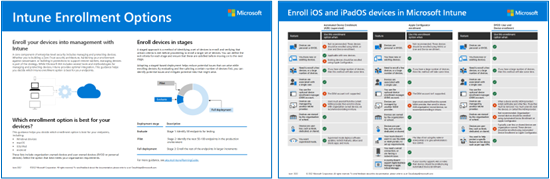

# Step 2. Enroll devices to Intune

There are several ways to secure the endpoint, a term often used to refer to the combined entity including devices, apps, and user identity. Security policies must be enforced consistently and reliably not only on the apps but the device itself. Enrolling the device to Intune and registering with a cloud identity provider, such as Azure Active Directory, is a great start.

Whether a device is a personally owned BYOD device or a corporate-owned and fully managed device, it's good to have visibility into the endpoints accessing your organization’s resources to ensure you’re only allowing healthy and compliant devices. This includes the health and trustworthiness of mobile and desktop apps that run on endpoints. You want to ensure those apps are healthy and compliant and that they prevent corporate data from leaking to consumer apps or services through malicious intent or accidental means.

The device enrollment process establishes a relationship between the user, the device, and the Microsoft Intune service. Using Microsoft Intune as a standalone service enables you to use a single web-based administration console to manage Windows PCs, macOS, and the most popular mobile device platforms.

This article recommends methods for enrolling devices to Intune. For more information about these methods and how to deploy each one, see [Deployment guidance: Enroll devices in Microsoft Intune](/mem/intune/fundamentals/deployment-guide-enrollment).

Use the guidance in this article together with this illustrated version of enrollment options for each platform. 

   [PDF](https://download.microsoft.com/download/e/6/2/e6233fdd-a956-4f77-93a5-1aa254ee2917/msft-intune-enrollment-options.pdf) | [Visio](https://download.microsoft.com/download/e/6/2/e6233fdd-a956-4f77-93a5-1aa254ee2917/msft-intune-enrollment-options.vsdx)   Updated June 2022

## Windows enrollment
There are several options for enrolling Windows 10 and Windows 11 devices. The most common methods include these two:

- Azure Active Directory (Azure AD) Join - Joins the device with Azure Active Directory and enables users to sign in to Windows with their Azure AD credentials. If Auto Enrollment is enabled, the device is automatically enrolled in Intune. The benefit of auto enrollment is a single-step process for the user. Otherwise, they'll have to enroll separately through MDM only enrollment and reenter their credentials. Users enroll this way either during initial Windows OOBE or from Settings. The device is marked as a corporate owned device in Intune.
- Autopilot - Automates Azure AD Join and enrolls new corporate-owned devices into Intune. This method simplifies the out-of-box experience and removes the need to apply custom operating system images onto the devices. When admins use Intune to manage Autopilot devices, they can manage policies, profiles, apps, and more after they're enrolled. There are four types of Autopilot deployment: Self-Deploying Mode (for kiosks, digital signage, or a shared device), User Driven Mode (for traditional users), Windows Autopilot for pre-provisioned deployment enables partners or IT staff to pre-provision a PC running Windows 10 or Windows 11 so that it is fully configured and business-ready, and Autopilot for existing devices enables you to easily deploy the latest version of Windows to your existing devices.

For additional options, including enrolling BYOD Windows devices, see, [Enroll Windows devices in Microsoft Intune](/mem/intune/fundamentals/deployment-guide-enrollment-windows).

## iOS and iPadOS enrollment

For user owned (BYOD) devices, you can let users enroll their personal devices with Intune using one of the following methods.
- Device enrollment is what you may think of as typical BYOD enrollment. It provides admins with a wide range of management options.
- User enrollment is a more streamlined enrollment process that provides admins with a subset of device management options. This feature is currently in preview.

For organizations that buy devices for their users, Intune supports the following iOS/iPadOS company-owned device enrollment methods:
- Apple's Automated Device Enrollment (ADE)
- Apple School Manager
- Apple Configurator Setup Assistant enrollment
- Apple Configurator direct enrollment

For more information, see [Enroll iOS and iPadOS devices in Microsoft Intune](/mem/intune/fundamentals/deployment-guide-enrollment-ios-ipados).

## Android enrollment 

There are several options for Android Enrollment depending on the type of device, the type of enrollment you’d like to support, as well as things like the Android version you are using or even the manufacturer (particularly Samsung). Most organizations use Android Work profiles for their end users, particular in BYOD scenarios. 

With an Android work profile the end user’s information is separated distinctly with data containers as well as separate apps for work and personal use. This is an ideal way for users to enroll their device while still maintaining the privacy of their own data and the security of corporate data. 

However, if your organization is providing Android devices, you might choose to use what is called a fully managed (User Affinity) or dedicated (no User Affinity) device.

To learn more about Android enrollment, see [Enroll Android devices in Microsoft Intune](/mem/intune/fundamentals/deployment-guide-enrollment-android).

## macOS enrollment

Enrollment for macOS can be a tricky subject for lots of IT organizations. Unless a majority of your users are Mac users than you may not be managing these types of devices to a great extent. If you have a small number of macOS users, we recommend Intune Only Enrollment. If you have a large number of macOS users, we recommend Intune + Jamf enrollment.  
- Intune Only enrollment — This is for basic management of macOS devices. It will require a manual process much like most of the other user-based enrollment options. But if you have a small number of Mac devices this may be easier than setting up an entire automated infrastructure just for those few users. With Intune only enrollment you have the ability to deploy things such as certificates, password configurations, and applications. You can also configure compliance policies and enlighten Conditional Access as well as the ability to enforce encryption and device wipe. 
- Intune and Jamf enrollment — For those looking for the deepest support for Mac management, with Jamf + Intune for Conditional Access, we have a great solution that combines the extensive Mac management capabilities of Jamf with Intune compliance to enable Conditional Access. In this scenario you are still fully managing the device with Jamf while being able to take those signals from Jamf for increased security.

To learn more about macOS enrollment, see [Enroll macOS devices in Microsoft Intune](/mem/intune/fundamentals/deployment-guide-enrollment-macos).

## Next steps

Go to Step [3. Set up compliance policies for devices with Intune](manage-devices-with-intune-compliance-policies.md).

