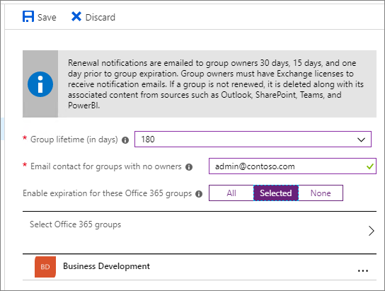

# Microsoft 365 group expiration policy

With the increase in usage of Microsoft 365 groups and Microsoft Teams, administrators and users need a way to clean up unused groups and teams. A Microsoft 365 groups expiration policy can help remove inactive groups from the system and make things cleaner.

When a group expires, all of its associated services (the mailbox, Planner, SharePoint site, team, etc.) are also deleted.

When a group expires it is "soft-deleted" which means it can still be recovered for up to 30 days.

Administrators can specify an expiration period and any inactive group that reaches the end of that period, and is not renewed, will be deleted. (This includes archived teams.) The expiration period begins when the group is created, or on the date it was last renewed. Group owners will automatically be sent an email before the expiration that allows them to renew the group for another expiration interval. Teams users will see persistent notifications in Teams.

Groups that are actively in use are renewed automatically. Any of the following actions will auto-renew a group:
- SharePoint - view, edit, download, move, share, or upload files. (Viewing a SharePoint page does not count as an action for automatic renewal.)
- Outlook - join group, read or write group message from the group, and like a message (Outlook on the web).
- Teams - visiting a teams channel.

Note that the only Yammer activity which will trigger an automatic group renewal is the upload of a document to SharePoint within the community.

> [!IMPORTANT]
> When you change the expiration policy, the service recalculates the expiration date for each group. It always starts counting from the date when the group was created, and then applies the new expiration policy.

It's important to know that expiration is turned off by default. Administrators have to enable it for their organization if they want to use it.

> [!NOTE]
> Configuring and using the expiration policy for Microsoft 365 groups requires you to possess but not necessarily assign Azure AD Premium licenses for the members of all groups to which the expiration policy is applied. For more information see [Getting started with Azure Active Directory Premium](/azure/active-directory/active-directory-get-started-premium).

## Who can configure and use the Microsoft 365 groups expiration policy?

|Role|What they can do|
|---------|---------|
|Office 365 global admin (in Azure, the Company administrator), User administrator|Create, read, update, or delete the Microsoft 365 groups expiration policy settings.|
|User|Renew or [restore](/azure/active-directory/users-groups-roles/groups-restore-deleted) a Microsoft 365 group that they own|

## How to set the expiration policy

As noted above, expiry is turned off by default. An administrator will have to enable the expiration policy and set the properties for it to take effect. To enable it, go to **Azure Active Directory** > **Groups** > **Expiration**. Here you can set the default group lifetime and specify how far in advance you want the first and second expiration notifications to go to the group owner.

The group lifetime is specified in days and can be set to 180, 365 or to a custom value that you specify. The custom value has to be at least 30 days.

If the group does not have an owner, the expiration emails will go to the specified administrator.

You can set the policy for all of your groups, only selected groups (up to 500), or turn it off completely by selecting **None**. Note that currently you can't have different policies for different groups.

## How expiry works with the retention policy

If you have set up a retention policy for groups in the Security and Compliance center, the expiration policy works seamlessly with retention policy. When a group expires, the group's mailbox conversations and files in the group site are retained in the retention container for the specific number of days defined in the retention policy. Users will not see the group, or its content, after expiration however.

## How and when a group owner learns if their groups are going to expire

Group owners will only be notified via email. If the group was created via Planner, SharePoint, or any other app, the expiration notifications will always come via email. If the group was created via Teams, the group owner will receive a notification to renew through the activity section. It's not recommended that you enable expiration on a group if your group owner doesn't have a valid email address.

Thirty days before the group expires, the group owners (or the email addresses that you specified for groups that don't have an owner) will receive an email allowing them to easily renew the group. If they don't renew it, they'll receive another renewal email 15 days before expiration. If they still haven't renewed it, they will receive one more email notification the day before expiration.

If for some reason none of the owners or admins renew the group before it expires, the admin can still restore the group for up to 30 days after expiration. For details see: [Restore a deleted Microsoft 365 group](https://support.office.com/article/restore-a-deleted-office-365-group-b7c66b59-657a-4e1a-8aa0-8163b1f4eb54).

## Archiving group contents

If you have a group that you no longer plan to use, but you want to retain its content, see [Archive groups, teams, and Yammer](end-life-cycle-groups-teams-sites-yammer.md) for information about how to export information from the different groups services.

## Related topics

[Collaboration governance planning step-by-step](collaboration-governance-overview.md#collaboration-governance-planning-step-by-step)

[Create your collaboration governance plan](collaboration-governance-first.md)

[Overview of retention policies](https://support.office.com/article/5e377752-700d-4870-9b6d-12bfc12d2423)

[Assign a new owner to an orphaned group](https://support.office.com/article/86bb3db6-8857-45d1-95c8-f6d540e45732)

[Configure Microsoft 365 groups expiration](/azure/active-directory/active-directory-groups-lifecycle-azure-portal)
