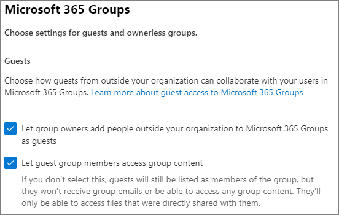

# Microsoft 365 guest sharing settings reference

This article provides a reference for the various settings that can affect sharing with people outside your organization for the Microsoft 365 workloads: Teams, Microsoft 365 Groups, SharePoint, and OneDrive. These settings are located in the Azure Active Directory, Microsoft 365, Teams, and SharePoint admin centers.

## Azure Active Directory

**Admin role:** Global administrator

Azure Active Directory is the directory service used by Microsoft 365. The Azure Active Directory Organizational relationships settings directly affect sharing in Teams, Microsoft 365 Groups, SharePoint, and OneDrive.

> [!NOTE]
> These settings only affect SharePoint when [SharePoint and OneDrive integration with Azure AD B2B](/sharepoint/sharepoint-azureb2b-integration-preview) has been configured. The table below assumes that this has been configured.

### External collaboration settings

**Navigation:** [Azure Active Directory admin center](https://aad.portal.azure.com) > Azure Active Directory > External Identities > External collaboration settings

| Setting | Default | Description |
|:-----|:-----|:-----|
|Guest user access|Guest users have limited access to properties and memberships of directory objects|Determines the [permissions that guests have in Azure Active Directory](/azure/active-directory/fundamentals/users-default-permissions).|
|Guest invite settings|Anyone in the organization can invite guest users including guests and non-admins|Determines whether guests, members, and admins can invite guests to the organization.   This setting affects  Microsoft 365 sharing experiences such as Teams and SharePoint.|
|Enable guest self-service sign up via user flows|No|Determines if you can create user flows that allow someone to sign up for an app that you created and create a new guest account.|
|Collaboration restrictions|Allow invitations to be sent to any domain|This setting allows you to specify a list of allowed or blocked domains for sharing. When allowed domains are specified, then sharing invitations can only be sent to those domains. When denied domains are specified, then sharing invitations cannot be sent to those domains.   This setting affects  Microsoft 365 sharing experiences such as Teams and SharePoint. You can allow or block domains at a more granular level by using domain filtering in SharePoint or Teams.|

These settings affect how users are invited to the directory. They do not affect sharing with guests who are already in the directory.

## Microsoft 365

**Admin role:** Global administrator

The Microsoft 365 admin center has organization-level settings for sharing and for Microsoft 365 Groups.

### Sharing

**Navigation:** [Microsoft 365 admin center](https://admin.microsoft.com) > Settings > Org Settings > Security & privacy tab > Sharing

| Setting | Default | Description |
|:-----|:-----|:-----|
|Let users add new guests to the organization|On|When set to **Yes**, Azure AD members can invite guests via Azure AD; when set to **No**, they cannot. When set to **Yes**, Microsoft 365 Group members can invite guests with owner approval; when set to **No**, Microsoft 365 Group members can invite guests with owner approval but owners must be global administrators to approve.   Note that **Members can invite** refers to members in Azure AD (as opposed to guests) and not to site or group members in  Microsoft 365.   This is identical to the **Members can invite** setting in Azure Active Directory Organizational relationships settings.|

### Microsoft 365 Groups

**Navigation:** [Microsoft 365 admin center](https://admin.microsoft.com) > Settings > Settings > Microsoft 365 Groups

| Setting | Default | Description |
|:-----|:-----|:-----|
|Let group members outside your organization access group content|On|When set to **On**, guests can access groups content; when set to **Off**, they can't. This setting should be **On** for any scenario where guests are interacting with Microsoft 365 Groups or Teams.|
|Let group owners add people outside your organization to groups|On|When **On**, Owners of Microsoft 365 Groups or Teams can invite new guests to the group. When **Off**, owners can only invite guests who are already in the directory.|

These settings are at the organization level. See [Create settings for a specific group](/azure/active-directory/users-groups-roles/groups-settings-cmdlets#create-settings-for-a-specific-group) for information about how to change these settings at the group level by using PowerShell.

## Teams

The Teams master guest access switch, **Allow guest access in Teams**, must be **On** for the other guest settings to be available.

**Admin role:** Teams service administrator

### Guest access

**Navigation:** [Teams admin center](https://admin.teams.microsoft.com) > Org-wide settings > Guest access

| Setting | Default | Description |
|:-----|:-----|:-----|
|Allow guest access in Teams|Off|Turns guest access on or off for Teams overall. This setting can take 24 hours to take effect once changed.|

### Guest calling

**Navigation:** [Teams admin center](https://admin.teams.microsoft.com) > Org-wide settings > Guest access

| Setting | Default | Description |
|:-----|:-----|:-----|
|Make private calls|On|When **On**, guests can make peer-to-peer calls in Teams; when **Off**, they can't.|

### Guest meeting

**Navigation:** [Teams admin center](https://admin.teams.microsoft.com) > Org-wide settings > Guest access

| Setting | Default | Description |
|:-----|:-----|:-----|
|Allow IP video|On|When **On**, guests can use video in their calls and meetings; when **Off**, they can't.|
|Screen sharing mode|Entire screen|When **Disabled**, guests can't share their screens in Teams. When set to **Single application**, guests can only share a single application on their screen. When set to **Entire screen**, guests can choose to share an application or their entire screen.|
|Allow Meet Now|On|When **On**, guests can use the Meet Now feature in Teams; when **Off**, they can't.|

### Guest messaging

**Navigation:** [Teams admin center](https://admin.teams.microsoft.com) > Org-wide settings > Guest access

| Setting | Default | Description |
|:-----|:-----|:-----|
|Edit sent messages|On|When **On**, guests can edit messages they previously sent; when **Off**, they can't.|
|Delete sent messages|On|When **On**, guests can delete messages they previously sent; when **Off**, they can't.|
|Chat|On|When **On**, guests can use chat in Teams; when **Off**, they can't.|
|Use Giphys in conversations|On|When **On**, guests can use Giphys in conversations; when **Off**, they can't.|
|Giphy content rating|Moderate|When set to **Allow all content**, guests will can insert all Giphys in chats, regardless of the content rating. When set to **Moderate** guests can insert Giphys in chats, but will be moderately restricted from adult content. When set to **Strict** guests can insert Giphys in chats, but will be restricted from inserting adult content.|
|Use Memes in conversations|On|When **On**, guests can use memes in conversations; when **Off**, they can't.|
|User stickers in conversations|On|When **On**, guests can use stickers in conversations; when **Off**, they can't.|
|Allow immersive reader for viewing messages|On|When **On**, guests can view messages in Immersive Reader; when **Off**, they can't.|

## SharePoint and OneDrive (organization-level)

**Admin role:** SharePoint administrator

These settings affect all of the sites in the organization. They do not affect Microsoft 365 Groups or Teams directly, however we recommend that you align these settings with the settings for Microsoft 365 Groups and Teams to avoid user experience issues. (For example, if guest sharing is allowed in Teams but not SharePoint, then guests in Teams will not have access to the Files tab because Teams files are stored in SharePoint.)

### SharePoint and OneDrive sharing settings

Because OneDrive is a hierarchy of sites within SharePoint, the organization-level sharing settings directly affect OneDrive just as they do other SharePoint sites.

**Navigation:** SharePoint admin center > Sharing

| Setting | Default | Description |
|:-----|:-----|:-----|
|SharePoint|Anyone|Specifies the most permissive sharing permissions allowed for SharePoint sites.|
|OneDrive|Anyone|Specifies the most permissive sharing permissions allowed for OneDrive sites. This setting cannot be more permissive than the SharePoint setting.|

### SharePoint and OneDrive advanced sharing settings

**Navigation:** SharePoint admin center > Sharing

| Setting | Default | Description |
|:-----|:-----|:-----|
|Limit external sharing by domain|Off|This setting allows you to specify a list of allowed or blocked domains for sharing. When allowed domains are specified, then sharing invitations can only be sent to those domains. When denied domains are specified, then sharing invitations cannot be sent to those domains.   This setting affects all SharePoint and OneDrive sites in the organization.|
|Guests must sign in using the same account to which sharing invitations are sent|Off|Prevents guests from redeeming site sharing invitations using a different email address than the invitation was sent to.  [SharePoint and OneDrive integration with Azure AD B2B (Preview)](/sharepoint/sharepoint-azureb2b-integration-preview) does not use this setting because all guests are added to the directory based on the email address that the invitation was sent to. Alternate email addresses cannot be used to access the site.|
|Allow guests to share items they don't own|On|When **On**, guests can share items that they don't own with other users or guests; when **Off** they cannot. Guests can always share items for which they have full control.|

### SharePoint and OneDrive file and folder link settings

When files and folders are shared in SharePoint and OneDrive, sharing recipients are sent a link with permissions to the file or folder rather than being granted direct access to the file or folder themselves. Several types of links are available, and you can choose the default link type presented to users when they share a file or folder. You can also set permissions and expiration options for *Anyone* links.

**Navigation:** SharePoint admin center > Sharing

| Setting | Default | Description |
|:-----|:-----|:-----|
|File and folder links|Anyone with the link|Specifies which sharing link is shown by default when a user shares a file or folder. Users can change the option before sharing if they want. If the default is set to **Anyone with the link** and *Anyone* sharing is not allowed for a given site, then **Only people in your organization** will be shown as the default for that site.|
|These links must expire within this many days|Off (no expiration)|Specifies the number of days after an *Anyone* link is created that it expires. Expired links cannot be renewed. Create a new link if you need to continue sharing past the expiration.|
|File permissions|View and edit|Specifies the file permission levels available to users when creating an *Anyone* link. If **View** is selected, then users can only create *Anyone* file links with view permissions. If **View, and edit** is selected, then users can choose between view and view and edit permissions when they create the link.|
|Folder permissions|View, edit, and upload|Specifies the folder permission levels available to users when creating an *Anyone* link. If **View** is selected, then users can only create *Anyone* folder links with view permissions. If **View, edit, and upload** is selected, then users can choose between view and view, edit, and upload permissions when they creat the link.|

### SharePoint and OneDrive security group settings

If you want to limit who can share with guests in SharePoint and OneDrive, you can do so by limiting sharing to people in specified security groups. These settings do not affect sharing via Microsoft 365 Groups or Teams. Guests invited via a group or team would also have access to the associated site, though document and folder sharing could only be done by people in the specified security groups.

**Navigation:** SharePoint admin center > Sharing > Limit external sharing to specific security groups

| Setting | Default | Description |
|:-----|:-----|:-----|
|Let only users in selected security groups share with authenticated external users|Off|When **On**, only the people in the specified security groups can share with people outside the organization. Only *Specific people* links are available. *Anyone* sharing is effectively disabled unless **Let only users in selected security groups share with authenticated external users and using anonymous links** is also **On**|
|Let only users in selected security groups share with authenticated external users and using anonymous links|Off|When **On**, only the people in the specified security groups can share with guests. Both *Anyone* and *Specific people* links are available.|

Both of these settings can be used at the same time. If a user is in security groups specified for both settings, then the greater permission level prevails (*Anyone* plus *Specific user*). Nested security groups are supported.

## SharePoint (site level)

**Admin role:** SharePoint administrator

Because these settings are subject to the organization-wide settings for SharePoint, the effective sharing setting for the site may change if the organization-level setting changes. If you choose a setting here and the organization-level is later set to a more restrictive value, then this site will operate at that more restrictive value. For example, if you choose **Anyone** and the organization-level setting is later set to **New and existing guests**, then this site will only allow new and existing guests. If the organization-level setting is then set back to **Anyone**, this site would again allow *Anyone* links.

### Site sharing

You can set guest sharing permissions for each site in SharePoint. This setting applies to both site sharing and file and folder sharing. (*Anyone* sharing is not available for site sharing. If you choose **Anyone**, users will be able to share files and folders by using *Anyone* links, and the site itself with new and existing guests.)

If the site has a sensitivity label applied, that label may control the external sharing settings. For more information, see [Use sensitivity labels to protect content in Microsoft Teams, Microsoft 365 groups, and SharePoint sites](../compliance/sensitivity-labels-teams-groups-sites.md).

**Navigation:** SharePoint admin center > Active sites > select the site > Policies tab > Edit External sharing

| Setting | Default | Description |
|:-----|:-----|:-----|
|Site content can be shared with|Varies by site type (see the table below)|Indicates the type of external sharing allowed for this site. Options available here are subject to the organization-level sharing settings for SharePoint.|

### Site file and folder link settings

You can set defaults for link type and permissions, and expiration settings for *Anyone* links for each site. When set at the site level, these settings override the organization-level settings. Note that if *Anyone* links are disabled at the organization level, *Anyone* will not be an available link type at the site level.

**Navigation:** SharePoint admin center > Active sites > select the site > Policies tab > Edit External sharing

| Setting | Default | Description |
|:-----|:-----|:-----|
|Limit sharing by domain|Off|This setting allows you to specify a list of allowed or blocked domains for sharing. When allowed domains are specified, then sharing invitations can only be sent to those domains. When denied domains are specified, then sharing invitations cannot be sent to those domains.   This setting cannot be used to override domain restrictions set at the organization or Azure AD level.|
|Default sharing link type|Same as organization-level setting|This setting allows you to specify the default sharing link presented to users in this site. The *Same as organization-level setting* option is defined by a combination of organization and site sharing settings.|
|Advanced settings for Anyone links|Same as organization-level setting|Specifies the number of days after an *Anyone* link is created for a file in this site that it expires. Expired links cannot be renewed. Create a new link if you need to continue sharing past the expiration.|
|Default link permission|Same as organization-level setting|This setting allows you to specify the default permission (View or Edit) for sharing links created for files in this site.|

### Default site sharing settings

The table below shows the default sharing setting for each site type.

| Site type | Default sharing setting |
|:-----|:-----|
|Classic|**Only people in your organization**|
|OneDrive|**Anyone**|
|Group-connected sites (including Teams)|**New and existing guests** if the Microsoft 365 Groups setting **Let group owners add people outside the organization to groups** is **On**; otherwise **Existing guests only**|
|Communication|**Only people in your organization**|
|Modern sites with no group (#STS3 TeamSite)|**Only people in your organization**|

> [!NOTE]
> The root communication site (tenant-name.sharepoint.com) has a default sharing setting of **Anyone**.

## See also

[SharePoint and OneDrive external sharing overview](/sharepoint/external-sharing-overview)

[Guest access in Microsoft Teams](/MicrosoftTeams/guest-access)

[Adding guests to Microsoft 365 Groups](https://support.office.com/article/bfc7a840-868f-4fd6-a390-f347bf51aff6)
