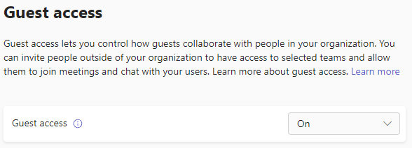

# Microsoft 365 guest sharing settings reference

This article provides a reference for the various settings that can affect sharing with people outside your organization for the Microsoft 365 workloads: Teams, Microsoft 365 Groups, SharePoint, and OneDrive. These settings are located in the Microsoft Entra ID, Microsoft 365, Teams, and SharePoint admin centers.

## Microsoft Entra ID

**Admin role:** Global administrator

Microsoft Entra ID is the directory service used by Microsoft 365. The Microsoft Entra organizational relationships settings directly affect sharing in Teams, Microsoft 365 Groups, SharePoint, and OneDrive.

> [!NOTE]
> These settings only affect SharePoint when [SharePoint and OneDrive integration with Microsoft Entra B2B](/sharepoint/sharepoint-azureb2b-integration-preview) has been configured. The table below assumes that this has been configured.

### External collaboration settings

**Navigation:** [Microsoft Entra admin center](https://entra.microsoft.com) > Identity > External Identities > External collaboration settings

| Setting | Default | Description |
|:-----|:-----|:-----|
|Guest user access|Guest users have limited access to properties and memberships of directory objects|Determines the [permissions that guests have in Microsoft Entra ID](/azure/active-directory/fundamentals/users-default-permissions).|
|Guest invite restrictions|Anyone in the organization can invite guest users including guests and non-admins|Determines whether guests, members, and admins can invite guests to the organization. 
 This setting affects  Microsoft 365 sharing experiences such as Teams and SharePoint.|
|Enable guest self-service sign-up via user flows|No|Determines if you can create user flows that allow someone to sign up for an app that you created and create a new guest account.|
|External user leave settings|Yes|Determines if guests can remove themselves from your organization.|
|Collaboration restrictions|Allow invitations to be sent to any domain|This setting allows you to specify a list of allowed or blocked domains for sharing. When allowed domains are specified, then sharing invitations can only be sent to those domains. When denied domains are specified, then sharing invitations can't be sent to those domains. 
 This setting affects  Microsoft 365 sharing experiences such as Teams and SharePoint. You can also allow or block domains at by using [domain allowlists or blocklists in SharePoint](/sharepoint/restricted-domains-sharing).|

These settings affect how users are invited to the directory. They don't affect sharing with guests who are already in the directory.

### Cross-tenant access settings

**Navigation:** [Microsoft Entra admin center](https://aad.portal.azure.com) > Identity > External Identities > Cross-tenant access settings > Default settings tab

The default settings apply to all external Microsoft Entra organizations except those with organization-specific settings. There are separate settings for guests (B2B collaboration) and [Microsoft Entra B2B direct connect](/azure/active-directory/external-identities/b2b-direct-connect-overview) users.

Settings for a specific organization can be configured on the **Organizational settings** tab. Connections to other cloud environments can be configured on the **Microsoft cloud settings** tab.

**Inbound access settings**

Inbound access settings control whether users from external Microsoft Entra organizations can access resources in your organization.

| Setting | Default | Description |
|:-----|:-----|:-----|
|B2B collaboration - external users and groups|All Allowed|Determines what people in other Microsoft Entra organizations can be granted access to resources in your organization as guests.|
|B2B collaboration - applications|All allowed|Determines what apps in your organization guests can be granted access to.|
|B2B direct connect - external users and groups|All blocked|Determines if people in other Microsoft Entra organizations can be granted access to resources in your organization through B2B direct connect.|
|B2B direct connect - applications|All blocked|Determines what apps in your organization B2B direct connect users can be granted access to.|
|Trust settings|Disabled|Determines if your conditional access policies will accept claims from other Microsoft Entra organizations when people from those organizations access your resources.|

**Outbound access settings**

Outbound access settings control whether your users can access resources in an external organization.

| Setting | Default | Description |
|:-----|:-----|:-----|
|B2B collaboration - external users and groups|All Allowed|Determines which users in your organization can be granted access to resources in other Microsoft Entra organizations as guests.|
|B2B collaboration - applications|All allowed|Determines what apps in other Microsoft Entra organizations your users can be granted access to as guests.|
|B2B direct connect - external users and groups|All blocked|Determines which users in your organization can be granted access to resources in other Microsoft Entra organizations through B2B direct connect.|
|B2B direct connect - applications|All blocked|Determines what apps in other Microsoft Entra organizations your users can be granted access to through B2B direct connect.|

**Tenant restrictions**

[Tenant restrictions settings](/entra/external-id/cross-tenant-access-overview#tenant-restrictions) control the types of external accounts your users can use on the devices you manage.

| Setting | Default | Description |
|:-----|:-----|:-----|
|External users and groups|All blocked|Control whether your users can access external applications from your network or devices using external accounts.|
|External applications|All blocked|Control which external applications users can access.|

## Microsoft 365

**Admin role:** Global administrator

The Microsoft 365 admin center has organization-level settings for sharing and for Microsoft 365 Groups.

### Sharing

**Navigation:** [Microsoft 365 admin center](https://admin.microsoft.com) > **Settings** > **Org settings** > <a href="https://go.microsoft.com/fwlink/p/?linkid=2072756" target="_blank">**Security & privacy** tab</a> > **Sharing**.

| Setting | Default | Description |
|:-----|:-----|:-----|
|Let users add new guests to the organization|On|When set to **Yes**, Microsoft Entra ID members can invite guests via Microsoft Entra ID; when set to **No**, they can't. When set to **Yes**, Microsoft 365 group members can invite guests with owner approval; when set to **No**, Microsoft 365 group members can invite guests with owner approval but owners must be global administrators to approve. 
 Note that **Members can invite** refers to members in Microsoft Entra ID (as opposed to guests) and not to site or group members in  Microsoft 365. 
 This setting changes the **Guest invite restrictions** setting in Microsoft Entra ID external collaboration settings.|

### Microsoft 365 Groups

**Navigation:** [Microsoft 365 admin center](https://admin.microsoft.com) > **Settings** > **Org settings** > Microsoft 365 Groups

| Setting | Default | Description |
|:-----|:-----|:-----|
|Let group members outside your organization access group content|On|When set to **On**, guests can access groups content; when set to **Off**, they can't. This setting should be **On** for any scenario where guests are interacting with Microsoft 365 groups or teams.|
|Let group owners add people outside your organization to groups|On|When **On**, owners of Microsoft 365 groups or teams can invite new guests to the group or team. When **Off**, they can't. This setting should be **On** for any scenario where guests are to be added to groups.|

These settings are at the organization level. See [Create settings for a specific group](/azure/active-directory/users-groups-roles/groups-settings-cmdlets#create-settings-for-a-specific-group) for information about how to change these settings at the group level.

## Teams

The Teams guest access switch must be **On** for the other guest settings to be available.

**Admin role:** Teams service administrator

### Guest access

**Navigation:** [Teams admin center](https://admin.teams.microsoft.com) > **Users** > <a href="https://go.microsoft.com/fwlink/p/?linkid=2173122" target="_blank">**Guest access**</a>

| Setting | Default | Description |
|:-----|:-----|:-----|
|Guest access|On|Turns guest access on or off for Teams overall. This setting can take 24 hours to take effect once changed.|

### Guest calling

**Navigation:** [Teams admin center](https://admin.teams.microsoft.com) > **Users** > <a href="https://go.microsoft.com/fwlink/p/?linkid=2173122" target="_blank">**Guest access**</a>

| Setting | Default | Description |
|:-----|:-----|:-----|
|Make private calls|On|When **On**, guests can make peer-to-peer calls in Teams; when **Off**, they can't.|

### Guest meeting

**Navigation:** [Teams admin center](https://admin.teams.microsoft.com) > **Users** > <a href="https://go.microsoft.com/fwlink/p/?linkid=2173122" target="_blank">**Guest access**</a>

| Setting | Default | Description |
|:-----|:-----|:-----|
|Video conferencing|On|When **On**, guests can use video in their calls and meetings; when **Off**, they can't.|
|Screen sharing|Entire screen|When **Not enabled**, guests can't share their screens in Teams. When set to **Single application**, guests can only share a single application on their screen. When set to **Entire screen**, guests can choose to share an application or their entire screen.|
|Meet now in channels|On|When **On**, guests can use the Meet Now feature in Teams channels; when **Off**, they can't.|

### Guest messaging

**Navigation:** [Teams admin center](https://admin.teams.microsoft.com) > **Users** > <a href="https://go.microsoft.com/fwlink/p/?linkid=2173122" target="_blank">**Guest access**</a>

| Setting | Default | Description |
|:-----|:-----|:-----|
|Edit sent messages|On|When **On**, guests can edit messages they previously sent; when **Off**, they can't.|
|Delete sent messages|On|When **On**, guests can delete messages they previously sent; when **Off**, they can't.|
|Delete chat|On|When **On**, guests can delete an entire chat conversation in Teams; when **Off**, they can't.|
|Chat|On|When **On**, guests can use chat in Teams; when **Off**, they can't.|
|Giphy in conversations|On|When **On**, guests can use Giphys in conversations; when **Off**, they can't.|
|Giphy content rating|Moderate|When set to **Allow all content**, guests can insert all Giphys in chats, regardless of the content rating. When set to **Moderate** guests can insert Giphys in chats, but will be moderately restricted from adult content. When set to **Strict** guests can insert Giphys in chats, but will be restricted from inserting adult content.|
|Memes in conversations|On|When **On**, guests can use memes in conversations; when **Off**, they can't.|
|Stickers in conversations|On|When **On**, guests can use stickers in conversations; when **Off**, they can't.|
|Immersive reader for messages|On|When **On**, guests can view messages in immersive reader; when **Off**, they can't.|

## SharePoint and OneDrive (organization-level)

**Admin role:** SharePoint administrator

These settings affect all the sites in the organization. They don't affect Microsoft 365 Groups or Teams directly, however we recommend that you align these settings with the settings for Microsoft 365 Groups and Teams to avoid user experience issues. (For example, if guest sharing is allowed in Teams but not SharePoint, then guests in Teams won't have access to the Files tab because [Teams files are stored in SharePoint](/SharePoint/teams-connected-sites).)

### SharePoint and OneDrive sharing settings

Because OneDrive is a hierarchy of sites within SharePoint, the organization-level sharing settings directly affect OneDrive just as they do other SharePoint sites.

**Navigation:** SharePoint admin center > **Policies** > <a href="https://go.microsoft.com/fwlink/?linkid=2185222" target="_blank">**Sharing**</a>

| Setting | Default | Description |
|:-----|:-----|:-----|
|SharePoint|Anyone|Specifies the most permissive sharing permissions allowed for SharePoint sites.|
|OneDrive|Anyone|Specifies the most permissive sharing permissions allowed for OneDrive sites. This setting can't be more permissive than the SharePoint setting.|

### SharePoint and OneDrive advanced sharing settings

**Navigation:** SharePoint admin center > **Policies** > <a href="https://go.microsoft.com/fwlink/?linkid=2185222" target="_blank">**Sharing**</a>

| Setting | Default | Description |
|:-----|:-----|:-----|
|Limit external sharing by domain|Off|This setting allows you to specify a list of allowed or blocked domains for sharing. When allowed domains are specified, then sharing invitations can only be sent to those domains. When denied domains are specified, then sharing invitations can't be sent to those domains. 
 This setting affects all SharePoint and OneDrive sites in the organization. You can also set this at the site level.|
|Allow only users in specific security groups to share externally|Off|If you want to limit who can share with guests in SharePoint and OneDrive, you can do so by limiting sharing to people in specified security groups. These settings don't affect sharing via Microsoft 365 Groups or Teams. Guests invited via a group or team would also have access to the associated site, though document and folder sharing could only be done by people in the specified security groups. 
 For each specified group, you can choose which of those users can share with *Anyone* links.|
|Guests must sign in using the same account to which sharing invitations are sent|Off|Prevents guests from redeeming site sharing invitations using a different email address than the invitation was sent to. 
 [SharePoint and OneDrive integration with Microsoft Entra B2B](/sharepoint/sharepoint-azureb2b-integration-preview) does not use this setting because all guests are added to the directory based on the email address that the invitation was sent to and alternate email addresses can't be used to access the site.|
|Allow guests to share items they don't own|On|When **On**, guests can share items that they don't own with other users or guests; when **Off** they can't. Guests can always share items for which they have full control.|
|Guest access to a site or OneDrive will expire automatically after this many days|On|This setting allows you to specify a number of days after which guest access to sites expires. [Site owners can manage access renewals](https://support.microsoft.com/office/25bee24f-42ad-4ee8-8402-4186eed74dea). You can also set this at the site level.|
|People who use a verification code must reauthenticate after this many days|Off|This setting allows you to require that users authenticating with a one-time passcode reauthenticate after a certain number of days.|

### SharePoint and OneDrive file and folder link settings

When files and folders are shared in SharePoint and OneDrive, sharing recipients are sent a link with permissions to the file or folder rather than being granted direct access to the file or folder themselves. Several types of links are available, and you can choose the default link type presented to users when they share a file or folder. You can also set permissions and expiration options for *Anyone* links.

**Navigation:** SharePoint admin center > **Policies** > <a href="https://go.microsoft.com/fwlink/?linkid=2185222" target="_blank">**Sharing**</a>

| Setting | Default | Description |
|:-----|:-----|:-----|
|Choose the type of link that's selected by default when users share files and folders in SharePoint and OneDrive|Anyone with the link|Specifies which sharing link is shown by default when a user shares a file or folder. Users can change the option before sharing if they want. If the default is set to **Anyone with the link** and *Anyone* sharing is not allowed for a given site, then **Only people in your organization** will be shown as the default for that site.|
|Choose the permission that's selected by default for sharing links|View and edit|Specifies the file permission levels available to users when creating an *Anyone* link. If **View** is selected, then users can only create *Anyone* file links with view permissions. If **View, and edit** is selected, then users can choose between view and view and edit permissions when they create the link.|
|These links must expire within this many days|Off (no expiration)|Specifies the number of days after an *Anyone* link is created that it expires. Expired links can't be renewed. Users can create a new link if they need to continue sharing past the expiration.|
|These links can give these permissions|View, edit, and upload|Specifies the folder permission levels available to users when creating an *Anyone* link. If **View** is selected, then users can only create *Anyone* folder links with view permissions. If **View, edit, and upload** is selected, then users can choose between view and view, edit, and upload permissions when they creat the link.|

## SharePoint (site level)

**Admin role:** SharePoint administrator

Because these settings are subject to the organization-wide settings for SharePoint, the effective sharing setting for the site might change if the organization-level setting changes. If you choose a setting here and the organization-level is later set to a more restrictive value, then this site will operate at that more restrictive value. For example, if you choose **Anyone** and the organization-level setting is later set to **New and existing guests**, then this site will only allow new and existing guests. If the organization-level setting is then set back to **Anyone**, this site would again allow *Anyone* links.

### Site sharing

You can set guest sharing permissions for each site in SharePoint. This setting applies to both site sharing and file and folder sharing. (*Anyone* sharing is not available for site sharing. If you choose **Anyone**, users will be able to share files and folders by using *Anyone* links, and the site itself with new and existing guests.)

If the site has a sensitivity label applied, that label might control the external sharing settings. For more information, see [Use sensitivity labels to protect content in Microsoft Teams, Microsoft 365 groups, and SharePoint sites](../compliance/sensitivity-labels-teams-groups-sites.md).

**Navigation:** SharePoint admin center > <a href="https://go.microsoft.com/fwlink/?linkid=2185220" target="_blank">**Active sites**</a> > select the site > **Settings** tab > **More sharing settings**

(For channel sites, select **sites** in the **Channel sites** column and then select the site.)

| Setting | Default | Description |
|:-----|:-----|:-----|
|Site content can be shared with|Varies by site type (see the table below)|Indicates the type of external sharing allowed for this site. Options available here are subject to the organization-level sharing settings for SharePoint.|

### Site access, file, and folder link settings

You can set defaults for link type and permissions, guest access expiration, and expiration settings for *Anyone* links for each site. When set at the site level, these settings override the organization-level settings. Note that if *Anyone* links are disabled at the organization level, *Anyone* won't be an available link type at the site level.

**Navigation:** SharePoint admin center > <a href="https://go.microsoft.com/fwlink/?linkid=2185220" target="_blank">**Active sites**</a> > select the site > **Settings** tab > **More sharing settings**

(For channel sites, select **sites** in the **Channel sites** column and then select the site.)

| Setting | Default | Description |
|:-----|:-----|:-----|
|Limit sharing by domain|Off|This setting allows you to specify a list of allowed or blocked domains for sharing. When allowed domains are specified, then sharing invitations can only be sent to those domains. When denied domains are specified, then sharing invitations can't be sent to those domains. 
 This setting can't be used to override domain restrictions set at the organization or Microsoft Entra ID level.|
|Expiration of guest access|Same as organization-level setting|This setting allows you to specify a number of days after which guest access to the site expires. [Site owners can manage access renewals](https://support.microsoft.com/office/25bee24f-42ad-4ee8-8402-4186eed74dea).|
|Default sharing link type|Same as organization-level setting|This setting allows you to specify the default sharing link presented to users in this site. The *Same as organization-level setting* option is defined by a combination of organization and site sharing settings.|
|Expiration of Anyone links|Same as organization-level setting|Specifies the number of days after an *Anyone* link is created for a file or folder in this site that it expires. Expired links can't be renewed. Users can create a new link if they need to continue sharing past the expiration.|
|Default link permission|Same as organization-level setting|This setting allows you to specify the default permission (View or Edit) for sharing links created for files and folders in this site.|

### Default site sharing settings

The table below shows the default sharing setting for each site type.

| Site type | Default sharing setting |
|:-----|:-----|
|Classic|**Only people in your organization**|
|OneDrive|**Anyone**|
|Group-connected sites (including Teams)|**New and existing guests** if the Microsoft 365 Groups setting **Let group owners add people outside the organization to groups** is **On**; otherwise **Existing guests only**|
|Communication|**Only people in your organization**|
|Modern sites with no group (#STS3 TeamSite)|**Only people in your organization**|

> [!NOTE]
> The root communication site (tenant-name.sharepoint.com) has a default sharing setting of **Anyone**.

## Related articles

[SharePoint and OneDrive external sharing overview](/sharepoint/external-sharing-overview)

[Guest access in Microsoft Teams](/MicrosoftTeams/guest-access)

[Adding guests to Microsoft 365 Groups](https://support.office.com/article/bfc7a840-868f-4fd6-a390-f347bf51aff6)
