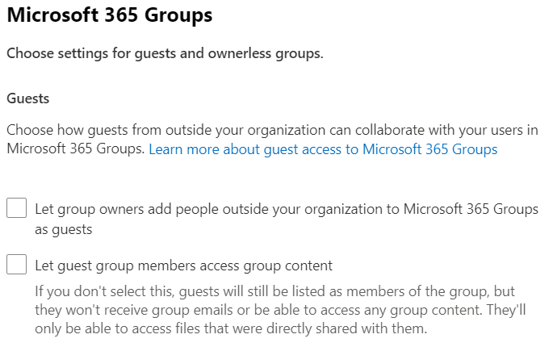
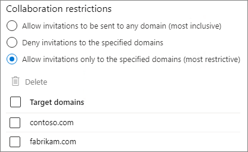
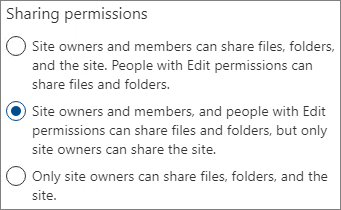
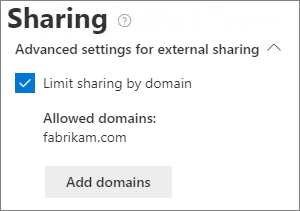
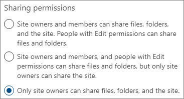
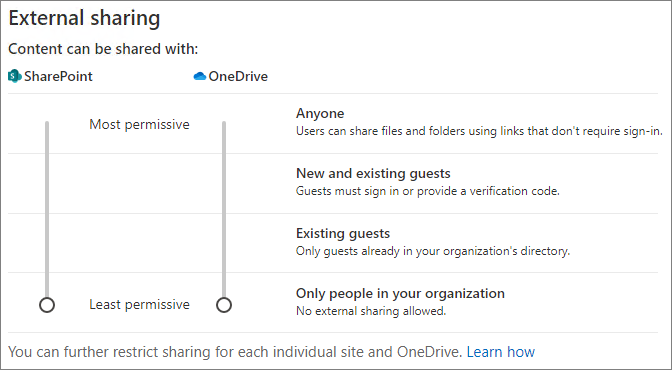
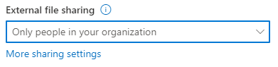
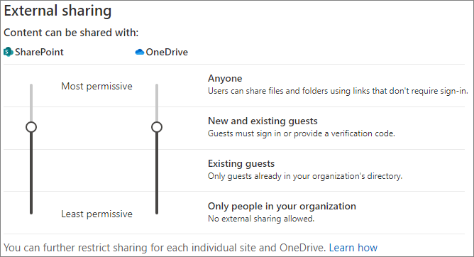
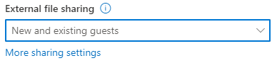

# Limit sharing in Microsoft 365

While you can't disable internal sharing entirely or remove the Share button from sites, there are a variety of ways that you can limit sharing in Microsoft 365 to meet the needs of your organization.

The methods of sharing files are listed in the table below. Click the link in the **Sharing method** column for detailed information.

|Sharing method|Description|Limiting options|
|:-------------|:----------|:-------------|
|[Microsoft 365 group or team](#microsoft-365-group-or-team)|People granted access to a Microsoft Teams team or Microsoft 365 group have edit access to files in the associated SharePoint site.|If the group or team is private, sharing invitations to join the team go to the owner for approval. Admins can disable guest access or use sensitivity labels to prevent access by people from outside the organization.|
|[SharePoint site](#sharepoint-site)|People can be granted Owner, Member, or Visitor access to a SharePoint site and will have that level of access to files in the site.|Site permissions can be restricted so that only site owners can share the site. Admins can set a site to read-only or block access entirely.|
|[Sharing with specific people](#sharing-with-specific-people)|Site members and people with edit permissions can give direct permissions to files and folders or share them by using *Specific people* links.|Site permissions can be restricted so that only site owners can share files and folders. In this case, direct access and *Specific people* link sharing by site members goes to site owner for approval.|
|[SharePoint and OneDrive guest sharing](#sharepoint-guest-sharing)|SharePoint site owners and members and OneDrive owners can share files and folders with people outside the organization.|Guest sharing can be disabled for the entire organization or for individual sites.|
|[*People in your organization* sharing links](#people-in-your-organization-sharing-links)|SharePoint site owners and members can share files using *People in your organization* links, which will work for anyone inside the organization.|*People in your organization* links can be disabled at the site level.|
|[Create sites, groups, and teams](#create-sites-groups-and-teams)|By default, users can create new sites, groups, and teams from which they can share content.|Admins can restrict who can create sites, groups, and teams.|
|[Email](#email)|People with access to a file can send it to others via email.|Admins can encrypt files by using sensitivity labels to prevent them being shared with unauthorized people.|
|[Download or file copy](#download-or-file-copy)|People with access to a file can download or copy it and share it with others outside the scope of Microsoft 365.|Admins can encrypt files by using sensitivity labels to prevent them being shared with unauthorized people.|

You can also restrict the conditions under which people access shared content. See [conditional access](#conditional-access) later in this article for more information.

While you can use the admin controls described in this article to limit sharing in your organization, we highly recommend that you consider using the security and compliance features available in Microsoft 365 to create a secure sharing environment. See [File collaboration in SharePoint with Microsoft 365](/sharepoint/deploy-file-collaboration) and [Configure a team with security isolation](secure-teams-security-isolation.md) for information.

To understand how sharing is being used in your organization, [run a report on file and folder sharing](/sharepoint/sharing-reports).

## Microsoft 365 group or team

If you want to limit sharing in a Microsoft 365 group or Microsoft Teams team, it's important to make the group or team private. People inside your organization can join a public group or team anytime. Unless the group or team is private, there's no way to limit sharing of the team or its files within the organization.

### Guest sharing

If you want to prevent guest access in Teams, you can turn off guest sharing in the Teams admin center.

To turn off guest sharing for Teams
1. In the Teams admin center, expand **Org-wide settings** > <a href="https://go.microsoft.com/fwlink/p/?linkid=2173122" target="_blank">**Guest access** tab</a>.
2. Turn off **Allow guest access in Teams**.
3. Click **Save**.

If you want to prevent guest access in Microsoft 365 Groups, you can turn off the groups guest access settings in the Microsoft 365 admin center.

To turn off guest sharing in Microsoft 365 Groups
1. In the Microsoft 365 admin center, click **Settings** > **Org Settings** > <a href="https://go.microsoft.com/fwlink/p/?linkid=2053743" target="_blank">**Services** tab</a>.
2. Click **Microsoft 365 Groups**.
3. Clear the **Let group members outside your organization access group content** and **Let group owners add people outside your organization to groups** check boxes.
4. Click **Save changes**.

    

> [!NOTE]
> If you want to prevent guest sharing for a particular group or team, you can do so by using [Microsoft PowerShell](per-group-guest-access.md) or [sensitivity labels](../compliance/sensitivity-labels-teams-groups-sites.md).

You can limit guest sharing to users from specific domains by allowing or blocking domains in Azure Active Directory. This will also affect guest sharing in SharePoint if you have enabled [SharePoint and OneDrive integration with Azure AD B2B](/sharepoint/sharepoint-azureb2b-integration-preview).

To allow sharing invitations only from specified domains
1. In Azure Active Directory, on the Overview page, expand **External identities**, and then choose **External collaboration settings**.
1. Under **Collaboration restrictions**, select **Deny invitations to the specified domains** or **Allow invitations only to the specified domains**, and then type the domains that you want to use.
1. Click **Save**.

    

You can also use **Cross-tenant access settings** in Azure AD to limit sharing to specific organizations. See [Limit guest sharing to specific organizations](limit-guest-sharing-to-specific-organization.md).

## SharePoint site

You can limit SharePoint site sharing to site owners only. This prevents site members from sharing the site. Keep in mind that if the site is connected to a Microsoft 365 group, group members can invite others to the group and those users will have site access.

To limit site sharing to owners
1. In the site, click the gear icon, and then click **Site permissions**.
2. Under **Sharing settings**, click **Change sharing settings**.
3. Select **Site owners and members, and people with Edit permissions can share files and folders, but only site owners can share the site**.
4. Click **Save**.

    

You can prevent users who are not members of the site from requesting access by turning off access requests.

To turn off access requests
1. In the site, click the gear icon, and then click **Site permissions**.
2. Under **Sharing settings**, click **Change sharing settings**.
3. Turn off **Allow access requests**, and then click **Save**.

You can limit site sharing to specific domains by allowing or blocking domains for the site.

To limit site sharing by domain

1. In the SharePoint admin center, under **Sites**, select <a href="https://go.microsoft.com/fwlink/?linkid=2185220" target="_blank">**Active sites**</a>.
2. Select the site that you want to configure.
3. On the **Policies** tab, under **External sharing** select **Edit**.
4. Under **Advanced settings for external sharing**, select the **Limit sharing by domain**.
5. Add the domains that you want to allow or block, and then select **Save**.
6. Select **Save**.

    

### Block access to a site

You can block access to a site or make a site read-only by changing the lock state of the site. For details, see [Lock and unlock sites](/sharepoint/manage-lock-status).

### Permissions inheritance

While not recommended, you can use [SharePoint permissions inheritance](/sharepoint/what-is-permissions-inheritance) to customize access levels to sites and subsites.

## Sharing with specific people

if you want to limit the sharing of a site or its contents, you can configure the site to only allow site owners to share files, folders, and the site. When this is configured, site members' attempts to share files or folders by using *Specific people* links will go to the site owner for approval.

To limit site, file, and folder sharing to owners
1. In the site, click the gear icon, and then click **Site permissions**.
2. Under **Sharing settings**, click **Change sharing settings**.
3. Select **Only site owners can share files, folders, and the site**.
4. Click **Save**.

    

## SharePoint guest sharing

If you want to prevent sharing SharePoint or OneDrive files and folders with people outside your organization, you can turn off guest sharing for the entire organization or for an individual site.

To turn off SharePoint guest sharing for your organization

1. In the SharePoint admin center, under **Policies**, select <a href="https://go.microsoft.com/fwlink/?linkid=2185222" target="_blank">**Sharing**</a>.
2. Under **External sharing**, drag the SharePoint slider down to **Only people in your organization**.
3. Select **Save**.

    


To turn off guest sharing for a site
1. In the SharePoint admin center, under **Sites**, select <a href="https://go.microsoft.com/fwlink/?linkid=2185220" target="_blank">**Active sites**</a>.
2. Select the site that you want to configure.
3. On the **Policies** tab, under **External sharing** select **Edit**.
4. Under **External sharing**, choose **Only people in your organization**, and then select **Save**.

    

You can turn off guest sharing for an individual OneDrive by clicking the user in the Microsoft 365 admin center and selecting **Manage external sharing** on the **OneDrive** tab.

If you would like to allow sharing with people outside your organization but you want to make sure that everyone authenticates, you can disable *Anyone* (anonymous sharing) links for the entire organization or for an individual site.

To turn off *Anyone* links at the organization level

1. In the SharePoint admin center, under **Policies**, select <a href="https://go.microsoft.com/fwlink/?linkid=2185222" target="_blank">**Sharing**</a>.
2. Under **External sharing**, drag the SharePoint slider down to **New and existing guests**.
3. Select **Save**.

    

To turn off *Anyone* links for a site

1. In the SharePoint admin center, under **Sites**, select <a href="https://go.microsoft.com/fwlink/?linkid=2185220" target="_blank">**Active sites**</a>.
2. Select the site that you want to configure.
3. On the **Policies** tab, under **External sharing** select **Edit**.
4. Under **External sharing**, choose **New and existing guests**, and then select **Save**.

    

## *People in your organization* sharing links

By default, members of a site can share files and folders with other people in your organization by using a *People in your organization* link. You can disable *People in your organization* links by using PowerShell:

```powershell
Set-SPOSite -Identity <site> -DisableCompanyWideSharingLinks Disabled
```

For example:

```powershell
Set-SPOSite -Identity https://contoso.sharepoint.com -DisableCompanyWideSharingLinks Disabled
```

Note that if you disable *People in your organization* links, people sharing files in the site may need to use *Specific people* links which can be shared with a maximum of 50 people.

## Create sites, groups, and teams

By default, users can create new sites, groups, and teams from which they may be able to share content (depending on your sharing settings). You can restrict who can create sites, groups, and teams. See the following references:

- [Manage site creation in SharePoint](/sharepoint/manage-site-creation)
- [Manage who can create Microsoft 365 Groups](./manage-creation-of-groups.md)

> [!NOTE]
> Restricting group creation restricts team creation.

## Email

You can prevent unwanted sharing of emails by using encryption. This prevents emails being forwarded or otherwise shared with unauthorized users. Email encryption can be enabled by using sensitivity labels. See [Restrict access to content by using encryption in sensitivity labels](../compliance/encryption-sensitivity-labels.md) for details.

## Download or file copy

Users who have access to files and folders in Microsoft 365 can download files and copy them to external media. To reduce the risk of unwanted file sharing, you can encrypt the content by using sensitivity labels.

## Conditional access

Azure Active Directory conditional access provides options to limit or prevent sharing with people based on network location, device health, sign-in risk, and other factors. See [What is Conditional Access?](/azure/active-directory/conditional-access/overview).

SharePoint provides direct integration with Azure AD conditional access for both unmanaged devices and network location. See the following references for details:

- [Control access from unmanaged devices](/sharepoint/control-access-from-unmanaged-devices)
- [Control access to SharePoint and OneDrive data based on network location](/sharepoint/control-access-based-on-network-location)

## See also

[Microsoft 365 guest sharing settings reference](microsoft-365-guest-settings.md)
