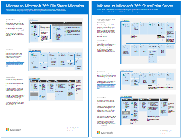
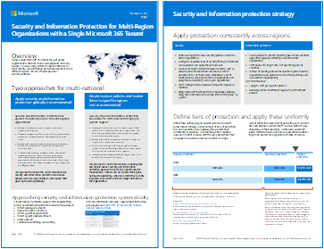
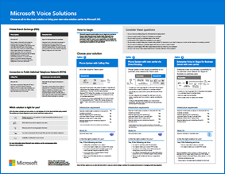
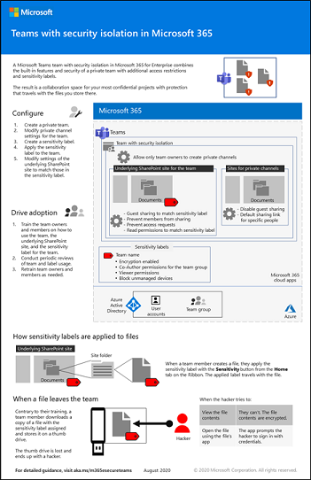

# Microsoft 365 productivity illustrations

The Microsoft 365 enterprise solution series provides guidance for implementing Microsoft 365 capabilities, especially where capabilities cross technologies, including Teams architecture diagrams.

## Microsoft Teams and related productivity services in Microsoft 365 for IT architects
The logical architecture of productivity services in Microsoft 365, leading with Microsoft Teams.

| Item | Description |
|:-----|:-----|
|   [PDF](https://github.com/MicrosoftDocs/microsoft-365-docs/raw/public/microsoft-365/downloads/msft-m365-teams-logical-architecture.pdf) \| [Visio](https://github.com/MicrosoftDocs/microsoft-365-docs/raw/public/microsoft-365/downloads/msft-m365-teams-logical-architecture.vsdx)   Updated January 2021   |Microsoft provides a suite of productivity services that work together to provide collaboration experiences with data governance, security, and compliance capabilities.    This series of illustrations provides a view into the logical architecture of productivity services for enterprise architects, leading with Microsoft Teams.|

## Groups in Microsoft 365 for IT Architects
This illustration includes information for IT architects about Microsoft 365 Groups. To learn about configuring and administering Microsoft 365 Groups and teams for collaboration in your organization, see [Set up secure collaboration with Microsoft 365](/microsoft-365/solutions/setup-secure-collaboration-with-teams) and [What is collaboration governance?](/microsoft-365/solutions/collaboration-governance-overview).

| Item | Description |
|:-----|:-----|
|   [PDF](https://github.com/MicrosoftDocs/microsoft-365-docs/raw/public/microsoft-365/downloads/msft-m365-groups.pdf) \| [Visio](https://github.com/MicrosoftDocs/OfficeDocs-Enterprise/raw/live/Enterprise/downloads/msft-m365-groups.vsdx)   Updated May 2020|These illustrations detail the different types of groups, how these are created and managed, and a few governance recommendations.|

## Migrate to Microsoft 365

Microsoft provides tools to migrate your on-premises network file shares and SharePoint Server sites to Microsoft 365 with an emphasis 
on protecting and ensuring your content's security during migration. This set of illustrations demonstrates the various methods available 
to move your content to SharePoint, Teams, and OneDrive and how your data flows through the process. 

| Item | Description |
|:-----|:-----|
|  [PDF](https://download.microsoft.com/download/0/5/b/05b7fb7c-1557-4ebb-9036-c5fc3a4cd94c/m365-migration-posters-mm-spmt.pdf)\|[Visio](https://download.microsoft.com/download/0/5/b/05b7fb7c-1557-4ebb-9036-c5fc3a4cd94c/m-365-migration-posters-mm-spmt.vsdx)   Updated March 2021 |Includes: <ul><li>  File share migration</li><li>SharePoint Server migration </li> </ul>  For more information, see [Migrate your content to Microsoft 365](/sharepointmigration/migrate-to-sharepoint-online).|

## Microsoft 365 information protection and compliance capabilities

Microsoft 365 includes a broad set of information protection and compliance capabilities. Together with Microsoft’s productivity tools, these capabilities are designed to help organizations collaborate in real time while adhering to stringent regulatory compliance frameworks. 

This set of illustrations uses one of the most regulated industries, financial services, to demonstrate how these capabilities can be applied to address common regulatory requirements. Feel free to adapt these illustrations for your own use. 

| Item | Description |
|:-----|:-----|
|   English: [Download as a PDF](https://download.microsoft.com/download/3/a/6/3a6ab1a3-feb0-4ee2-8e77-62415a772e53/m365-compliance-illustrations.pdf)  \| [Download as a Visio](https://download.microsoft.com/download/3/a/6/3a6ab1a3-feb0-4ee2-8e77-62415a772e53/m365-compliance-illustrations.vsdx)   Japanese: [Download as a PDF](https://download.microsoft.com/download/6/f/1/6f1a7d0e-dd8e-442e-b073-8e94327ae4f8/m365-compliance-illustrations.pdf)  \| [Download as a Visio](https://download.microsoft.com/download/6/f/1/6f1a7d0e-dd8e-442e-b073-8e94327ae4f8/m365-compliance-illustrations.vsdx)   Updated November 2020|Includes: <ul><li>  Microsoft information protection and data loss prevention</li><li>Retention policies and retention labels </li><li>Information barriers</li><li>Communication compliance</li><li>Insider risk</li><li>Third-party data ingestion</li>|

## Security and Information Protection for Multi-Region Organizations
Security and information protection for multi-region organizations with a single Microsoft 365 tenant

| Item | Description |
|:-----|:-----|
|   [PDF](https://github.com/MicrosoftDocs/microsoft-365-docs/raw/public/microsoft-365/downloads/msft-security-info-protect-multi-region.pdf) \| [Visio](https://github.com/MicrosoftDocs/microsoft-365-docs/raw/public/microsoft-365/downloads/msft-security-info-protect-multi-region.vsdx) Updated March 2020 |Using a single Microsoft 365 tenant for your global organization is the best choice and experience for many reasons. However, many architects wrestle with how to meet security and information protection objectives across different regions. This set of topics provides recommendations. |

## Microsoft Defender for Endpoint deployment strategy

Depending on your environment, some tools are better suited for certain architectures.

| Item | Description |
|:-----|:-----|
|  [PDF](https://github.com/MicrosoftDocs/microsoft-365-docs/raw/public/microsoft-365/security/defender-endpoint/downloads/mdatp-deployment-strategy.pdf)  \| [Visio](https://github.com/MicrosoftDocs/microsoft-365-docs/raw/public/microsoft-365/security/defender-endpoint/downloads/mdatp-deployment-strategy.vsdx)  Updated February 2020| The architectural material helps you plan your deployment for the following architectures: <ul><li> Cloud-native </li><li> Co-management </li><li> On-premise</li><li>Evaluation and local onboarding</li>

## Identity and device protection for Microsoft 365

Recommended capabilities for protecting identities and devices that access Microsoft 365, other SaaS services, and on-premises applications published with Azure AD Application Proxy.

| Item | Description |
|:-----|:-----|
|    [View as a PDF](../downloads/MSFT_cloud_architecture_identity&device_protection.pdf) \| [Download as a PDF](https://github.com/MicrosoftDocs/microsoft-365-docs/raw/public/microsoft-365/downloads/MSFT_cloud_architecture_identity&device_protection.pdf)  \| [Download as a Visio](https://github.com/MicrosoftDocs/microsoft-365-docs/raw/public/microsoft-365/downloads/MSFT_cloud_architecture_identity&device_protection.vsdx)   Updated September 2020|It's important to use consistent levels of protection across your data, identities, and devices. This model shows you which capabilities are comparable with more information on capabilities to protect identities and devices.    |
 

## Advanced eDiscovery architecture in Microsoft 365

Advanced eDiscovery end-to-end workflow and data flow, including within Microsoft 365 Multi-Geo environments. 

| Item | Description |
|:-----|:-----|
|   [View as an image](../media/solutions-architecture-center/m365-advanced-ediscovery-architecture.png) \| [Download as a PDF](https://download.microsoft.com/download/d/1/c/d1ce536d-9bcf-4d31-b75b-fcf0dc560665/m365-advanced-ediscovery-architecture.pdf)  \| [Download as a Visio](https://download.microsoft.com/download/d/1/c/d1ce536d-9bcf-4d31-b75b-fcf0dc560665/m365-advanced-ediscovery-architecture.vsdx)   Updated October 2020|Includes: <ul><li>  End-to-end workflow in a single environment</li><li>End-to-end workflow in a Microsoft 365 Multi-Geo environment </li><li>End-to-end data flow supporting the EDRM workflow</li> |
  

## Microsoft Telephony Solutions

Microsoft supports several options as you begin your journey to Teams in the Microsoft cloud. This poster helps you decide which Microsoft telephony solution (Phone System in the cloud or Enterprise Voice on-premises) is right for users in your organization, and how your organization can connect to the Public Switched Telephone Network (PSTN).

| Item | Description |
|:-----|:-----|
|   [PDF](https://download.microsoft.com/download/4/3/5/435cd4e9-ca56-4fd1-acb6-d1fda7952320/microsoft-voice-solutions.pdf) \| [Visio](https://download.microsoft.com/download/7/5/c/75c13012-e20c-48bd-a6dd-ea49d1a3420d/microsoft-voice-solutions.vsdx)  Updated March 2021 | For more information, see [Plan your Teams voice solution](/microsoftteams/cloud-voice-landing-page).|

## Set up your infrastructure for hybrid work

With Microsoft 365 and other Microsoft cloud technologies, you can provide your workers with secure access to your organization's on-premises and cloud-based information, tools, and resources from their homes. 

  
[PDF](https://download.microsoft.com/download/9/b/b/9bb5fa79-74e9-497b-87c5-4021e53d9fc2/hybrid-worker-infrastructure.pdf) | [PowerPoint](https://download.microsoft.com/download/9/b/b/9bb5fa79-74e9-497b-87c5-4021e53d9fc2/hybrid-worker-infrastructure.pptx)  
Updated June 2021

For more information, see the article for this poster: [Set up your infrastructure for hybrid work with Microsoft 365](empower-people-to-work-remotely.md).

## Microsoft Teams with security isolation

With Microsoft 365, you can configure a private team in Microsoft Teams and use SharePoint site security settings and a unique sensitivity label to encrypt files so that only team members can decrypt them.

  
[PDF](https://github.com/MicrosoftDocs/microsoft-365-docs/raw/public/microsoft-365/downloads/team-security-isolation-poster.pdf) | [PowerPoint](https://download.microsoft.com/download/8/0/5/8057fc16-c044-40b6-a652-7ed555ba2895/team-security-isolation-poster.pptx)   
Updated August 2020

For more information, see the article for this poster: [Configure a team with security isolation](secure-teams-security-isolation.md).

  
## See Also

[Architectural models for SharePoint, Exchange, Skype for Business, and Lync](../enterprise/architectural-models-for-sharepoint-exchange-skype-for-business-and-lync.md)
  
[Cloud adoption Test Lab Guides (TLGs)](../enterprise/cloud-adoption-test-lab-guides-tlgs.md)
