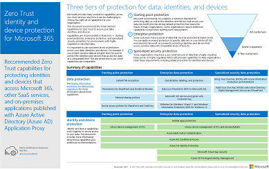
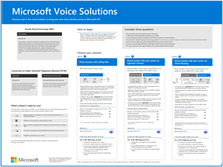

# Microsoft 365 productivity illustrations

The Microsoft 365 enterprise solution series provides guidance for implementing Microsoft 365 capabilities, especially where capabilities cross technologies, including Teams architecture diagrams.

## Microsoft Teams and related productivity services in Microsoft 365 for IT architects
The logical architecture of productivity services in Microsoft 365, leading with Microsoft Teams.

| Item | Description |
|:-----|:-----|
|   [PDF](https://github.com/MicrosoftDocs/microsoft-365-docs/raw/public/microsoft-365/downloads/msft-m365-teams-logical-architecture.pdf) \| [Visio](https://github.com/MicrosoftDocs/microsoft-365-docs/raw/public/microsoft-365/downloads/msft-m365-teams-logical-architecture.vsdx)   Updated January 2021   |Microsoft provides a suite of productivity services that work together to provide collaboration experiences with data governance, security, and compliance capabilities.    This series of illustrations provides a view into the logical architecture of productivity services for enterprise architects, leading with Microsoft Teams.|

## Microsoft 365 for frontline workers scenarios
Microsoft 365 for frontline workers can help you connect and engage your workforce, enhance workforce management, and increase operational efficiency. You can use the capabilities included with Microsoft 365 for frontline workers, from Microsoft Teams, to SharePoint, Viva Connections, Viva Engage, and the Power Platform, or add in solutions from our partners in the digital ecosystem to connect with existing systems or create custom solutions for your business.

Use the following posters to start envisioning what your organization can do with Microsoft 365 for frontline workers.

| Item | Description |
|:-----|:-----|
|   [PDF](https://go.microsoft.com/fwlink/?linkid=2206713) \| [Visio](https://go.microsoft.com/fwlink/?linkid=2206386)   Updated September 2022   |**Frontline worker scenarios**  This poster provides an overview of the scenarios you can implement for your frontline workforce to increase communications, enhance wellbeing and engagement, train and onboard your workers, and manage your workforce and operations.  **Related solution guides**   <ul><li>[Microsoft 365 for frontline workers](/microsoft-365/frontline/flw-overview)|
|   [PDF](https://go.microsoft.com/fwlink/?linkid=2206475) \| [Visio](https://go.microsoft.com/fwlink/?linkid=2206474)   Updated September 2022   |**Healthcare scenarios**  This poster provides an overview of the scenarios you can implement for your frontline workforce in a healthcare setting.  **Related solution guides**   <ul><li>[Get started with Microsoft 365 for healthcare organizations](/microsoft-365/frontline/teams-in-hc)|
|   [PDF](https://go.microsoft.com/fwlink/?linkid=2206476) \| [Visio](https://go.microsoft.com/fwlink/?linkid=2206271)   Updated September 2022   |**Retail scenarios**  This poster provides an overview of the scenarios you can implement for your frontline workforce in a retail setting.  **Related solution guides**   <ul><li>[Get started with Microsoft 365 for retail organizations](/microsoft-365/frontline/teams-for-retail-landing-page)|

## Corporate communications with Microsoft 365 — a Contoso case study
Employee engagement is a significant contributor to workplace satisfaction, retention, and productivity at any organization. Across Microsoft 365, there are multiple ways to communicate and engage your audience. 

Knowing which method (or combinations of methods) to use and when to use them depends on your audience and the communication culture of your organization. 

| Item | Description |
|:-----|:-----|
|   [PDF](https://download.microsoft.com/download/0/3/4/034fbee5-ecf4-4559-86d3-815e898f21ea/relecloud-corporate-communication-poster.pdf) \| [Visio](https://download.microsoft.com/download/0/3/4/034fbee5-ecf4-4559-86d3-815e898f21ea/relecloud-corporate-communication-poster.vsdx)   Updated January 2022   |This poster illustrates how Contoso keeps employees informed and engaged across popular communication scenarios. Contoso uses a variety of Microsoft 365 apps, including a new offering, Viva Connections.  **Related solution guides**   <ul><li>[Organizational communications: Guidance, methods, and products](/sharepoint/corporate-communications-overview)|

## Groups in Microsoft 365 for IT Architects
This illustration includes information for IT architects about Microsoft 365 Groups. To learn about configuring and administering Microsoft 365 Groups and teams for collaboration in your organization, see [Set up secure collaboration with Microsoft 365](/microsoft-365/solutions/setup-secure-collaboration-with-teams) and [What is collaboration governance?](/microsoft-365/solutions/collaboration-governance-overview).

| Item | Description |
|:-----|:-----|
|   [PDF](https://download.microsoft.com/download/6/3/0/6309218f-a169-4f2d-af4c-2fe49e30ba17/msft-m365-groups.pdf) \| [Visio](https://download.microsoft.com/download/6/3/0/6309218f-a169-4f2d-af4c-2fe49e30ba17/msft-m365-groups.vsdx)   Updated May 2022|These illustrations detail the different types of groups, how these are created and managed, and a few governance recommendations.

## Migrate to Microsoft 365

Microsoft provides tools to migrate your on-premises network file shares and SharePoint Server sites to Microsoft 365 with an emphasis on protecting and ensuring your content's security during migration. This set of illustrations demonstrates the various methods available to move your content to SharePoint, Teams, and OneDrive and how your data flows through the process.

| Item | Description |
|:-----|:-----|
| 
 [PDF](https://download.microsoft.com/download/0/5/b/05b7fb7c-1557-4ebb-9036-c5fc3a4cd94c/m365-migration-posters-mm-spmt.pdf)\|[Visio](https://download.microsoft.com/download/0/5/b/05b7fb7c-1557-4ebb-9036-c5fc3a4cd94c/m-365-migration-posters-mm-spmt.vsdx) 
 Updated March 2021 |Includes: <ul><li> File share migration</li><li>SharePoint Server migration</li></ul> 
 For more information, see [Migrate your content to Microsoft 365](/sharepointmigration/migrate-to-sharepoint-online).|

## Microsoft 365 information protection and compliance capabilities

Microsoft 365 includes a broad set of information protection and compliance capabilities. Together with Microsoft’s productivity tools, these capabilities are designed to help organizations collaborate in real time while adhering to stringent regulatory compliance frameworks.

This set of illustrations uses one of the most regulated industries, financial services, to demonstrate how these capabilities can be applied to address common regulatory requirements. Feel free to adapt these illustrations for your own use.

| Item | Description |
|:-----|:-----|
|   English: [Download as a PDF](https://download.microsoft.com/download/3/a/6/3a6ab1a3-feb0-4ee2-8e77-62415a772e53/m365-compliance-illustrations.pdf)  \| [Download as a Visio](https://download.microsoft.com/download/3/a/6/3a6ab1a3-feb0-4ee2-8e77-62415a772e53/m365-compliance-illustrations.vsdx)   Japanese: [Download as a PDF](https://download.microsoft.com/download/6/f/1/6f1a7d0e-dd8e-442e-b073-8e94327ae4f8/m365-compliance-illustrations.pdf)  \| [Download as a Visio](https://download.microsoft.com/download/6/f/1/6f1a7d0e-dd8e-442e-b073-8e94327ae4f8/m365-compliance-illustrations.vsdx)   Updated November 2020|Includes: <ul><li>  Information protection and data loss prevention</li><li>Retention policies and retention labels </li><li>Information barriers</li><li>Communication compliance</li><li>Insider risk</li><li>Third-party data ingestion</li>|

## Security and Information Protection for Multi-Region Organizations
Security and information protection for multi-region organizations with a single Microsoft 365 tenant

| Item | Description |
|:-----|:-----|
|   [PDF](https://github.com/MicrosoftDocs/microsoft-365-docs/raw/public/microsoft-365/downloads/msft-security-info-protect-multi-region.pdf) \| [Visio](https://github.com/MicrosoftDocs/microsoft-365-docs/raw/public/microsoft-365/downloads/msft-security-info-protect-multi-region.vsdx) Updated March 2020 |Using a single Microsoft 365 tenant for your global organization is the best choice and experience for many reasons. However, many architects wrestle with how to meet security and information protection objectives across different regions. This set of topics provides recommendations. |

<!--
## Security Guidance for Political Campaigns, Nonprofits, and Other Agile Organizations

If your organization is agile, you have a small IT team, and your threat profile is higher than average, this guidance is designed for you. This solution demonstrates how to quickly build an environment with essential cloud services that include secure controls from the start. This guidance includes prescriptive security recommendations for protecting data, identities, email, and access from mobile devices.

| Item | Description |
|:---|:---|
|**Microsoft Security Guidance for Political Campaigns**   [:::image type="content" source="../media/d370ce28-ca40-4930-9a2c-907312aa06c8.png" alt-text="Thumbnail for mini poster about security guidance.":::](https://download.microsoft.com/download/B/4/D/B4D520C3-4D0C-4B4D-BFB9-09F0651C2775/MSFT_Cloud_architecture_security%20for%20political%20campaigns.pdf)   [PDF](https://download.microsoft.com/download/B/4/D/B4D520C3-4D0C-4B4D-BFB9-09F0651C2775/MSFT_Cloud_architecture_security%20for%20political%20campaigns.pdf) \| [Visio](https://download.microsoft.com/download/B/4/D/B4D520C3-4D0C-4B4D-BFB9-09F0651C2775/MSFT_Cloud_architecture_security%20for%20political%20campaigns.vsdx)|This guidance uses a political campaign organization as an example. Use this guidance as a starting point for any environment.|
|**Microsoft Security Guidance for Nonprofits**   [:::image type="content" source="../media/e4784889-1c69-4067-9a8f-31d31d1eceea.png" alt-text="Thumbnail for security guidance download.":::](https://download.microsoft.com/download/9/4/3/94389612-C679-4061-8DF2-D9A15D72B65F/Microsoft_Cloud%20Architecture_Security%20for%20Nonprofits.pdf)   [PDF](https://download.microsoft.com/download/9/4/3/94389612-C679-4061-8DF2-D9A15D72B65F/Microsoft_Cloud%20Architecture_Security%20for%20Nonprofits.pdf) \| [Visio](https://download.microsoft.com/download/9/4/3/94389612-C679-4061-8DF2-D9A15D72B65F/Microsoft_Cloud%20Architecture_Security%20for%20Nonprofits.vsdx)|This guide is slightly revised for nonprofit organizations. For example, it references Office 365 Nonprofit plans. The technical guidance is the same as the political campaign solution guide.|
-->

## Microsoft Defender for Endpoint deployment strategy

Depending on your environment, some tools are better suited for certain architectures.

| Item | Description |
|:-----|:-----|
|  [PDF](https://download.microsoft.com/download/5/6/0/5609001f-b8ae-412f-89eb-643976f6b79c/mde-deployment-strategy.pdf)  \| [Visio](https://download.microsoft.com/download/5/6/0/5609001f-b8ae-412f-89eb-643976f6b79c/mde-deployment-strategy.vsdx)  Updated September 2021| The architectural material helps you plan your deployment for the following architectures: <ul><li> Cloud-native </li><li> Co-management </li><li> On-premises</li><li>Evaluation and local onboarding</li> |
<!--

## Zero Trust identity and device protection for Microsoft 365

Recommended Zero Trust capabilities for protecting identities and devices that access Microsoft 365, other SaaS services, and on-premises applications published with Azure AD Application Proxy.

| Item | Description |
|:-----|:-----|
|    [View as a PDF](../downloads/MSFT_cloud_architecture_identity&device_protection.pdf) \| [Download as a PDF](https://github.com/MicrosoftDocs/microsoft-365-docs/raw/public/microsoft-365/downloads/MSFT_cloud_architecture_identity&device_protection.pdf)  \| [Download as a Visio](https://github.com/MicrosoftDocs/microsoft-365-docs/raw/public/microsoft-365/downloads/MSFT_cloud_architecture_identity&device_protection.vsdx)   Updated November 2021|It's important to use consistent levels of protection across your data, identities, and devices. This model shows you which Zero Trust capabilities are comparable with more information on capabilities to protect identities and devices.    |

--> 

## eDiscovery (Premium) architecture in Microsoft 365

eDiscovery (Premium) end-to-end workflow and data flow, including within Microsoft 365 Multi-Geo environments.

| Item | Description |
|:-----|:-----|
|   [View as an image](../media/solutions-architecture-center/m365-advanced-ediscovery-architecture.png) \| [Download as a PDF](https://download.microsoft.com/download/d/1/c/d1ce536d-9bcf-4d31-b75b-fcf0dc560665/m365-advanced-ediscovery-architecture.pdf)  \| [Download as a Visio](https://download.microsoft.com/download/d/1/c/d1ce536d-9bcf-4d31-b75b-fcf0dc560665/m365-advanced-ediscovery-architecture.vsdx)   Updated October 2020|Includes: <ul><li>  End-to-end workflow in a single environment</li><li>End-to-end workflow in a Microsoft 365 Multi-Geo environment </li><li>End-to-end data flow supporting the EDRM workflow</li> |

## Microsoft Telephony Solutions

This poster helps you decide which Microsoft telephony solution is right for users in your organization. It describes Phone System, Microsoft's technology for enabling call control and Private Branch Exchange (PBX) capabilities in Microsoft 365 with Microsoft Teams. The poster also describes options for connecting Phone System to the Public Switched Telephone Network (PSTN).  

| Item | Description |
|:-----|:-----|
|   [PDF](https://download.microsoft.com/download/4/3/5/435cd4e9-ca56-4fd1-acb6-d1fda7952320/microsoft-voice-solutions.pdf) \| [Visio](https://download.microsoft.com/download/7/5/c/75c13012-e20c-48bd-a6dd-ea49d1a3420d/microsoft-voice-solutions.vsdx)  Updated June 2022 | For more information, see [Plan your Teams voice solution](/microsoftteams/cloud-voice-landing-page).|

## Set up your infrastructure for hybrid work

With Microsoft 365 and other Microsoft cloud technologies, you can provide your workers with secure access to your organization's on-premises and cloud-based information, tools, and resources from their homes.

  
[PDF](https://download.microsoft.com/download/9/b/b/9bb5fa79-74e9-497b-87c5-4021e53d9fc2/hybrid-worker-infrastructure.pdf)    
Updated June 2021

For more information, see the article for this poster: [Set up your infrastructure for hybrid work with Microsoft 365](empower-people-to-work-remotely.md).

## See Also

[Architectural models for SharePoint, Exchange, Skype for Business, and Lync](../enterprise/architectural-models-for-sharepoint-exchange-skype-for-business-and-lync.md)

[Cloud adoption Test Lab Guides (TLGs)](../enterprise/cloud-adoption-test-lab-guides-tlgs.md)
