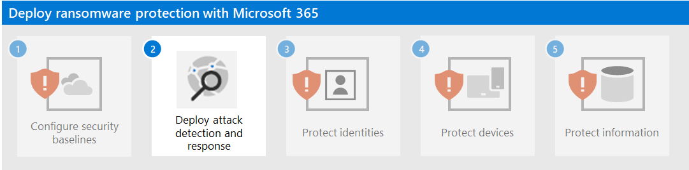

# Step 1.Configure security baselines

Apply security baselines to harden internet-facing servers, clients, and Office applications.

## Microsoft 365 security baseline

Assess and measure security posture using Microsoft Secure Score.

Use attack surface reduction rules to help block suspicious activity and vulnerable content:

- Block all Office applications from creating child processes
- Block executable content from email client and webmail
- Block executable files from running unless they meet a prevalence, age, or trusted list criterion
- Block execution of potentially obfuscated scripts
- Block JavaScript or VBScript from launching downloaded executable content
- Block Office applications from creating executable content
- Block Office applications from injecting code into other processes
- Block Office communication application from creating child processes
- Block untrusted and unsigned processes that run from USB
- Block persistence through WMI event subscription
- Block credential stealing from the Windows local security authority subsystem (lsass.exe)
- Block process creations originating from PSExec and WMI commands

## Exchange email management baseline 

To help prevent initial access to your tenant from an email-based attack:

- Enable Microsoft Defender Antivirus email scanning.
- Use Microsoft Defender for Office 365 for enhanced phishing protection and coverage against new threats and polymorphic variants.
- Check your Office 365 email filtering settings to ensure you block spoofed emails, spam, and emails with malware. Use Microsoft Defender for Office 365 for enhanced phishing protection and coverage against new threats and polymorphic variants. Configure Microsoft Defender for Office 365 to recheck links on click and delete delivered mails in response to newly acquired threat intelligence.
- Review and update to the latest recommended settings for EOP and Microsoft Defender for Office 365 security.
- Configure Microsoft Defender for Office 365 to recheck links on click and delete delivered mails in response to newly acquired threat intelligence.

## Next step

[Step 2. Deploy attack detection and response](protect-against-ransomware-microsoft-365-step2.md)
