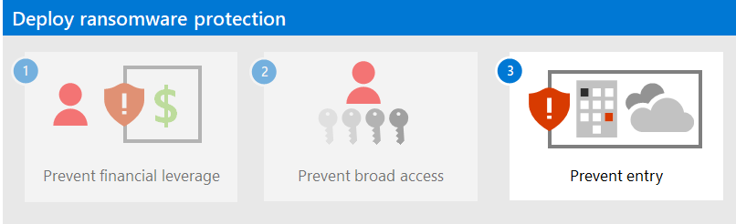

# Step 2. Deploy attack detection and response

Enable, configure, and use:

- M365D
- MDO
- MDE
- MDI
- Azure Identity Protection
- MCAS

Look for:

- Credential theft
- Escalation privilege
- Data exfiltration

## Impact on users and change management

TBD

## Next step

[Step 3. Protect identities](protect-against-ransomware-microsoft-365-step3.md)
