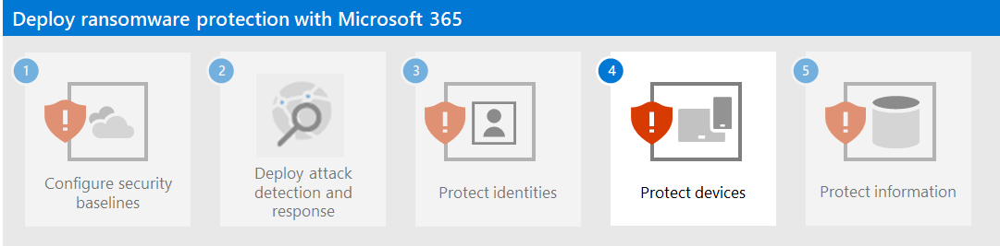

# Step 3. Protect identities

Use the following sections to protect your organization from credential compromise, which is typically the first stage of a larger ransomware attack.

## Increase sign-in security

First, use these password best practices:

- Block known weak and custom passwords with Azure AD Password Protection.
- Extend blocking of known weak and custom passwords to your on-premises Active Directory Domain Services (AD DS) with Azure AD Password Protection.
- Allow your users to change their own passwords with Self-Service Password Reset (SSPR).

Next, implement the [Common identity and device access policies](/microsoft-365/security/office-365-security/identity-access-policies). These policies provide higher security for access to Microsoft 365 cloud services, including on-premises applications published with Azure AD Application Proxy. 

For user sign-ins, these policies include:

- Requiring MFA for priority accounts (in the short term) and eventually all user accounts.
- Requiring high-risk users to use MFA.
- Requiring high-risk users to change their passwords.

## Prevent privilege escalation

Use these best practices:

- Implement the principle of least-privilege and maintain credential hygiene. 
- Avoid the use of domain-wide, admin-level service accounts. 
- Restricting local administrative privileges can help limit installation of Remote Access Trojans (RATs) and other unwanted applications.
- Use Azure AD Conditional Access to explicitly validate the trust of users and workstations before allowing access to administrative portals. See [this example](/azure/active-directory/conditional-access/howto-conditional-access-policy-azure-management) for the Azure portal.
- Enable Local Admin password management.
- Determine where highly privileged accounts are signing in and exposing credentials. Highly privileged accounts should not be present on workstations.
- Disable the local storage of passwords and credentials.

## Impact on users and change management

Users in your organization must be made aware of:

- The new requirements for stronger passwords.
- The changes in sign-in processes, such as the required use of MFA and the MFA secondary authenticaton method registration.
- The use of password maintenance with SSPR. For example, no more calls to helpdesk for a password reset.
- The prompting to require MFA or a password change for sign-ins that are determined to be risky.

## Resulting configuration

Here is the ransomware protection for your tenant after this step.

## Next step

[Step 4. Protect devices](protect-against-ransomware-microsoft-365-step4.md)
