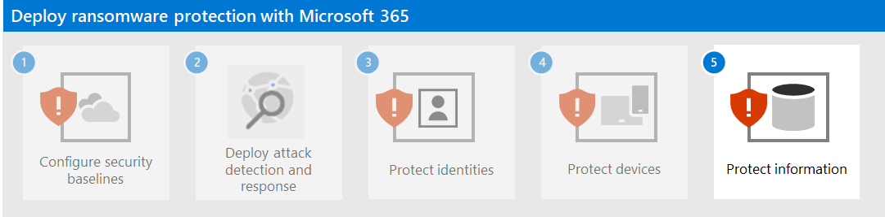

# Step 4. Protect devices

To help protect against the initial access part of an attack:

- Enable Network Protection in Microsoft Defender for Endpoint and Microsoft 365 Defender.
- Configure site and download checking in Microsoft Defender SmartScreen to block or warn.
- Configure app and file checking in Microsoft Defender SmartScreen to block or warn.
- Enable Microsoft Defender Antivirus scanning of downloaded files and attachments.
- Set Remote Desktop security level to TLS in Microsoft Defender for Endpoint and Microsoft 365 Defender.

To help protect against the lateral movement part of an attack:

- Turn on Microsoft Defender Firewall.
- Update Microsoft Defender Antivirus definitions.

To reduce the impact of the attack:

- Use advanced protection against ransomware.

To help protect against an attacker evading the security defences:

- Keep cloud-delivered protection in Microsoft Defender Antivirus turned on.
- Keep Microsoft Defender Antivirus real-time behavior monitoring turned on.
- Turn on real-time protection.
- Turn on tamper protection in Microsoft Defender for Endpoint, to prevent malicious changes to security settings.

To help protect against an attacker executing code as part of an attack:

- Turn on Microsoft Defender Antivirus.
- Block Win32 API calls from Office macros.
- Migrate all legacy workbooks requiring Excel 4.0 macros to the updated VBA macro format using this process.
- Disable use of unsigned macros. Ensure all internal macros with business need are signed and leveraging trusted locations to ensure unknown macros will not run in your environment.
- Stop malicious XLM or VBA macros by ensuring runtime macro scanning by Antimalware Scan Interface (AMSI) is on. This feature (enabled by default) is on if the Group Policy setting for Macro Run Time Scan Scope is set to Enable for All Files or Enable for Low Trust Files. Get the latest group policy template files.

## Next step

[Step 5. Protect information](protect-against-ransomware-microsoft-365-step5.md)
