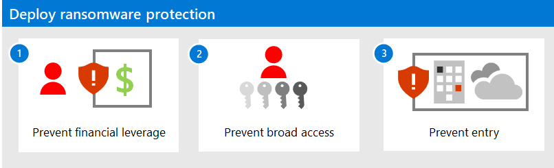
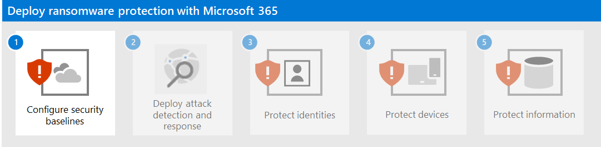

# Deploy protection against ransomware with Microsoft 365

Ransomware is a type of extortion attack that encrypts files and folders, preventing access to important data. Commodity ransomware typically spreads like a virus that infects devices and only requires malware remediation. Human-operated ransomware is the result of an active attack by cybercriminals that infiltrate an organization’s on-premises or cloud IT infrastructure, elevate their privileges, and deploy ransomware to critical data.

Once deployed, an attacker demands money from victims in exchange for decryption keys or a promise not to release sensitive data to the dark web or the public internet. Human-operated ransomware can also be used to shut down critical machines or processes, such as those needed for industrial production, bringing normal business operations to a halt until the ransom is paid and the damage is corrected or the organization remediates the damage themselves.

A human-operated ransomware attack can be catastrophic to businesses of all sizes and are difficult to clean up, requiring complete adversary eviction to protect against future attacks. Unlike commodity ransomware, human-operated ransomware can continue to threaten businesses operations after the initial ransom incident.

## What’s in this solution

This solution steps you through the deployment of three layers of protection and mitigation features, configurations, and ongoing operations to minimize the ability of a ramsomware attacker to use the critical data in your Microsoft 365 tenant as financial leverage and prevent entry and escalation of access.

It is common practice for human-operated ransomware attackers to infiltrate an organization well ahead of the actual attack that exfiltrates, encrypts, or damages data and demands a ransom amount. They accumulate elevated credentials and access and compile information on where the critical data is located. This is sometimes known as “banking” an organization. When the actual attack occurs, typically during a vulnerable time such as a weekend or holiday, the attackers can quickly exfiltrate data and then encrypt or destroy it.

The steps in this solution are designed on the assumption that attackers may have already “banked” your Microsoft 365 tenant. 

If the attackers are already in: 

1. 	Your first step is to *protect your critical data in ways that prevent an attacker from gaining financial leverage on your organization*. For example, if it is possible to restore critical files encrypted by attackers from an offsite and offline backup, then the attackers lose the ability to hold those critical files for ransom.
2. Your next step is to ensure that *user accounts have an appropriate level of access and that it is difficult to increase levels of access through privilege escalation without detection*.
3. Your final step is to *prevent future infiltrations by preventing entry into your organization through user accounts, devices, email, or applications*.

To protect your Microsoft 365 tenant from a ransomware attack, use these Microsoft 365 features.

| Capability or feature | Description | Licensing |
|:-------|:-----|:-------|
|MFA enforced with security defaults|Protect against compromised identities and devices by requiring a second form of authentication for sign-ins. Security defaults requires MFA for all user accounts.|Microsoft 365 E3 or E5|
|MFA enforced with Conditional Access|Require MFA based on the properties of the sign-in with Conditional Access policies.|Microsoft 365 E3 or E5|
|MFA enforced with risk-based Conditional Access|Require MFA based on the risk of the user sign-in with Microsoft Defender for Identity.|Microsoft 365 E5 or E3 with Azure AD Premium P2 licenses|
|Microsoft Intune|Manage devices and applications.|Microsoft 365 E3 or E5|
|  |  |  |
|  |  |  |
|  |  |  |
|  |  |  |
|  |  |  |
|  |  |  |
||||

## Impact on users and change management

Deploying additional security features and policies to your Microsoft 365 tenant can impact your users. For example, you may impose a new security policy that requires users to create new teams for specific uses with a list of user accounts as members, instead of more easily creating a team for all users in the organization. This can help prevent a ransomware attacker from exploring the available teams and “banking” them and their resources.
This solution will identify when a new configuration or recommended security policy can impact your users so you can implement the required change management.

<!--

Here are the preventative and mitigation steps to minimize the damage from a ransomware attack, in order of urgency:

1. Prevent a ransomware attacker from obtaining financial leverage and executing the activities leading to the ransom demand. The assumption is that your organization has already been infiltrated and the attacker has escalated privileges and is waiting for the right time to ransom you. 

2. Prevent an attacker who has infiltrated your tenant from escalating their privileges through the credentials of an admin or priority account. The assumption is that your organization has already been infiltrated but the attacker has not yet escalated their privileges.

2. Prevent a ransomware attacker from accessing your tenant. The assumption is that your organization has NOT already been infiltrated.

--> 

## Next steps

Use these steps:

1. [Remove attacker financial leverage with data protection](protect-against-ransomware-microsoft-365-step1.md)
2. [Minimize privileged access and prevent credential escalation](protect-against-ransomware-microsoft-365-step2.md)
3. [Prevent attacker access](protect-against-ransomware-microsoft-365-step3.md)
