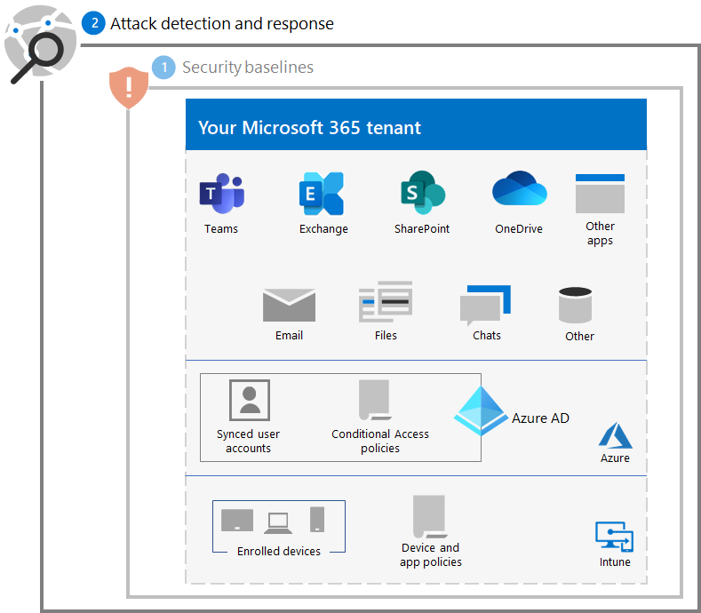
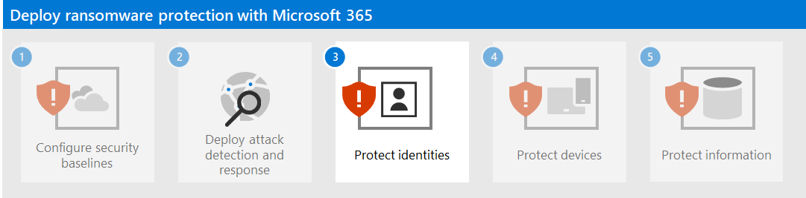

# Step 2. Deploy attack detection and response

Enable, configure, and use these tools for ransomware attack detection and response.

| Feature | Description | Where to start | How to use it for detection and response |
|:-------|:-----|:-------|:-------|
| [Microsoft 365 Defender](/microsoft-365/security/defender) | Combines signals and orchestrates capabilities into a single solution    Enables security professionals to stitch together threat signals and determine the full scope and impact of a threat    Automates actions to prevent or stop the attack and self-heal affected mailboxes, endpoints, and user identities | [Get started](/microsoft-365/security/defender/get-started) | [Incident response](/microsoft-365/security/defender/incidents-overview) |
| [Microsoft Defender for Identity](/defender-for-identity/what-is) |  Identifies, detects, and investigates advanced threats, compromised identities, and malicious insider actions directed at your organization through a cloud-based security interface uses your on-premises Active Directory Domain Services (AD DS) signals | [Overview](/defender-for-identity/what-is) | [Working with the Microsoft Defender for Identity portal](/defender-for-identity/workspace-portal) |
| [Microsoft Defender for Office 365](/microsoft-365/security/office-365-security) | Safeguards your organization against malicious threats posed by email messages, links (URLs), and collaboration tools    Protects against malware, phishing, spoofing, and other attack types  | [Overview](/microsoft-365/security/office-365-security/overview) | [Threat hunting](/microsoft-365/security/office-365-security/threat-hunting-in-threat-explorer) |
| [Microsoft Defender for Endpoint](/microsoft-365/security/defender-endpoint) | Enables detection and response to advanced threats across endpoints (devices) | [Overview](/microsoft-365/security/defender-endpoint/microsoft-defender-endpoint)  | [Endpoint detection and response](/microsoft-365/security/defender-endpoint/overview-endpoint-detection-response) |
| [Azure Active Directory (Azure AD) Identity Protection](/azure/active-directory/identity-protection/) | Automates detection and remediation of identity-based risks and investigation of those risks | [Overview](/azure/active-directory/identity-protection/overview-identity-protection) | [Investigate risk](/azure/active-directory/identity-protection/howto-identity-protection-investigate-risk) |
| [Microsoft Cloud App Security](/cloud-app-security) | A cloud access security broker for discovery, investigation, and governance across all your Microsoft and third-party cloud services. | [Overview](/cloud-app-security/what-is-cloud-app-security) | [Investigate](/cloud-app-security/investigate) |

>[!Note]
>All of these tools require Microsoft 365 E5 or Microsoft 365 E3 with the Microsoft 365 E5 Security add-on.
>

Use these tools to detect and respond to the following common threats from ransomware attackers:

- Credential theft

   - Azure AD Identity Protection
   - Microsoft Defender for Identity
   - Microsoft Defender for Office 365

- Device compromise

   - Microsoft Defender for Endpoint
   - Microsoft Defender for Office 365

- Escalation of privilege

   - Azure AD Identity Protection
   - Microsoft Cloud App Security

- Malicious app behavior

   - Microsoft Cloud App Security

- Data exfiltration

   - Microsoft Defender for Office 365
   - Microsoft Cloud App Security

The following tools use Microsoft 365 Defender and its portal (https://security.microsoft.com) as a common threat collection and analysis point:

- Microsoft Defender for Identity
- Microsoft Defender for Office 365
- Microsoft Defender for Endpoint
- Microsoft Cloud App Security

Microsoft 365 Defender combines threat signals into alerts and connected alerts into an incident so that your security analysts can more quickly detect, investigate, and remediate the phases of a ransomware attack.

You can [set up a trial environment](/microsoft-365/security/defender/eval-overview) to evaluate the features and capabilities of Microsoft 365 Defender.

## Resulting configuration

Here is the ransomware protection for your tenant for steps 1 and 2.

## Next step

Continue with [Step 3](ransomware-protection-microsoft-365-identities.md) to protect identities in your Microsoft 365 tenant.
