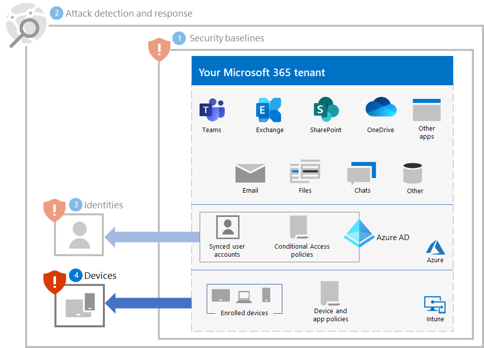
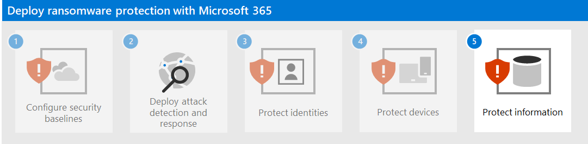

# Step 4. Protect devices

To help protect devices (endpoints) against the initial access part of a ransomware attack:

- Deploy [Intune](/mem/intune/fundamentals/what-is-intune) as a mobile device management (MDM) and mobile application management (MAM) provider for your devices and enroll your organization-owned devices.
- Implement the [Common identity and device access policies](/microsoft-365/security/office-365-security/zero-trust-identity-device-access-policies-common) to validate the user account credentials and enforce device health and compliance requirements.
- Enable [Network Protection](/microsoft-365/security/defender-endpoint/network-protection) in Microsoft Defender for Endpoint and Microsoft Defender XDR.
- Configure [site and download checking](/windows/security/threat-protection/microsoft-defender-smartscreen/microsoft-defender-smartscreen-available-settings) and [app and file checking](/windows/security/threat-protection/microsoft-defender-smartscreen/microsoft-defender-smartscreen-available-settings) in Microsoft Defender SmartScreen to block or warn.
- Enable [Microsoft Defender Antivirus scanning](/microsoft-365/security/defender-endpoint/configure-advanced-scan-types-microsoft-defender-antivirus) of downloaded files and attachments.
- Set **Remote Desktop security level** to **TLS** in Microsoft Defender for Endpoint and Microsoft Defender XDR.

## Windows 11 or 10 devices

To help protect against the lateral movement part of an attack from a Windows 11 or 10 device:

- [Turn on Microsoft Defender Firewall](https://support.microsoft.com/windows/turn-microsoft-defender-firewall-on-or-off-ec0844f7-aebd-0583-67fe-601ecf5d774f).
- [Update Microsoft Defender Antivirus definitions](/microsoft-365/security/defender-endpoint/manage-updates-baselines-microsoft-defender-antivirus).

To reduce the impact of the attack:

- Use [attack surface reduction rules and advanced protection against ransomware](/microsoft-365/security/defender-endpoint/attack-surface-reduction-rules-reference#use-advanced-protection-against-ransomware).

To help protect against an attacker evading your security defenses:

- Keep [cloud-delivered protection](/microsoft-365/security/defender-endpoint/enable-cloud-protection-microsoft-defender-antivirus) in Microsoft Defender Antivirus turned on.
- Keep Microsoft Defender Antivirus [real-time behavior monitoring](/microsoft-365/security/defender-endpoint/configure-real-time-protection-microsoft-defender-antivirus) turned on.
- Turn on [real-time protection](/microsoft-365/security/defender-endpoint/configure-real-time-protection-microsoft-defender-antivirus).
- Turn on [tamper protection in Microsoft Defender for Endpoint](/microsoft-365/security/defender-endpoint/prevent-changes-to-security-settings-with-tamper-protection) to prevent malicious changes to security settings.

To help protect against an attacker executing code as part of an attack:

- Turn on [Microsoft Defender Antivirus](/mem/intune/user-help/turn-on-defender-windows).
- [Block Win32 API calls from Office macros](/microsoft-365/security/defender-endpoint/attack-surface-reduction-rules#block-win32-api-calls-from-office-macros).
- Migrate all legacy workbooks requiring Excel 4.0 macros to the updated VBA macro format.
- [Disable use of unsigned macros](https://support.microsoft.com/topic/enable-or-disable-macros-in-office-files-12b036fd-d140-4e74-b45e-16fed1a7e5c6). Ensure all internal macros with business need are signed and leveraging [trusted locations](/deployoffice/security/designate-trusted-locations-for-files-in-office) to ensure unknown macros will not run in your environment.
- Stop malicious XLM or VBA macros by ensuring runtime macro scanning by [Antimalware Scan Interface](https://www.microsoft.com/security/blog/2021/03/03/xlm-amsi-new-runtime-defense-against-excel-4-0-macro-malware/) (AMSI) is on. This feature (enabled by default) is on if the Group Policy setting for **Macro Run Time Scan Scope** is set to **Enable for All Files** or **Enable for Low Trust Files**. Get the latest group policy template files.

## Impact on users and change management

As you implement these protections, perform change management for the following:

- The [common Zero Trust identity and device access policies](/microsoft-365/security/office-365-security/zero-trust-identity-device-access-policies-common) can deny access to users who have non-compliant devices.
- Downloading files might warn users before the download or it might be blocked.
- Some Office, Excel 4.0, XLM, or VBA macros might no longer run.

## Resulting configuration

Here's the ransomware protection for your tenant for steps 1-4.

## Next step

Continue with [Step 5](ransomware-protection-microsoft-365-information.md) to protect information in your Microsoft 365 tenant. 
