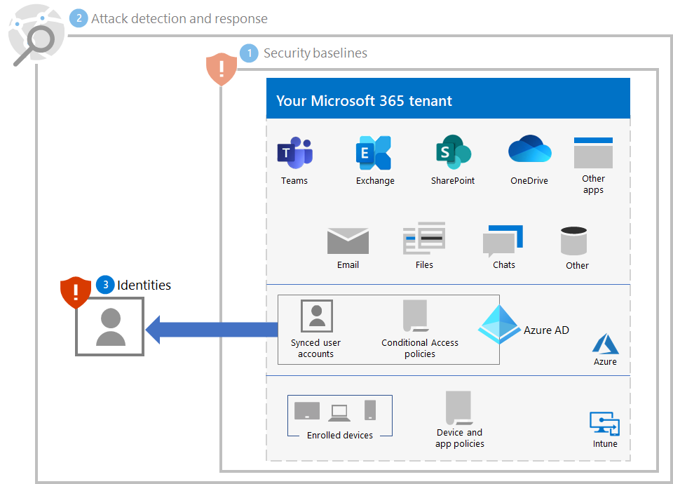
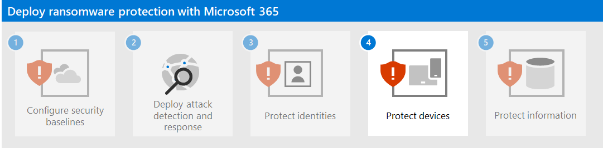

# Step 3. Protect identities

Use the following sections to protect your organization from credential compromise, which is typically the first stage of a larger ransomware attack.

## Increase sign-in security

Use [passwordless authentication](/azure/active-directory/authentication/howto-authentication-passwordless-deployment) for user accounts in Microsoft Entra ID.

During the transition to passwordless authentication, use these best practices for user accounts that still use password authentication:

- Block known weak and custom passwords with [Microsoft Entra Password Protection](/azure/active-directory/authentication/concept-password-ban-bad).
- Extend blocking of known weak and custom passwords to your [on-premises Active Directory Domain Services (AD DS) with Microsoft Entra Password Protection](/azure/active-directory/authentication/concept-password-ban-bad-on-premises).
- Allow your users to change their own passwords with [Self-Service Password Reset (SSPR)](/azure/active-directory/authentication/concept-sspr-howitworks).

Next, implement the [Common identity and device access policies](/microsoft-365/security/office-365-security/zero-trust-identity-device-access-policies-common). These policies provide higher security for access to Microsoft 365 cloud services. 

For user sign-ins, these policies include:

- Requiring multi-factor authentication (MFA) for [priority accounts](/microsoft-365/admin/setup/priority-accounts) (immediately) and eventually all user accounts.
- Requiring high-risk sign-ins to use MFA.
- Requiring high-risk users with high-risk sign-ins to change their passwords.

## Prevent privilege escalation

Use these best practices:

- Implement the principle of [least privilege](/windows-server/identity/ad-ds/plan/security-best-practices/implementing-least-privilege-administrative-models) and use password protection as described in [Increase sign-in security](#increase-sign-in-security) for those user accounts that still use passwords for their sign-ins. 
- Avoid the use of domain-wide, admin-level service accounts. 
- Restrict local administrative privileges to limit installation of Remote Access Trojans (RATs) and other unwanted applications.
- Use Microsoft Entra Conditional Access to explicitly validate the trust of users and workstations before allowing access to administrative portals. See [this example](/azure/active-directory/conditional-access/howto-conditional-access-policy-azure-management) for the Azure portal.
- Enable Local Admin password management.
- Determine where highly privileged accounts are signing in and exposing credentials. Highly privileged accounts should not be present on workstations.
- Disable the local storage of passwords and credentials.

## Impact on users and change management

You must make the users in your organization aware of:

- The new requirements for stronger passwords.
- The changes in sign-in processes, such as the required use of MFA and the MFA secondary authentication method registration.
- The use of password maintenance with SSPR. For example, no more calls to helpdesk for a password reset.
- The prompting to require MFA or a password change for sign-ins that are determined to be risky.

## Resulting configuration

Here's the ransomware protection for your tenant for steps 1-3.

## Next step

Continue with [Step 4](ransomware-protection-microsoft-365-devices.md) to protect devices (endpoints) in your Microsoft 365 tenant. 
