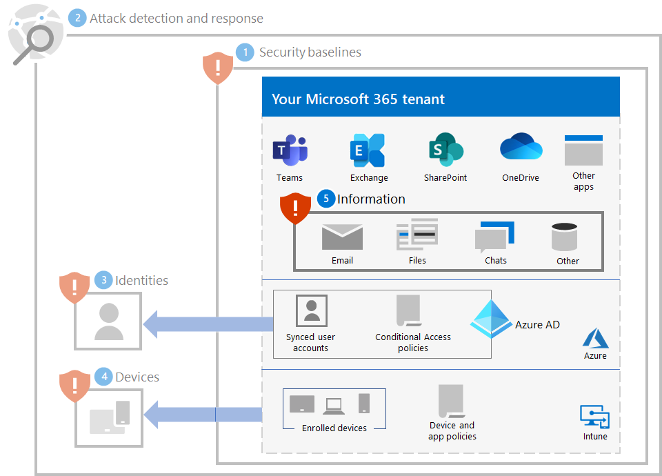

# Step 5. Protect information

Because ransomware attackers will also look at your on-premises data located on file, database, and other types of servers, one of the best ways to protect that data is to migrate it to your Microsoft 365 tenant. Once there, it can be protected by built-in mitigation and recovery features such as [versioning, recycle bin, and the Preservation Hold library](ransomware-protection-microsoft-365.md#ransomware-mitigation-and-recovery-capabilities-provided-with-microsoft-365).

To provide additional protection of your ransomable information in your Microsoft 365 tenant:

- Locate your ransomable information.
- Implement strict permissions and eliminating broad access (for example, too many users having write, edit, and delete abilities).
- Protect your ransomable information.

## Locate your ransomable information

The first task is to [identify the types and locations](/microsoft-365/compliance/information-protection#know-your-data) of ransomable information in your tenant, which can include the following types:

- Sensitive
- Proprietary or intellectual property
- Regulated, such regional regulations that specify protection of personally identifying information (PII)
- IT recovery plans

For each type of ransomable information, determine the following:

- The use of the information to your organization
- A relative measure of its monetary value if it were held for ransom (such as high, medium, low)
- Its current location, such as a OneDrive or SharePoint folder or collaboration venue such as a Microsoft Teams team
- The current permissions, which consist of:

   - The user accounts who have access to it

   - The actions that are allowed to each account that has access to it

## Implement strict permissions for locations with ransomable information

Using strict permissions within your Microsoft 365 tenant is the "only those that need to know" principle for locations and communications venues, which in Microsoft 365 are typically OneDrive folders, SharePoint sites and folders, and teams. 

While it is easier to create file storage locations or teams with broad access (such as the default of everyone in your organization), for ransomable information, the user accounts that are permitted and the actions that are allowed must be confined to the minimum set required to meet collaboration and business requirements.

Once a ransomware attacker has infiltrated your tenant, they try to escalate their privileges by compromising the credentials of user accounts with wider scope of permissions across your tenant, such as administrator role accounts or user accounts that have access to ransomable information. 

Based on this typical attacker behavior, there are two levels of difficulty for the attacker:

- **Low:** An attacker can use a low-permission account and discover your ransomable information because of broad access throughout your tenant.
- **Higher:** An attacker can't use a low-permission account and discover your ransomable information because of strict permissions. They must escalate their permissions by determining and then compromising the credentials of an account that has access to a location with ransomable information, but then may only be able to do a limited set of actions.

For ransomable information, you must make the level of difficulty as high as you can.

You can ensure strict permissions in your tenant with these steps:

1. From the effort to [locate your ransomable information](#locate-your-ransomable-information), review the permissions for the locations of ransomable information. 
2. Implement strict permissions for the ransomable information while meeting collaboration and business requirements and inform the users that are affected.
3. Perform change management for your users so that future locations for ransomable information are created and maintained with strict permissions.
4. Audit and monitor the locations for ransomable information to ensure that broad permissions aren't being granted.

An example of a communication and collaboration venue with strict permissions for sensitive information is a [team with security isolation](/microsoft-365/solutions/secure-teams-security-isolation).

## Protect your ransomable information

To protect your ransomable information in case a ransomware attacker has access to it:

- Use [controlled folder access](/windows/security/threat-protection/microsoft-defender-atp/controlled-folders) to make it more difficult for unauthorized applications to modify the data in controlled folders.

- Use [Microsoft Information Protection](/microsoft-365/compliance/information-protection) and sensitivity labels and apply them to ransomable information. Sensitivity labels can be configured for additional encryption and permissions with defined user accounts and allowed actions. A file labeled with this type of sensitivity label that is exfiltrated from your tenant will only be useable to a user account defined in the label.

- Use Microsoft 365 [Data Loss Prevention (DLP)](/microsoft-365/compliance/dlp-learn-about-dlp) to detect, warn, and block risky, inadvertent, or inappropriate sharing of data containing personal or confidential information based on sensitivity labels, both internally and externally.

- Use [Microsoft Cloud App Security](/cloud-app-security/what-is-cloud-app-security) to block downloads of sensitive information such as files. 

## Impact on users and change management

Administrative changes to broad permissions can lead to users being denied access or being unable to execute some actions.

Additionally, for the protection of ransomable information in your Microsoft 365 tenant, train your users to:

- Create communication and collaboration venues with strict permissions (the minimum set of user accounts for access and the minimum allowed actions for each). 
- Apply the proper sensitivity labels to ransomable information.
- Use controlled folder access.

## Resulting configuration

Here is the ransomware protection for your tenant for steps 1-5.

## Additional ransomware resources

Key information from Microsoft:

- [The growing threat of ransomware](https://blogs.microsoft.com/on-the-issues/2021/07/20/the-growing-threat-of-ransomware/), Microsoft On the Issues blog post on July 20, 2021
- [Human-operated ransomware](/security/compass/human-operated-ransomware)
- [Rapidly protect against ransomware and extortion](/security/compass/protect-against-ransomware)
- [The latest Microsoft Security Intelligence Report](https://www.microsoft.com/securityinsights/) (see pages 22-24)
- **Ransomware: A pervasive and ongoing threat** report in the **Threat analytics** node of the Microsoft 365 Defender portal (see these [licensing requirements](/microsoft-365/security/defender/prerequisites#licensing-requirements))

Microsoft 365:

- [Recover from a ransomware attack](/microsoft-365/security/office-365-security/recover-from-ransomware)
- [Malware and ransomware protection](/compliance/assurance/assurance-malware-and-ransomware-protection)
- [Protect your Windows 10 PC from ransomware](https://support.microsoft.com//windows/protect-your-pc-from-ransomware-08ed68a7-939f-726c-7e84-a72ba92c01c3)
- [Handling ransomware in SharePoint Online](/sharepoint/troubleshoot/security/handling-ransomware-in-sharepoint-online)

Microsoft 365 Defender:

- [Find ransomware with advanced hunting](/microsoft-365/security/defender/advanced-hunting-find-ransomware)

Microsoft Azure:

- [Azure Defenses for Ransomware Attack](https://azure.microsoft.com/resources/azure-defenses-for-ransomware-attack/)
- [Backup and restore plan to protect against ransomware](/security/compass/backup-plan-to-protect-against-ransomware)
- [Help protect from ransomware with Microsoft Azure Backup](https://www.youtube.com/watch?v=VhLOr2_1MCg) (26-minute video)
- [Recovering from systemic identity compromise](/azure/security/fundamentals/recover-from-identity-compromise)
- [Advanced multistage attack detection in Azure Sentinel](/azure/sentinel/fusion#ransomware)
- [Fusion Detection for Ransomware in Azure Sentinel](https://techcommunity.microsoft.com/t5/azure-sentinel/what-s-new-fusion-detection-for-ransomware/ba-p/2621373)

Microsoft Cloud App Security:

-  [Create anomaly detection policies in Cloud App Security](/cloud-app-security/anomaly-detection-policy)

Microsoft Security team blog posts:

- [3 steps to prevent and recover from ransomware (September 2021)](https://www.microsoft.com/security/blog/2021/09/07/3-steps-to-prevent-and-recover-from-ransomware/)
- [Becoming resilient by understanding cybersecurity risks: Part 4—navigating current threats (May 2021)](https://www.microsoft.com/security/blog/2021/05/26/becoming-resilient-by-understanding-cybersecurity-risks-part-4-navigating-current-threats/)

  See the **Ransomware** section.

- [Human-operated ransomware attacks: A preventable disaster (March 2020)](https://www.microsoft.com/security/blog/2020/03/05/human-operated-ransomware-attacks-a-preventable-disaster/)

  Includes attack chain analyses of actual attacks.

- [Ransomware response—to pay or not to pay? (December 2019)](https://www.microsoft.com/security/blog/2019/12/16/ransomware-response-to-pay-or-not-to-pay/)
- [Norsk Hydro responds to ransomware attack with transparency (December 2019)](https://www.microsoft.com/security/blog/2019/12/17/norsk-hydro-ransomware-attack-transparency/)

