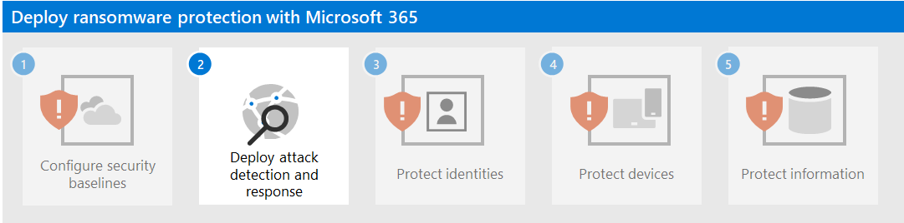

# Step 1. Configure security baselines

As a first step to counter ransomware attackers, you must configure the following Microsoft-defined security baselines:

- [Microsoft 365 security](#microsoft-365-security-baseline)
- [Exchange email management](#exchange-email-management-baseline)
- [Additional baselines for Windows devices and client software](#additional-baselines)

These baselines contain configuration settings and rules that are well-known by attackers, the absence of which are quickly noticed and commonly exploited.

## Microsoft 365 security baseline

First, assess and measure your security posture using [Microsoft Secure Score](/microsoft-365/security/defender/microsoft-secure-score) and follow instructions to improve it as needed.

Next, use [attack surface reduction rules](/microsoft-365/security/defender-endpoint/attack-surface-reduction-rules-deployment) to help block suspicious activity and vulnerable content. These rules include preventing:

- All Office applications from creating child processes
- Executable content from email client and webmail
- Executable files from running unless they meet a prevalence, age, or trusted list criterion
- Execution of potentially obfuscated scripts
- JavaScript or VBScript from launching downloaded executable content
- Office applications from creating executable content
- Office applications from injecting code into other processes
- Office communication application from creating child processes
- Untrusted and unsigned processes that run from USB
- Persistence through Windows Management Interface (WMI) event subscription
- Credential stealing from the Windows local security authority subsystem (lsass.exe)
- Process creations originating from PSExec and WMI commands

## Exchange email management baseline

Help prevent initial access to your tenant from an email-based attack with these Exchange email baseline settings:

- Enable [Microsoft Defender Antivirus email scanning](/microsoft-365/security/defender-endpoint/configure-advanced-scan-types-microsoft-defender-antivirus).
- Use Microsoft Defender for Office 365 for [enhanced phishing protection](/microsoft-365/security/office-365-security/anti-phishing-protection-about) and coverage against new threats and polymorphic variants.
- Check your Office 365 email filtering settings to ensure you block spoofed emails, spam, and emails with malware. Use Defender for Office 365 for enhanced phishing protection and coverage against new threats and polymorphic variants. Configure Defender for Office 365 to [recheck links on click](/microsoft-365/security/office-365-security/safe-links-about) and [delete delivered mails](/microsoft-365/security/office-365-security/zero-hour-auto-purge) in response to newly acquired threat intelligence.
- Review and update to the latest [recommended settings for EOP and Defender for Office 365 security](/microsoft-365/security/office-365-security/recommended-settings-for-eop-and-office365).
- Configure Defender for Office 365 to [recheck links on click](/microsoft-365/security/office-365-security/safe-links-policies-configure) and delete delivered mails in response to newly acquired threat intelligence.

## Additional baselines

Apply [security baselines](https://techcommunity.microsoft.com/t5/microsoft-security-baselines/bg-p/Microsoft-Security-Baselines) for:

- Microsoft Windows 11 or 10
- Microsoft 365 Apps for Enterprise
- Microsoft Edge

## Impact on users and change management

As a best practice for an attack surface reduction rule, assess how a rule might impact your network by opening the security recommendation for that rule in Defender Vulnerability Management. The recommendation details pane describes the user impact, which you can use to determine what percentage of your devices can accept a new policy enabling the rule in blocking mode without adverse impact to user productivity.

Additionally, Exchange email baseline settings can block incoming email and prevent the sending of email or the clicking of links within email. Educate your workers on this behavior and the reason these precautions are being taken.

## Resulting configuration

Here's the ransomware protection for your tenant after this step.

## Next step

Continue with [Step 2](ransomware-protection-microsoft-365-attack-detection-response.md) to deploy attack detection and response capabilities for your Microsoft 365 tenant.
