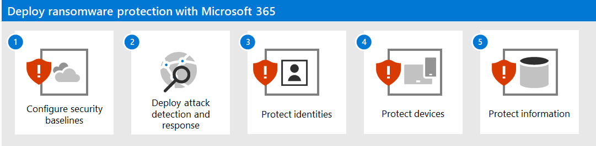
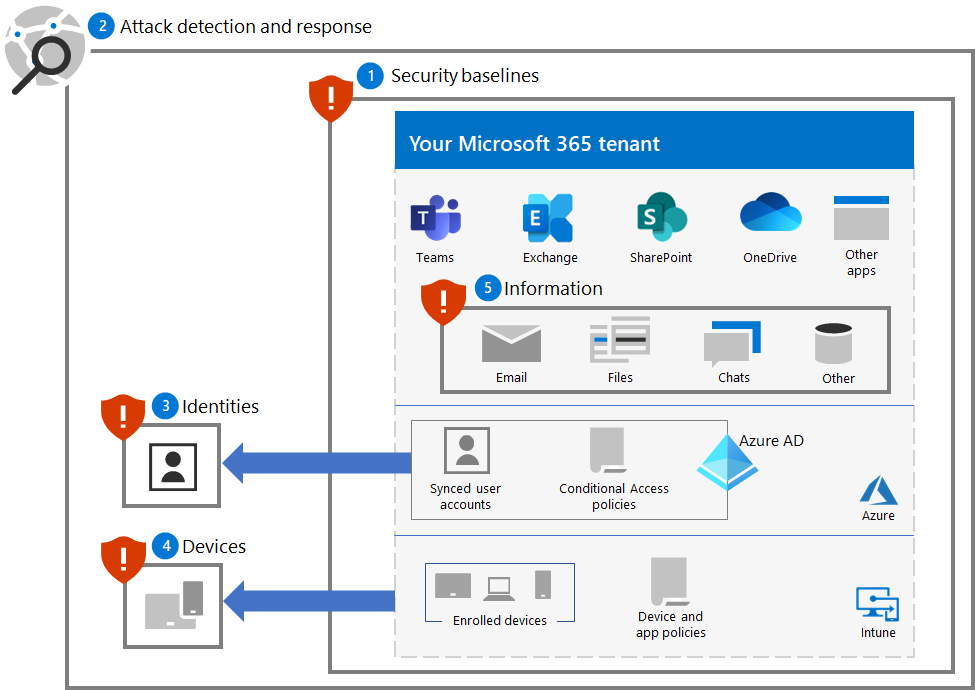
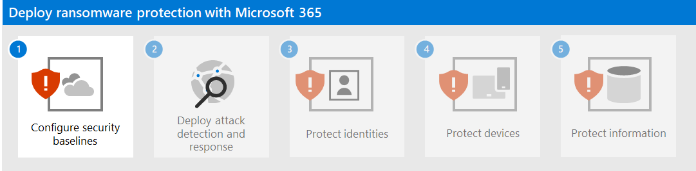

# Deploy ransomware protection for your Microsoft 365 tenant

Ransomware is a type of extortion attack that destroys or encrypts files and folders, preventing access to critical data. Commodity ransomware typically spreads like a virus that infects devices and only requires malware remediation. Human-operated ransomware is the result of an active attack by cybercriminals that infiltrate an organization’s on-premises or cloud IT infrastructure, elevate their privileges, and deploy ransomware to critical data.

Once the attack is complete, an attacker demands money from victims in exchange for the deleted files, decryption keys for encrypted files, or a promise not to release sensitive data to the dark web or the public internet. Human-operated ransomware can also be used to shut down critical machines or processes, such as those needed for industrial production, bringing normal business operations to a halt until the ransom is paid and the damage is corrected, or the organization remediates the damage themselves.

A human-operated ransomware attack can be catastrophic to businesses of all sizes and is difficult to clean up, requiring complete adversary eviction to protect against future attacks. Unlike commodity ransomware, human-operated ransomware can continue to threaten businesses operations after the initial ransom request.

>[!Note]
>A ransomware attack on a Microsoft 365 tenant assumes that the attacker has valid user account credentials for a tenant and has access to all of the files and resources that are permitted to the user account. An attacker without any valid user account credentials would have to decrypt the data at rest that has been encrypted by Microsoft 365 default and enhanced encryption. For more information, see [Encryption and key management overview](/compliance/assurance/assurance-encryption). 
>

For more information about ransomware protection across Microsoft products, see these [additional ransomware resources](#additional-ransomware-resources).

## Security in the cloud is a partnership

The security of your Microsoft cloud services is a partnership between you and Microsoft:

- Microsoft cloud services are built on a foundation of trust and security. Microsoft provides you with security controls and capabilities to help you protect your data and applications.
- You own your data and identities and the responsibility for protecting them, the security of your on-premises resources, and the security of cloud components you control.

By combining these capabilities and responsibilities, we can provide the best protection against a ransomware attack.

## Ransomware mitigation and recovery capabilities provided with Microsoft 365

A ransomware attacker that has infiltrated a Microsoft 365 tenant can hold your organization for ransom by:

- Deleting files or email
- Encrypting files in place
- Copying files outside your tenant (data exfiltration)

However, Microsoft 365 online services have many built in capabilities and controls to protect customer data from ransomware attacks. The following sections provide a summary. For more details about how Microsoft protects customer data, [Malware and ransomware protection in Microsoft 365](/compliance/assurance/assurance-malware-and-ransomware-protection).

>[!Note]
>A ransomware attack on a Microsoft 365 tenant assumes that the attacker has valid user account credentials for a tenant and has access to all of the files and resources that are permitted to the user account. An attacker without any valid user account credentials would have to decrypt the data at rest that has been encrypted by Microsoft 365 default and enhanced encryption. For more information, see [Encryption and key management overview](/compliance/assurance/assurance-encryption). 
>

### Deleting files or email

Files in SharePoint and OneDrive for Business are protected by:

- Versioning 

   Microsoft 365 retains a minimum of 500 versions of a file by default and can be configured to retain more. 

   To minimize the burden on your security and helpdesk staff, train your users on how to [restore previous versions of files](https://support.microsoft.com/office/restore-a-previous-version-of-an-item-or-file-in-sharepoint-f66dbda0-81f4-4d1e-b08c-793265c58934).

- Recycle bin

   If the ransomware creates a new encrypted copy of the file and deletes the old file, customers have 93 days to restore it from the recycle bin. After 93 days, there is a 14-day window where Microsoft can still recover the data. 
  
   To minimize the burden on your security and helpdesk staff, train your users on how to [restore files from the recycle bin](https://support.microsoft.com/office/restore-deleted-items-from-the-site-collection-recycle-bin-5fa924ee-16d7-487b-9a0a-021b9062d14b).

- [Files Restore](https://support.microsoft.com/office/restore-your-onedrive-fa231298-759d-41cf-bcd0-25ac53eb8a15)

   A complete self-service recovery solution for SharePoint and OneDrive that allows administrators and end users to restore files from any point in time during the last 30 days.

   To minimize the burden on your security and IT helpdesk staff, train your users on [Files Restore](https://support.microsoft.com/office/restore-your-onedrive-fa231298-759d-41cf-bcd0-25ac53eb8a15).

For OneDrive and SharePoint files, Microsoft can roll back to a previous point in time for up to 14 days if you are hit by a mass attack.

Email is protected by:

- [Single item recovery](/exchange/recipients-in-exchange-online/manage-user-mailboxes/enable-or-disable-single-item-recovery) and mailbox retention, in which you can recover items in a mailbox upon inadvertent or malicious premature deletion. You can rollback mail messages deleted within 14 days by default, configurable up to 30 days.

- [Retention policies](/exchange/security-and-compliance/messaging-records-management/retention-tags-and-policies) allow you to retain immutable copies of email for the configured retention period.

### Encrypting files in place

As previously described, files in SharePoint and OneDrive for Business are protected from malicious encryption with:

- Versioning
- Recycle bin
- Preservation Hold library

For additional details, see [Dealing with data corruption in Microsoft 365](/compliance/assurance/assurance-dealing-with-data-corruption).

### Copying files outside your tenant 

You can prevent a ransomware attacker from copying files outside your tenant with:

- [Microsoft Purview Data Loss Prevention (DLP)](/microsoft-365/compliance/dlp-learn-about-dlp) policies

    Detect, warn, and block risky, inadvertent, or inappropriate sharing of data containing:

    - Personal information such as personally identifying information (PII) for compliance with regional privacy regulations.

    - Confidential organization information based on sensitivity labels.

- [Microsoft Defender for Cloud Apps](/cloud-app-security/what-is-cloud-app-security)

    Block downloads of sensitive information such as files. 

    You can also use session policies for [Defender for Cloud Apps Conditional Access App Control](/cloud-app-security/tutorial-dlp#how-to-discover-and-protect-sensitive-information-in-your-organization) to monitor the flow of information between a user and an application in real time.

## What’s in this solution

This solution steps you through the deployment of Microsoft 365 protection and mitigation features, configurations, and ongoing operations to minimize the ability of a ransomware attacker to use the critical data in your Microsoft 365 tenant and hold your organization for ransom.

The steps in this solution are:

1. [Configure security baselines](ransomware-protection-microsoft-365-security-baselines.md)
2. [Deploy attack detection and response](ransomware-protection-microsoft-365-attack-detection-response.md)
3. [Protect identities](ransomware-protection-microsoft-365-identities.md)
4. [Protect devices](ransomware-protection-microsoft-365-devices.md)
5. [Protect information](ransomware-protection-microsoft-365-information.md)

Here are the five steps of the solution deployed for your Microsoft 365 tenant.

This solution uses the principles of [Zero Trust](/security/zero-trust/): 

- **Verify explicitly:** Always authenticate and authorize based on all available data points.
- **Use least privilege access:** Limit user access with Just-In-Time and Just-Enough-Access (JIT/JEA), risk-based adaptive policies, and data protection.
- **Assume breach:** Minimize blast radius and segment access. Verify end-to-end encryption and use analytics to get visibility, drive threat detection, and improve defenses.

Unlike conventional intranet access, which trusts everything behind an organization's firewall, Zero Trust treats each sign-in and access as though it originated from an uncontrolled network, whether it's behind the organization firewall or on the Internet. Zero Trust requires protection for the network, infrastructure, identities, endpoints, apps, and data.

## Microsoft 365 capabilities and features

To protect your Microsoft 365 tenant from a ransomware attack, use these Microsoft 365 capabilities and features for these steps in the solution.

### 1. Security baseline

| Capability or feature | Description | Helps... | Licensing |
|:-------|:-----|:-------|:-------|
| Microsoft Secure Score |  Measures the security posture of a Microsoft 365 tenant. | Assess your security configuration and suggests improvements. | Microsoft 365 E3 or Microsoft 365 E5 |
| Attack surface reduction rules | Reduces your organization's vulnerability to cyber attacks using a variety of configuration settings. | Block suspicious activity and vulnerable content. | Microsoft 365 E3 or Microsoft 365 E5 |
| Exchange email settings |  Enables services that reduce your organization's vulnerability to an email-based attack. | Prevent initial access to your tenant through phishing and other email-based attacks.  | Microsoft 365 E3 or Microsoft 365 E5 |
| Microsoft Windows, Microsoft Edge, and Microsoft 365 Apps for Enterprise settings | Provides industry-standard security configurations that are broadly known and well-tested. | Prevent attacks through Windows, Edge, and Microsoft 365 Apps for Enterprise. | Microsoft 365 E3 or Microsoft 365 E5 |
|

### 2. Detection and response

| Capability or feature | Description | Helps detect and respond to... | Licensing |
|:-------|:-----|:-------|:-------|
| Microsoft 365 Defender | Combines signals and orchestrates capabilities into a single solution.    Enables security professionals to stitch together threat signals and determine the full scope and impact of a threat.    Automates actions to prevent or stop the attack and self-heal affected mailboxes, endpoints, and user identities. | Incidents, which are the combined alerts and data that make up an attack. | Microsoft 365 E5 or Microsoft 365 E3 with the Microsoft 365 E5 Security add-on |
| Microsoft Defender for Identity |  Identifies, detects, and investigates advanced threats, compromised identities, and malicious insider actions directed at your organization through a cloud-based security interface uses your on-premises Active Directory Domain Services (AD DS) signals. | Credential compromise for AD DS accounts. | Microsoft 365 E5 or Microsoft 365 E3 with the Microsoft 365 E5 Security add-on |
| Microsoft Defender for Office 365 | Safeguards your organization against malicious threats posed by email messages, links (URLs), and collaboration tools.    Protects against malware, phishing, spoofing, and other attack types. | Phishing attacks. | Microsoft 365 E5 or Microsoft 365 E3 with the Microsoft 365 E5 Security add-on |
| Microsoft Defender for Endpoint | Enables detection and response to advanced threats across endpoints (devices). | Malware installation and device compromise. | Microsoft 365 E5 or Microsoft 365 E3 with the Microsoft 365 E5 Security add-on |
| Azure Active Directory (Azure AD) Identity Protection | Automates detection and remediation of identity-based risks and investigation of those risks. | Credential compromise for Azure AD accounts and privilege escalation. | Microsoft 365 E5 or Microsoft 365 E3 with the Microsoft 365 E5 Security add-on |
| Defender for Cloud Apps | A cloud access security broker for discovery, investigation, and governance across all your Microsoft and third-party cloud services. | Lateral movement and data exfiltration. | Microsoft 365 E5 or Microsoft 365 E3 with the Microsoft 365 E5 Security add-on |
|

### 3. Identities

| Capability or feature | Description | Helps prevent... | Licensing |
|:-------|:-----|:-------|:-------|
|Azure AD Password Protection | Block passwords from a common list and custom entries. | Cloud or on-premises user account password determination. |Microsoft 365 E3 or Microsoft 365 E5|
|MFA enforced with Conditional Access | Require MFA based on the properties of user sign-ins with Conditional Access policies. | Credential compromise and access. | Microsoft 365 E3 or Microsoft 365 E5|
|MFA enforced with risk-based Conditional Access | Require MFA based on the risk of user sign-ins with Azure AD Identity protection. |Credential compromise and access. | Microsoft 365 E5 or Microsoft 365 E3 with the Microsoft 365 E5 Security add-on|
|

### 4. Devices

For device and app management:

| Capability or feature | Description | Helps prevent... | Licensing |
|:-------|:-----|:-------|:-------|
| Microsoft Intune | Manage devices and the applications that run on them.  | Device or app compromise and access. | Microsoft 365 E3 or E5 |
|  |  |  |  |

For Windows 11 or 10 devices:

| Capability or feature | Description | Helps... | Licensing |
|:-------|:-----|:-------|:-------|
| Microsoft Defender Firewall | Provides a host-based firewall.  | Prevent attacks from inbound, unsolicited network traffic. | Microsoft 365 E3 or Microsoft 365 E5 |
| Microsoft Defender Antivirus | Provides anti-malware protection of devices (endpoints) using machine learning, big-data analysis, in-depth threat resistance research, and the Microsoft cloud infrastructure. | Prevent installation and running of malware. | Microsoft 365 E3 or Microsoft 365 E5 |
| Microsoft Defender SmartScreen | Protects against phishing or malware websites and applications, and the downloading of potentially malicious files. | Block or warn when checking sites, downloads, apps, and files. | Microsoft 365 E3 or Microsoft 365 E5 |
| Microsoft Defender for Endpoint | Helps prevent, detect, investigate, and respond to advanced threats across devices (endpoints). | Protect against network tampering. | Microsoft 365 E5 or Microsoft 365 E3 with the Microsoft 365 E5 Security add-on |
|  |  |  |  |

### 5. Information

| Capability or feature | Description | Helps... | Licensing |
|:-------|:-----|:-------|:-------|
| Controlled folder access | Protects your data by checking apps against a list of known, trusted apps. | Prevent files from being altered or encrypted by ransomware. | Microsoft 365 E3 or Microsoft 365 E5 |
| Microsoft Purview Information Protection | Enables sensitivity labels to be applied to information that is ransomable | Prevent use of exfiltrated information. | Microsoft 365 E3 or Microsoft 365 E5 |
| Data loss prevention (DLP) | Protects sensitive data and reduces risk by preventing users from sharing it inappropriately. | Prevent data exfiltration. | Microsoft 365 E3 or Microsoft 365 E5 |
| Defender for Cloud Apps | A cloud access security broker for discovery, investigation, and governance. | Detect lateral movement and prevent data exfiltration. | Microsoft 365 E5 or Microsoft 365 E3 with the Microsoft 365 E5 Security add-on |
|

## Impact on users and change management

Deploying additional security features and implementing requirements and security policies for your Microsoft 365 tenant can impact your users. 

For example, you may impose a new security policy that requires users to create new teams for specific uses with a list of user accounts as members, instead of more easily creating a team for all users in the organization. This can help prevent a ransomware attacker from exploring teams that are not available to the attacker's compromised user account and targeting the resources of that team in the subsequent attack.

This foundation solution will identify when new configurations or recommended security policies can impact your users so you can perform the required change management.

## Next steps

Use these steps to deploy comprehensive protection for your Microsoft 365 tenant:

1. [Configure security baselines](ransomware-protection-microsoft-365-security-baselines.md)
2. [Deploy attack detection and response](ransomware-protection-microsoft-365-attack-detection-response.md)
3. [Protect identities](ransomware-protection-microsoft-365-identities.md)
4. [Protect devices](ransomware-protection-microsoft-365-devices.md)
5. [Protect information](ransomware-protection-microsoft-365-information.md)

## Additional ransomware resources

Key information from Microsoft:

- [The growing threat of ransomware](https://blogs.microsoft.com/on-the-issues/2021/07/20/the-growing-threat-of-ransomware/), Microsoft On the Issues blog post on July 20, 2021
- [Human-operated ransomware](/security/compass/human-operated-ransomware)
- [Rapidly protect against ransomware and extortion](/security/compass/protect-against-ransomware)
- [2021 Microsoft Digital Defense Report](https://www.microsoft.com/security/business/microsoft-digital-defense-report) (see pages 10-19)
- [Ransomware: A pervasive and ongoing threat](https://security.microsoft.com/threatanalytics3/05658b6c-dc62-496d-ad3c-c6a795a33c27/overview) threat analytics report in the Microsoft 365 Defender portal
- Microsoft's Detection and Response Team (DART) ransomware [approach and best practices](/security/compass/incident-response-playbook-dart-ransomware-approach) and [case study](/security/compass/dart-ransomware-case-study)

Microsoft 365:

- [Maximize Ransomware Resiliency with Azure and Microsoft 365](https://azure.microsoft.com/resources/maximize-ransomware-resiliency-with-azure-and-microsoft-365/)
- [Ransomware incident response playbooks](/security/ransomware/)
- [Malware and ransomware protection](/compliance/assurance/assurance-malware-and-ransomware-protection)
- [Protect your Windows 10 PC from ransomware](https://support.microsoft.com//windows/protect-your-pc-from-ransomware-08ed68a7-939f-726c-7e84-a72ba92c01c3)
- [Handling ransomware in SharePoint Online](/sharepoint/troubleshoot/security/handling-ransomware-in-sharepoint-online)
- [Threat analytics reports for ransomware](https://security.microsoft.com/threatanalytics3?page_size=30&filters=tags%3DRansomware&ordering=-lastUpdatedOn&fields=displayName,alertsCount,impactedEntities,reportType,createdOn,lastUpdatedOn,tags,flag) in the Microsoft 365 Defender portal

Microsoft 365 Defender:

- [Find ransomware with advanced hunting](/microsoft-365/security/defender/advanced-hunting-find-ransomware)

Microsoft Azure:

- [Azure Defenses for Ransomware Attack](https://azure.microsoft.com/resources/azure-defenses-for-ransomware-attack/)
- [Maximize Ransomware Resiliency with Azure and Microsoft 365](https://azure.microsoft.com/resources/maximize-ransomware-resiliency-with-azure-and-microsoft-365/)
- [Backup and restore plan to protect against ransomware](/security/compass/backup-plan-to-protect-against-ransomware)
- [Help protect from ransomware with Microsoft Azure Backup](https://www.youtube.com/watch?v=VhLOr2_1MCg) (26-minute video)
- [Recovering from systemic identity compromise](/azure/security/fundamentals/recover-from-identity-compromise)
- [Advanced multistage attack detection in Microsoft Sentinel](/azure/sentinel/fusion#ransomware)
- [Fusion Detection for Ransomware in Microsoft Sentinel](https://techcommunity.microsoft.com/t5/azure-sentinel/what-s-new-fusion-detection-for-ransomware/ba-p/2621373)

Microsoft Defender for Cloud Apps:

-  [Create anomaly detection policies in Defender for Cloud Apps](/cloud-app-security/anomaly-detection-policy)

Microsoft Security team blog posts:

- [3 steps to prevent and recover from ransomware (September 2021)](https://www.microsoft.com/security/blog/2021/09/07/3-steps-to-prevent-and-recover-from-ransomware/)
- [A guide to combatting human-operated ransomware: Part 1 (September 2021)](https://www.microsoft.com/security/blog/2021/09/20/a-guide-to-combatting-human-operated-ransomware-part-1/)

  Key steps on how Microsoft's Detection and Response Team (DART) conducts ransomware incident investigations.

- [A guide to combatting human-operated ransomware: Part 2 (September 2021)](https://www.microsoft.com/security/blog/2021/09/27/a-guide-to-combatting-human-operated-ransomware-part-2/)

  Recommendations and best practices.

- [Becoming resilient by understanding cybersecurity risks: Part 4—navigating current threats (May 2021)](https://www.microsoft.com/security/blog/2021/05/26/becoming-resilient-by-understanding-cybersecurity-risks-part-4-navigating-current-threats/)

  See the **Ransomware** section.

- [Human-operated ransomware attacks: A preventable disaster (March 2020)](https://www.microsoft.com/security/blog/2020/03/05/human-operated-ransomware-attacks-a-preventable-disaster/)

  Includes attack chain analyses of actual attacks.

- [Ransomware response—to pay or not to pay? (December 2019)](https://www.microsoft.com/security/blog/2019/12/16/ransomware-response-to-pay-or-not-to-pay/)
- [Norsk Hydro responds to ransomware attack with transparency (December 2019)](https://www.microsoft.com/security/blog/2019/12/17/norsk-hydro-ransomware-attack-transparency/)
