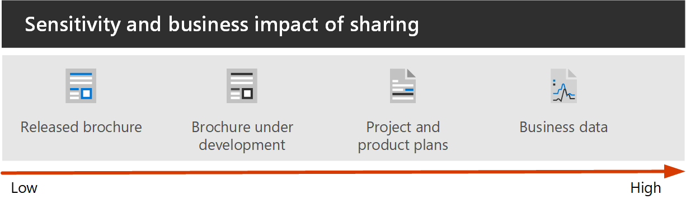
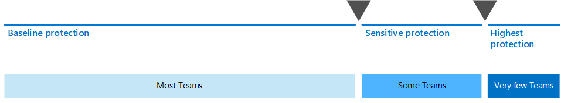

# Set up secure collaboration with Microsoft 365

Being able to easily share information with the right people while preventing oversharing is key to an organization's success. This includes being able to share sensitive data safely with only those who should have access to it. Depending on the project, this might include sharing sensitive data with people outside your organization.

This collaboration solution guidance includes two components to help you:
- Deploy Microsoft Teams with the right level of protection for each project
- Configure external sharing with appropriate security settings for each project

If versatile and easy-to-use content collaboration tools aren't available, users will often collaborate by emailing documents. This is a tedious and error-prone method of collaboration, and can increase the risk of inappropriate sharing of information. If people find sharing information too difficult, they could revert to using consumer products that are not governed by IT. This can pose an even greater risk.

With Microsoft 365, you can deploy Teams with a variety of configurations that help:

- Protect your intellectual property
- Enable easy collaboration
- Create a balance between security and usability that increases user satisfaction and reduces the risk of shadow IT

Most organizations have a variety of information, with varying degrees of sensitivity and varying degrees of business impact if the information is inappropriately shared. Depending on the sensitivity of a given piece of information, you may want to allow sharing with:

- Anyone (unauthenticated)
- People inside the organization
- Specific people inside the organization
- Specific people inside and outside the organization

Information such as marketing brochures are meant for sharing broadly outside the organization. Information such as cafeteria menus aren't meant for external sharing, but would have no business impact if they were shared externally. These types of information need little or no protection.

Those same marketing brochures, while under development, might only be shared inside the organization. In this case, the default sharing settings in Teams may be sufficient.

Information about a new product that is under development might be considered sensitive, even within the organization. A greater degree of protection might be appropriate in this case. You could restrict access to this information to members of a specific team, for example. Depending on the project, you may need to collaborate with people outside your organization, such as a vendor or partner organization.

Information that is critical to your organization's success, or has stringent security or compliance requirements might require even greater levels of protection.

For all the scenarios noted above, you can use teams in Microsoft Teams to store, share, and collaborate on the information. 

To configure secure collaboration, you use these Microsoft 365 capabilities and features.

| Product or component | Capability or feature | Licensing |
|:-------|:-----|:-------|
| Microsoft Defender for Office 365	| Safe Attachments for SPO, OneDrive and Teams; Safe Documents; Safe Links for Teams	| Microsoft 365 E1, E3 and E5 |
| SharePoint	| Site and file sharing policies, Site sharing permissions, Sharing links, Access requests, Site guest sharing settings	| Microsoft 365 E1, E3 and E5 |
| Microsoft Teams	| Guest access, private teams, private channels	| Microsoft 365 E1, E3 and E5 |
| Microsoft 365 Compliance	| Sensitivity labels	| Microsoft 365 E3 and E5 |

### Using Teams for all kinds of data

To manage access to information with different sensitivities, we've developed [three different tiers of protection for Teams](configure-teams-three-tiers-protection.md). You can customize any of these tiers to better address the needs or your business. 

These tiers - *baseline*, *sensitive*, and *highly sensitive* - gradually increase the protections that help prevent oversharing and potential information leakage, as shown in the following table.

|-|**Baseline tier**|**Sensitive tier**|**Highly sensitive tier**|
|:--|:-----------|:------------|:-------------------|
|Public or private team|Either|Private|Private|
|Unauthenticated sharing|Blocked|Blocked|Blocked|
|File sharing|Allowed|Allowed|Only team owners can share.|
|Team membership|Anyone can join public teams. Team owner approval required to join private teams.|Team owner approval required to join.|Team owner approval required to join.|
|Document encryption|||Available with sensitivity label|
|Guest sharing|Allowed|Can be allowed or blocked|Can be allowed or blocked|
|Unmanaged devices|No restriction|Web-only access|Blocked|

Configuring these tiers involves:

- Configuring settings in Teams for guest access and private channels
- Configuring settings in a team's associated SharePoint site for internal and guest sharing, access requests, and sharing links
- For the *sensitive* and *highly sensitive* tiers, configuring sensitivity labels to classify the teams, and control guest sharing and access from unmanaged devices
- For the *highly sensitive* tier, configuring a sensitivity label to encrypt the documents to which it is applied

Start with the baseline tier, and then add teams that use the *sensitive* and *highly sensitive* tiers as needed to help protect the information in your organization. See these resources to get started:

- [Configure teams with baseline protection](configure-teams-baseline-protection.md)
- [Configure teams with protection for sensitive data](configure-teams-sensitive-protection.md)
- [Configure teams with protection for highly sensitive data](configure-teams-highly-sensitive-protection.md)

If you have a highly sensitive project that requires additional protection from sharing even within your organization, you can configure a team that uses its own sensitivity label to encrypt files so that only team members can read them. See [Configure a team with security isolation](secure-teams-security-isolation.md) for details.

### Sharing with people outside your organization

You may need to [share information of any sensitivity with people outside your organization](collaborate-with-people-outside-your-organization.md). This could range from sharing a single document with a single person to collaborating on a major project with a large partner organization or freelancers from around the world. In Microsoft 365, this range of external sharing can be done easily and with the appropriate safeguards to help protect your sensitive information.

These resources will help you get started with setting up your environment for collaborating with people outside your organization:

- [Collaborate on documents](collaborate-on-documents.md) for sharing individual files of folders.
- [Collaborate in a site](collaborate-in-site.md) for collaborating with guests in a SharePoint site.
- [Collaborate as a team](collaborate-as-team.md) for collaborating with guests in a team.

Depending on the sensitivity of the information being shared, you can add safeguards to help prevent oversharing. These resources will help you set up the protections that you need for your organization:

- [Best practices for sharing files and folders with unauthenticated users](best-practices-anonymous-sharing.md)
- [Limit accidental exposure to files when sharing with people outside your organization](share-limit-accidental-exposure.md)
- [Create a secure guest sharing environment](create-secure-guest-sharing-environment.md)

If you have a major project with a partner organization, you can use Azure Entitlement Management to manage the guests from that organization in a team that you set up for the project. See [Create a B2B extranet with managed guests](b2b-extranet.md) for details.

## Deploy the secure collaboration solution

When you're ready to deploy this solution, continue with these steps:
1. Configure the [three different tiers of protection for Teams](configure-teams-three-tiers-protection.md).
2. Configure settings for [sharing information of any sensitivity with people outside your organization](collaborate-with-people-outside-your-organization.md).

## See also

[Microsoft 365 security documentation](https://docs.microsoft.com/microsoft-365/security)

[Microsoft 365 compliance documentation](https://docs.microsoft.com/microsoft-365/compliance)

[Welcome to Microsoft Teams](https://docs.microsoft.com/MicrosoftTeams/Teams-overview)
