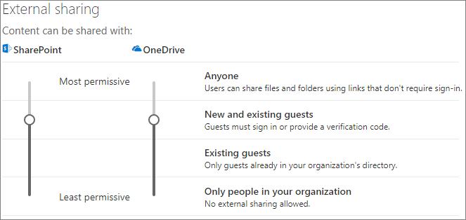
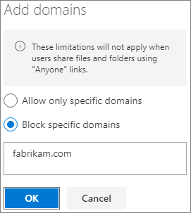

# Limit accidental exposure to files when sharing with people outside your organization

When sharing files and folders with people outside your organization, there are a variety of options to reduce the chances of accidentally sharing sensitive information. You can choose from the options in this article to best meet the needs of your organization.

## Use best practices for Anyone links

If people in your organization need to do unauthenticated sharing, but you're concerned about unauthenticated people modifying content, read [Best practices for unauthenticated sharing](best-practices-anonymous-sharing.md) for guidance on how to work with unauthenticated sharing in your organization.

## Turn off Anyone links

We recommend leaving *Anyone* links enabled for appropriate content because it's the easiest way to share and can help reduce the risk of users seeking other solutions that are outside the control of your IT department. *Anyone* links can be forwarded to others, but file access is only available to those who have the link.

If you always want people outside your organization to authenticate when accessing content in SharePoint, Groups, or Teams, you can turn off *Anyone* sharing. This will prevent users from unauthenticated sharing of content.

If you disable *Anyone* links, users can still easily share with guests using *Specific people* links. In this case, all people outside your organization will be required to authenticate before they can access the shared content.

Depending on your needs, you can disable *Anyone* links for specific sites, or for your whole organization.

To turn off *Anyone* links for your organization
1. In the SharePoint admin center, in the left navigation, click **Sharing**.
2. Set the SharePoint external sharing settings to **New and existing guests**.

   

3. Click **Save**.

To turn off *Anyone* links for a site
1. In the SharePoint admin center, in the left navigation, expand **Sites** and click **Active sites**.
2. Select the site that you want to configure.
3. In the ribbon, click **Sharing**.
4. Ensure that sharing is set to **New and existing guests**.

   

5. If you made changes, click **Save**.

## Domain filtering

You can use domain allow or deny lists to specify which domains your users can use when sharing with people outside your organization.

With an allow list, you can specify a list of domains where users in your organization can share with people outside your organization. Sharing with to other domains is blocked. If your organization only collaborates with people from a list of specific domains, you can use this feature to prevent sharing with other domains.

With a deny list, you can specify a list of domains from which users in your organization cannot share with people outside your organization. Sharing with the listed domains is blocked. This can be useful if you have competitors, for example, who you want to prevent from accessing content in your organization.

The allow and deny lists only affect sharing with guests. Users can still share with people from prohibited domains by using *Anyone* links if you haven't disabled them. For best results with domain allow and deny lists, consider disabling *Anyone* links as described above.

To set up a domain allow or deny list
1. In the SharePoint admin center, in the left navigation, click **Sharing**.
2. Under **Advanced settings for external sharing**, select the **Limit external sharing by domain** check box.
3. Click **Add domains**.
4. Select whether you want to block domains, type the domains, and click **OK**.

   

5. Click **Save**.

If you want to limit sharing by domain at a higher level than SharePoint and OneDrive, you can [allow or block invitations to B2B users from specific organizations](/azure/active-directory/b2b/allow-deny-list) in Azure Active Directory. (You must configure the [SharePoint and OneDrive integration with Azure AD B2B Preview](/sharepoint/sharepoint-azureb2b-integration-preview) for these settings to affect SharePoint and OneDrive.)

## Limit sharing of files, folders, and sites with people outside your organization to specified security groups

You can restrict sharing of files, folders, and sites with people outside your organization to members of a specific security group. This is useful if you want to enable external sharing, but with an approval workflow or request process. Alternatively, you might require your users to complete a training course before they're added to the security group and are allowed to share externally.

To limit external sharing to members of a security group
1. In the [SharePoint admin center](https://admin.microsoft.com/sharepoint), in the left navigation, under **Policies**, click **Sharing**.
2. Under **External sharing**, expand **More external sharing settings**.

3. Select **Allow only users in specific security groups to share externally**, and then select **Manage security groups**.

    

4. In the **Add a security group** box, enter a name for a security group. The security group box appears.

5. Next to the security group name, from the **Can share with** dropdown, select either:

    - **Authenticated guests only** (default)
    - **Anyone**

6. Select **Save**.

Note that this affects files, folders, and sites, but not Microsoft 365 groups or Teams. When members invite guests to a private Microsoft 365 group or a private team in Microsoft Teams, the invitation is sent to the group or team owner for approval.

## See Also

[Create a secure guest sharing environment](create-secure-guest-sharing-environment.md)

[Best practices for sharing files and folders with anonymous users](best-practices-anonymous-sharing.md)