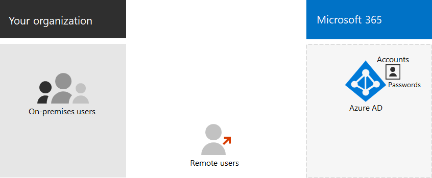
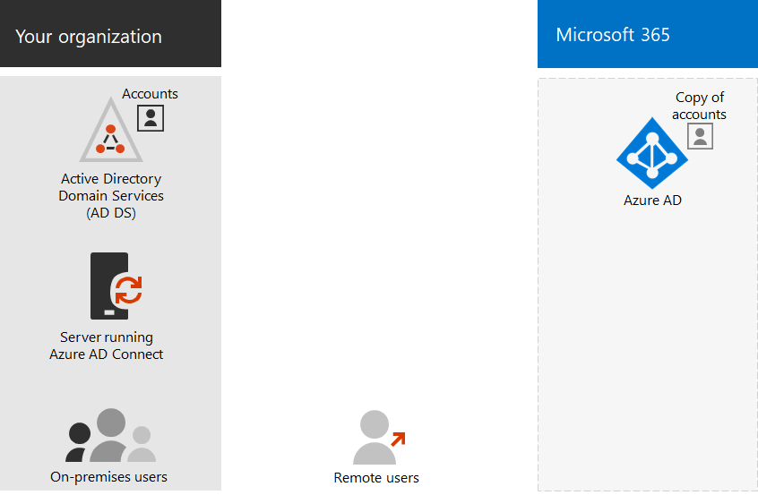
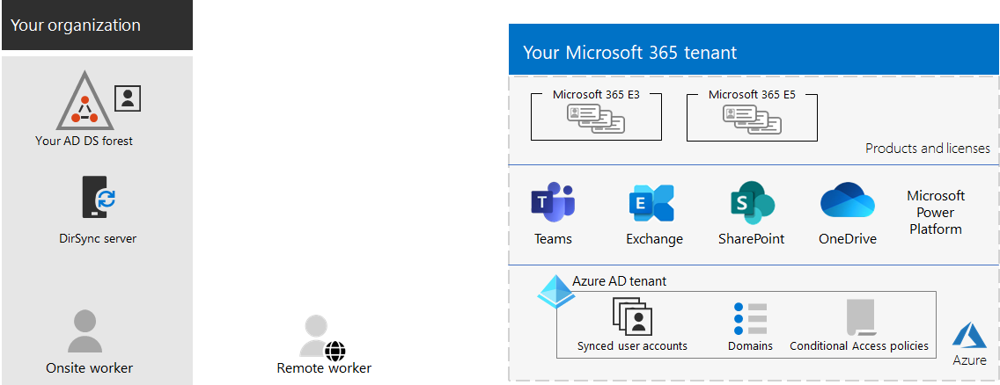
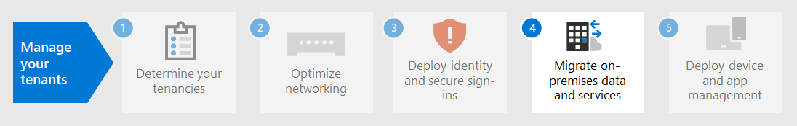

# Step 3. Identity for your Microsoft 365 for enterprise tenants

Your Microsoft 365 tenant includes a Microsoft Entra tenant to manage identities and authentication for sign-ins. Getting your identity infrastructure configured correctly is vital to managing Microsoft 365 user access and permissions for your organization.

## Cloud-only vs. hybrid

Here are the two types of identity models and their best fit and benefits.

| Model | Description | How Microsoft 365 authenticates user credentials | Best for | Greatest benefit |
|:-------|:-----|:-----|:-----|:-----|
| Cloud-only | User account only exists in the Microsoft Entra tenant for your Microsoft 365 tenant. | The Microsoft Entra tenant for your Microsoft 365 tenant performs the authentication with the cloud identity account. | Organizations that don't have or need an on-premises Active Directory. | Simple to use. No extra directory tools or servers required. |
| Hybrid |  User account exists in your on-premises Active Directory Domain Services (AD DS) and a copy is also in the Microsoft Entra tenant for your Microsoft 365 tenant. Microsoft Entra Connect runs on an on-premises server to synchronize AD DS changes to your Microsoft Entra tenant. The user account in Microsoft Entra ID might also include a hashed version of the already hashed AD DS user account password. | The Microsoft Entra tenant for your Microsoft 365 tenant either handles the authentication process or redirects the user to another identity provider. | Organizations using AD DS or another identity provider. | Users can use the same credentials when accessing on-premises or cloud-based resources. |
||||||

Here are the basic components of cloud-only identity.

In this illustration, on-premises and remote users sign in with accounts in the Microsoft Entra tenant of their Microsoft 365 tenant.

Here are the basic components of hybrid identity.

In this illustration, on-premises and remote users sign in to their Microsoft 365 tenant with accounts in the Microsoft Entra tenant that have been copied from their on-premises AD DS.

## Synchronizing your on-premises AD DS

Depending on your business needs and technical requirements, the hybrid identity model and directory synchronization is the most common choice for enterprise customers who are adopting Microsoft 365. Directory synchronization allows you to manage identities in your AD DS and all updates to user accounts, groups, and contacts are synchronized to the Microsoft Entra tenant of your Microsoft 365 tenant.

> [!NOTE]
> When AD DS user accounts are synchronized for the first time, they are not automatically assigned a Microsoft 365 license and cannot access Microsoft 365 services, such as email. You must first assign them a usage location. Then, assign a license to these user accounts, either individually or dynamically through group membership.

Here are the two types of authentication when using the hybrid identity model.

| Authentication type | Description |
|:-------|:-----|
| Managed authentication | Microsoft Entra ID handles the authentication process by using a locally stored hashed version of the password or sends the credentials to an on-premises software agent to be authenticated by the on-premises AD DS.      There are two types of managed authentication: Password hash synchronization (PHS) and Pass-through authentication (PTA). With PHS, Microsoft Entra ID performs the authentication itself. With PTA, Microsoft Entra ID has AD DS perform the authentication. |
| Federated authentication | Microsoft Entra ID redirects the client computer requesting authentication to another identity provider. |
|  |  |

See [choosing the right authentication method](/azure/active-directory/hybrid/choose-ad-authn) to learn more.

## Enforcing strong sign-ins

To increase the security of user sign-ins, use the features and capabilities in the following table.

| Capability | Description | More information | Licensing requirements |
|:-------|:-----|:-----|:-----|
| Windows Hello for Business | Replaces passwords with strong two-factor authentication when signing on a Windows device. The two factors are a new type of user credential that is tied to a device and a biometric or PIN. | [Windows Hello for Business Overview](/windows/security/identity-protection/hello-for-business/hello-overview) | Microsoft 365 E3 or E5 |
| Microsoft Entra Password Protection | Detects and blocks known weak passwords and their variants and can also block additional weak terms that are specific to your organization. | [Configure Microsoft Entra password protection](/azure/active-directory/authentication/concept-password-ban-bad) | Microsoft 365 E3 or E5 |
| Use multi-factor authentication (MFA) | MFA requires that user sign-ins be subject to another verification beyond the user account password, such as verification with a smartphone app or a text message sent to a smartphone. See [this video](https://support.microsoft.com/office/set-up-multi-factor-authentication-in-microsoft-365-business-a32541df-079c-420d-9395-9d59354f7225) for instructions on how users set up MFA. | [MFA for Microsoft 365 for enterprise](../enterprise/microsoft-365-secure-sign-in.md#mfa) | Microsoft 365 E3 or E5 |
| Identity and device access configurations | Settings and policies that consist of recommended prerequisite features and their settings combined with Conditional Access, Intune, and Microsoft Entra ID Protection policies that determine whether a given access request should be granted and under what conditions.  | [Identity and device access configurations](../security/office-365-security/zero-trust-identity-device-access-policies-overview.md) | Microsoft 365 E3 or E5 |
| Microsoft Entra ID Protection | Protect against credential compromise, where an attacker determines a user's account name and password to gain access to an organization's cloud services and data. | [Microsoft Entra ID Protection](/azure/active-directory/active-directory-identityprotection) | Microsoft 365 E5 or Microsoft 365 E3 with the Identity & Threat Protection add-on |

## Results of Step 3

For identity for your Microsoft 365 tenant, you have determined:

- Which identity model to use.
- How you will enforce strong user and device access.

Here is an example a tenant with the new hybrid identity elements highlighted.

In this illustration, the tenant has:

- An AD DS forest that is being synchronized with the Microsoft Entra tenant using a directory synchronization server and Microsoft Entra Connect.
- A copy of the AD DS user accounts and other objects from the AD DS forest.
- A set of Conditional Access policies to enforce secure user sign-ins and access based on the user account.

## Ongoing maintenance for identity

On an ongoing basis, you might need to:

- Add or modify user accounts and groups. For cloud-only identity, you maintain your cloud-based users and groups with Microsoft Entra tools such as the Microsoft 365 admin center or PowerShell. For hybrid identity, you maintain your on-premises users and groups with AD DS tools.
- Add or modify your identity and device access configuration to enforce sign-in security requirements.

## Next step

Continue with [migration](tenant-management-migration.md) to migrate your on-premises Office servers and their data to Microsoft 365.
