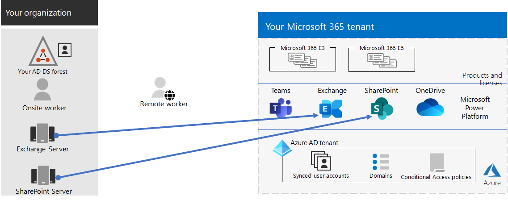
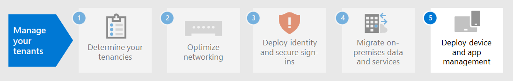

# Step 4. Migration for your Microsoft 365 for enterprise tenancies

Most enterprise organizations have a heterogeneous environment that includes multiple releases of operating systems, client software, and server software. Microsoft 365 for Enterprise includes the most secure versions of the key components of your IT infrastructure. It also includes productivity features that are designed to take advantage of cloud technologies.

To maximize the business value of the Microsoft 365 for Enterprise integrated suite of products, begin planning and implementing a strategy to migrate releases of:

| From | To |
|:-------|:-----|
| Windows 7 and Windows 8.1 | Windows 10 Enterprise |
| Office client products installed on your worker's devices | Microsoft 365 Apps for enterprise |
| Office server products installed on on-premises servers | Their equivalent cloud-based services in Microsoft 365 |
|  |  |

## Migrating to Windows 10

Each Microsoft 365 for Enterprise license includes a license for Windows 10 Enterprise. To migrate your devices that run Windows 7 or Windows 8.1, you can do an in-place upgrade. Support ended for Windows 7 on *January 14, 2020*. 

For additional methods of installing Windows 10 Enterprise beyond an in-place upgrade, see [Windows 10 deployment scenarios](https://docs.microsoft.com/windows/deployment/windows-10-deployment-scenarios). You can also [plan for Windows 10 deployment](https://aka.ms/planforwin10deployment) on your own.

## Migrating to Microsoft 365 Apps for enterprise

Microsoft 365 for Enterprise includes Microsoft 365 Apps for enterprise, a version of the Office client products (Word, PowerPoint, Excel, and Outlook) that is installed and updated from the Microsoft cloud. Microsoft 365 Apps for enterprise includes security updates and the latest features. For more information, see [About Microsoft 365 Apps for enterprise](https://docs.microsoft.com/deployoffice/about-microsoft-365-apps).

Rather than keeping your computers current for Office 2019 or older versions, take the following steps:

1. Get and assign a Microsoft 365 license for your users.
2. Uninstall Office 2013 or Office 2016 on their computers.
3. Install Microsoft 365 Apps for enterprise, either individually or during an IT rollout. For more information, see [Deployment guide for Microsoft 365 Apps](https://docs.microsoft.com/deployoffice/deployment-guide-microsoft-365-apps).

Microsoft 365 Apps for enterprise installs both security updates and new feature updates automatically. It can take advantage of cloud-based services in Microsoft 365 for enhanced security and productivity.

## Migrating on-premises servers and data to Microsoft 365

Microsoft 365 for Enterprise includes cloud-based versions of Office server services that use some of the same tools as on-premises versions of Office server software, such as web browsers and the Outlook client. These cloud-based services are automatically updated for security and new features. After migration, your IT department can save the time it takes to maintain and update on-premises servers.

Use the following resources for information about migrating users and data for specific Microsoft 365 workloads:

- [Move mailboxes from on-premises Exchange Server to Exchange Online](https://docs.microsoft.com/exchange/hybrid-deployment/move-mailboxes)
- [Migrate SharePoint data from SharePoint Server to SharePoint Online](https://docs.microsoft.com/sharepointmigration/migrate-to-sharepoint-online)
- [Migrate Skype for Business Online to Microsoft Teams](https://docs.microsoft.com/microsoftteams/migration-interop-guidance-for-teams-with-skype)

## Transition your entire organization

To get a better picture of how to move your entire organization to the products and services in Microsoft 365 for enterprise, download this transition poster:

This two-page poster is a quick way to inventory your existing infrastructure. Use it to get guidance for moving to a product or service in Microsoft 365 for Enterprise. It shows Windows and Office products and other infrastructure and security elements such as device management, identity and threat protection, and information and compliance protection.

## Results of Step 4

For migration for your Microsoft 365 tenancy, you have determined:

- Which devices are running Windows 7 or Windows 8.1 and the plan to update them to Windows 10 Enterprise.
- Which devices are running the Office client apps and the plan to update them to Microsoft 365 apps for enterprise.
- Which on-premises Office server services should be migrated to their Microsoft 365 equivalent and the plan to migrate them and their data.

Here is an example of a tenancy with a completed migration of on-premises servers.

The tenancy has:

- Migrated its on-premises Exchange Server mailboxes to Exchange Online.
- Migrated its on-premises SharePoint Server sites and data to SharePoint in Microsoft 365.

## Ongoing maintenance for migration

On an ongoing basis, you might need to:

- Depending on the state of your Exchange mailbox migration, continue rolling the transition to Exchange Online out to your organization.
- Depending on the state of your on-premises SharePoint site migration, continue rolling the transition to SharePoint in Microsoft 365 out to your organization.

## Next step

Continue with [device and app management](tenant-management-device-management.md) to deploy device and app management.
