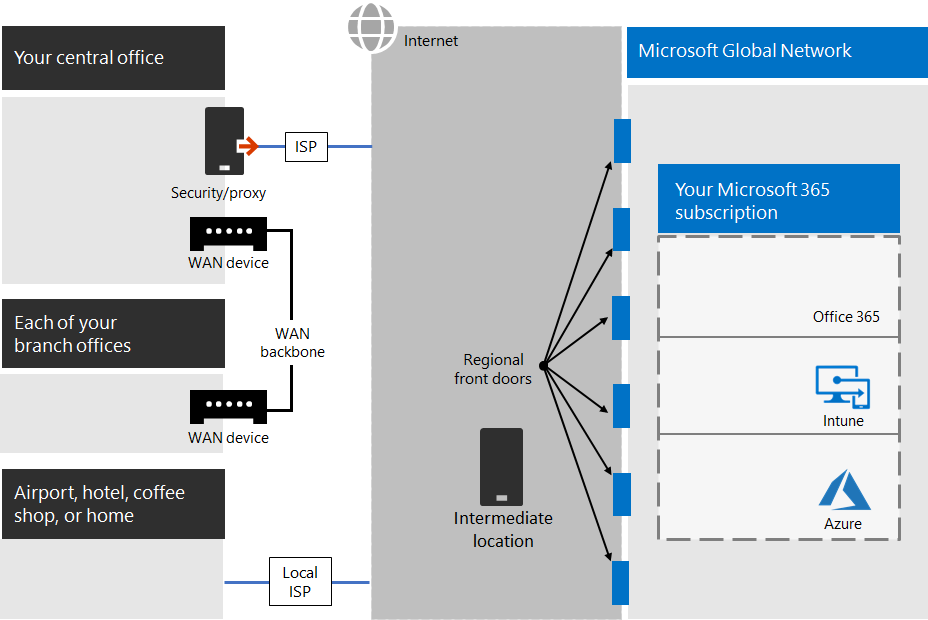
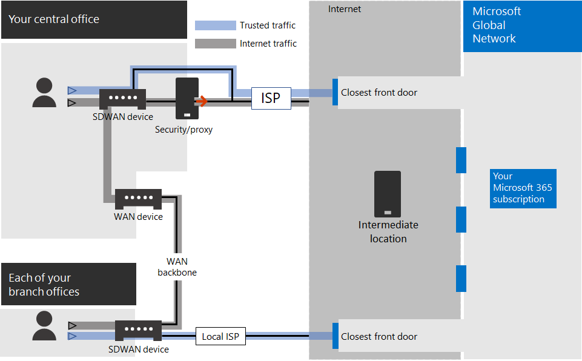
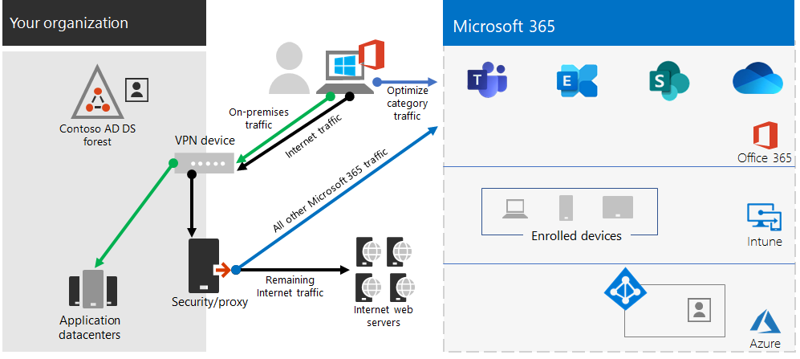
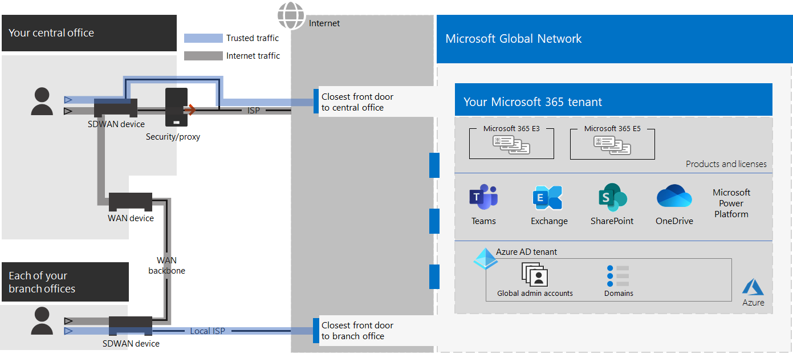
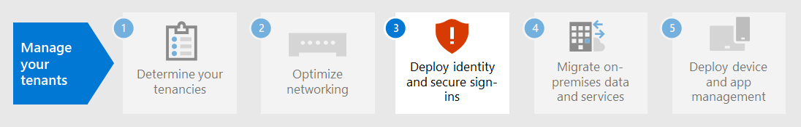

# Step 2. Optimal networking for your Microsoft 365 for enterprise tenants

Microsoft 365 for enterprise includes cloud productivity apps such as Teams and Exchange Online, and Microsoft Intune, along with many identity and security services of Microsoft Azure. All of these cloud-based services rely on the security, performance, and reliability of connections from client devices on your on-premises network or any location on the Internet.

To optimize network access for your tenant, you need to:

- Optimize the path between your on-premises users and the closest location to the Microsoft Global Network.
- Optimize access to the Microsoft Global Network for your remote users that are using a remote access VPN solution.
- Use Network Insights to design the network perimeter for your office locations.
- Optimize access to specific assets hosted on SharePoint sites with the Office 365 CDN.
- Configure proxy and network edge devices to bypass processing for Microsoft 365 trusted traffic with the list of endpoints and automate the updating of the list as changes are made.

## Enterprise on-premises workers

For enterprise networks, you should optimize the end user experience by enabling the highest-performing network access between clients and the closest Microsoft 365 endpoints. The quality of end user experience is directly related to the performance and responsiveness of the application that the user is using. For example, Microsoft Teams relies on low latency so that user phone calls, conferences and shared screen collaborations are glitch-free.

The primary goal in the network design should be to minimize latency by reducing the round-trip time (RTT) from client devices to the Microsoft Global Network, Microsoft's public network backbone that interconnects all of Microsoft's datacenters with low latency, high availability cloud application entry points, known as front doors, spread around the world.

Here is an example of a traditional enterprise network.

In this illustration, branch offices connect to a central office through wide area network (WAN) devices and a WAN backbone. Internet access is through a security or proxy device at the network edge of the central office and an Internet service provider (ISP). On the Internet, the Microsoft Global Network has a series of front doors in regions around the world. Organizations can also use intermediate locations for additional packet processing and security for traffic. An organization's Microsoft 365 tenant is located within the Microsoft Global Network.

The problems with this configuration for Microsoft 365 cloud services are:

- For users in branch offices, traffic gets sent to non-local front doors, increasing latency.
- Sending traffic to intermediate locations create network hairpins that perform duplicate packet processing on trusted traffic, increasing latency.
- Network edge devices perform unneeded and duplicate packet processing on trusted traffic, increasing latency.

Optimizing Microsoft 365 network performance doesn't need to be complicated. You can get the best possible performance by following a few key principles:

- Identify Microsoft 365 network traffic, which is trusted traffic destined to Microsoft cloud services.
- Allow local branch egress of Microsoft 365 network traffic to the internet from each location where users connect to Microsoft 365.
- Avoid network hairpins.
- Allow Microsoft 365 traffic to bypass proxies and packet inspection devices.

If you implement these principles, you get an enterprise network optimized for Microsoft 365.

In this illustration, branch offices have their own Internet connection through a software-defined WAN device (SDWAN) device, which sends trusted Microsoft 365 traffic to the regionally closest front door. At the central office, trusted Microsoft 365 traffic bypasses the security or proxy device and intermediate devices are no longer used.

Here's are how the optimized configuration solves the latency issues of a traditional enterprise network:

- Trusted Microsoft 365 traffic skips the WAN backbone and is sent to local front doors for all offices, decreasing latency.
- Network hairpins that perform duplicate packet processing are skipped for Microsoft 365 trusted traffic, decreasing latency.
- Network edge devices that perform unneeded and duplicate packet processing are skipped for Microsoft 365 trusted traffic, decreasing latency.

For more information, see [Microsoft 365 network connectivity overview](../enterprise/microsoft-365-networking-overview.md).

## Remote workers

If your remote workers are using a traditional VPN client to obtain remote access to your organization network, verify that the VPN client has split tunneling support. Without split tunneling, all of your remote work traffic gets sent across the VPN connection, where it must be forwarded to your organization's edge devices, get processed, and then sent on the Internet. Here is an example.

In this illustration, Microsoft 365 traffic must take an indirect route through your organization, which could be forwarded to a Microsoft Global Network front door far away from the VPN client's physical location. This indirect path adds latency to the network traffic and decreases overall performance.

With split tunneling, you can configure your VPN client to exclude specific types of traffic from being sent over the VPN connection to the organization network.

To optimize access to Microsoft 365 cloud resources, configure your split tunneling VPN clients to exclude traffic to the **Optimize** category Microsoft 365 endpoints over the VPN connection. For more information, see [Office 365 endpoint categories](../enterprise/microsoft-365-network-connectivity-principles.md#optimizing-connectivity-to-microsoft-365-services) and [the lists](../enterprise/microsoft-365-vpn-implement-split-tunnel.md#implement-vpn-split-tunneling) of Optimize category endpoints for split tunneling.

Here is the resulting traffic flow for split tunneling, in which most of the traffic to Microsoft 365 cloud apps bypasses the VPN connection.

In this illustration, the VPN client sends and receives crucial Microsoft 365 cloud service traffic directly over the Internet and to the nearest front door into the Microsoft Global Network.

For more information and guidance, see [Optimize Office 365 connectivity for remote users using VPN split tunneling](../enterprise/microsoft-365-vpn-split-tunnel.md).

## Using Network Insights

Network insights are performance metrics collected from your Microsoft 365 tenant that help you design network perimeters for your office locations. Each insight provides live details about the performance characteristics for a specified issue for each geographic location where on-premises users are accessing your tenant.

There are two tenant level network insights that may be shown for the tenant:

- [Exchange sampled connections impacted by connectivity issues](../enterprise/office-365-network-mac-perf-insights.md#exchange-sampled-connections-affected-by-connectivity-issues)
- [SharePoint sampled connections impacted by connectivity issues](../enterprise/office-365-network-mac-perf-insights.md#sharepoint-sampled-connections-affected-by-connectivity-issues)

These are the specific network insights for each office location:

- [Backhauled network egress](../enterprise/office-365-network-mac-perf-insights.md#backhauled-network-egress)
- [Better performance detected for customers near you](../enterprise/office-365-network-mac-perf-insights.md#better-performance-detected-for-customers-near-you)
- [Use of a non-optimal Exchange Online service front door](../enterprise/office-365-network-mac-perf-insights.md#use-of-a-nonoptimal-exchange-online-service-front-door)
- [Use of a non-optimal SharePoint Online service front door](../enterprise/office-365-network-mac-perf-insights.md#use-of-a-nonoptimal-sharepoint-service-front-door)
- [Low download speed from SharePoint front door](../enterprise/office-365-network-mac-perf-insights.md#low-download-speed-from-sharepoint-front-door)
- [China user optimal network egress](../enterprise/office-365-network-mac-perf-insights.md#china-user-optimal-network-egress)

For more information, see [Microsoft 365 Network Insights](../enterprise/office-365-network-mac-perf-insights.md).

## SharePoint performance with the Office 365 CDN

A cloud-based Content Delivery Network (CDN) allows you to reduce load times, save bandwidth, and speed responsiveness. A CDN improves performance by caching static assets such as graphic or video files closer to the browsers requesting them, which helps to speed up downloads and reduce latency. You can use the built-in Office 365 Content Delivery Network (CDN), included with SharePoint in Microsoft 365 E3 and E5, to host static assets to provide better performance for your SharePoint pages.

The Office 365 CDN is composed of multiple CDNs that allow you to host static assets in multiple locations, or _origins_, and serve them from global high-speed networks. Depending on the kind of content you want to host in the Office 365 CDN, you can add **public** origins, **private** origins, or both.

When deployed and configured, the Office 365 CDN uploads assets from public and private origins and makes them available for fast access to users located across the Internet.

For more information, see [Use the Office 365 CDN with SharePoint Online](../enterprise/use-microsoft-365-cdn-with-spo.md).

## Automated endpoint listing

To have your on-premises clients, edge devices, and cloud-based packet analysis services skip processing of trusted Microsoft 365 traffic, you must configure them with the set of endpoints (IP address ranges and DNS names) corresponding to Microsoft 365 services. These endpoints can be manually configured in firewalls and other edge security devices, PAC files for client computers to bypass proxies, or SD-WAN devices at branch offices. However, the endpoints change over time, requiring ongoing manual maintenance of the endpoint lists in these locations.

To automate the listing and change management for Microsoft 365 endpoints in your client PAC files and network devices, use the [Office 365 IP Address and URL REST-based web service](../enterprise/microsoft-365-ip-web-service.md). This service helps you better identify and differentiate Microsoft 365 network traffic, making it easier for you to evaluate, configure, and stay current with the latest changes.

You can use PowerShell, Python, or other languages to determine the changes to endpoints over time and configure your PAC files and edge network devices.

The basic process is:

1. Use the Office 365 IP Address and URL web service and the configuration mechanism of your choice to configure your PAC files and network devices with the current set of Microsoft 365 endpoints.
2. Run a daily recurring to check for changes in the endpoints or use a notification method.
3. When changes are detected, regenerate and redistribute the PAC file for client computers and make the changes to your network devices.

For more information, see [Office 365 IP Address and URL web service](../enterprise/microsoft-365-ip-web-service.md).

## Results of Step 2

For your Microsoft 365 tenant with optimal networking, you have determined:

- How to optimize network performance for on-premises users by adding Internet connections to all branch offices and eliminating network hairpins.
- How to implement automated trusted endpoint listing for your client-based PAC files and your network devices and services, including ongoing updates (most suitable for enterprise networks).
- How to support the access of remote workers to on-premises resources.
- How to use Network Insights
- How to deploy the Office 365 CDN.

Here is an example of an enterprise organization and its tenant with optimal networking.

In this illustration, the tenant for this enterprise organization has:

- Local internet access for each branch office with an SDWAN device that forwards trusted Microsoft 365 traffic to a local front door.
- No network hairpins.
- Central office security and proxy edge devices that forward Microsoft 365 trusted traffic to a local front door.

## Ongoing maintenance for optimal networking

On an ongoing basis, you might need to:

- Update your edge devices and deployed PAC files for changes in endpoints or verify that your automated process works properly.
- Manage your assets in the Office 365 CDN.
- Update the split tunneling configuration in your VPN clients for changes in endpoints.

## Next step

Continue with [identity](tenant-management-identity.md) to synchronize your on-premises accounts and groups and enforce secure user sign-ins.
