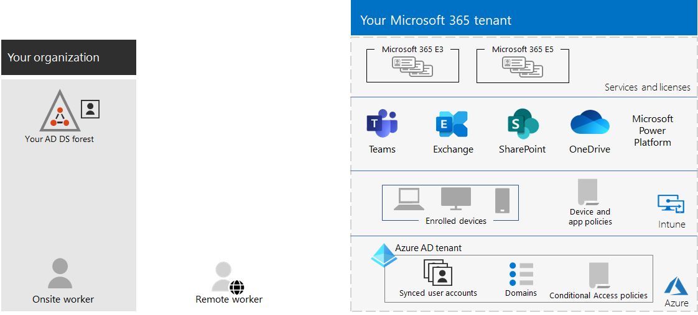

# Tenant management for Microsoft 365 for enterprise

Creating a path to your organization's digital transformation with cloud computing requires a firm foundation upon which your workers can rely for productivity, collaboration, performance, privacy, compliance, and security.

Correct configuration of your Microsoft 365 tenants provides that foundation, leaving your workers to focus on getting their work done and your IT department to focus on end-to-end solutions that provide additional business value.

This solution takes you through the configuration of that foundation in these steps:

1. Determine your tenants
2. Optimize your networking
3. Synchronize your identities and enforce secure sign-ins
4. Migrate your Windows devices, Office clients, and on-premises Office servers and data
5. Deploy device and app management

But first, let's take a moment to understand what a tenant is and what a tenant that provides a firm foundation looks like.

## A Microsoft 365 tenant defined

A Microsoft 365 tenant is a dedicated instance of the services of Microsoft 365 and your organization data stored within a specific default location, such as Europe or North America. This location is specified when you create the tenant for your organization. Each Microsoft 365 tenant is distinct, unique, and separate from all other Microsoft 365 tenants. You create a Microsoft 365 tenant when you purchase one or more products from Microsoft, such as Microsoft 365 E3 or E5, and a set of licenses for each.

Your Microsoft 365 tenant also includes a Microsoft Entra tenant, which is a dedicated instance of Microsoft Entra ID for user accounts, groups, and other objects. Each Microsoft Entra tenant is distinct, unique, and separate from all other Microsoft Entra tenants. While your organization can have multiple Microsoft Entra tenants that you can set up with Azure subscriptions, Microsoft 365 tenants can only use a single Microsoft Entra tenant, the one that was created when you created the tenant.

Here is an example:

*Tenant management* is the planning, deployment, and ongoing operation of your Microsoft 365 tenants.

## Attributes of a well-designed and operating tenant

Beyond the correct name and location for your tenant, there are additional elements to plan, deploy, and manage to ensure that your user experiences with cloud productivity apps&mdash;such as Microsoft Teams and Exchange Online&mdash;are effective, secure, and performant.

Here are the elements:

- You have the correct set of products (subscriptions) and licenses.
  - The set of products match your business, IT, and security needs.
  - There is an adequate number of licenses for your workers and anticipated changes in staffing.
- For networking:
  - You have configured the correct DNS domain names.
  - For enterprise networks, you have optimized network traffic to the Microsoft network for onsite workers.
  - You have optimized network traffic for remote workers who are using a VPN client.
- You have synchronized your Active Directory Domain Services (AD DS) accounts, groups, and other objects.
  - Your Microsoft Entra tenant accounts are mapped to Exchange Online mailboxes with the correct DNS domains for email addresses.
  - Your user accounts have been assigned the correct licenses from the correct purchased products (such as Microsoft 365 E3 or E5).
- You have configured strong identity and access management.
  - You are requiring secure user sign-in with passwordless or multi-factor authentication (MFA).
  - You have Conditional Access policies that enforce sign-in requirements and restrictions for higher levels of security.
- On-premises Office servers and their data have been migrated to cloud apps or are being used in a hybrid configuration.
- You are managing devices with Intune or Basic Mobility and Security built into Microsoft 365.
  - Your organization-owned devices are enrolled and managed.
  - The apps for personal devices are managed.

Here is an example of a Microsoft 365 tenant with all these elements in place.

In this illustration, the Microsoft 365 tenant includes:

- Products and licenses for Microsoft 365 E3 and E5.
- Microsoft 365 productivity apps.
- Intune with enrolled devices and device and application policies.
- A Microsoft Entra tenant that has synchronized user account (groups and other directory objects are not shown), domains, and Conditional Access policies.

## Tenant capabilities for Microsoft 365 for enterprise

The following sections and table list the key capabilities and licensing for the steps in this solution.

### Tenant

|Capability or feature|Description|Licensing|
|---|---|---|
|Multiple tenants|Each Microsoft 365 tenant is distinct, unique, and separate from all other Microsoft 365 tenants. With multiple tenants, there are restrictions and additional considerations when managing them and providing services to your users.|Microsoft 365 E3 or E5|
|Cross-tenant mailbox migration|Tenant administrators can move mailboxes between tenants with minimal infrastructure dependencies in their on-premises systems. This removes the need to off-board and onboard mailboxes.|Microsoft 365 E3 or E5|
|Multi-Geo|Your tenant can store data at rest in the other datacenter geo locations that you've chosen to meet data residency requirements.|Microsoft 365 E3 or E5|
|Move core data to a new datacenter geo|As Microsoft adds new datacenter geos for additional capacity and compute resources, you can request a datacenter geo move for in-geo data residency for your core customer data.|Microsoft 365 E3 or E5|
||||

### Networking

|Capability or feature|Description|Licensing|
|---|---|---|
|Network Insights|Network performance metrics collected from your Microsoft 365 tenant to help you design network perimeters for your office locations.|Microsoft 365 E3 or E5|
|Automate endpoint updates|Automate the configuration and ongoing updates for Microsoft 365 endpoints in your client PAC files and network devices and services.|Microsoft 365 E3 or E5|
||||

### Identity

|Capability or feature|Description|Licensing|
|---|---|---|
|Synchronize on-premises Active Directory Domain Services (AD DS) with your Microsoft Entra tenant|Leverage your on-premises identity provider for user accounts, groups, and other objects.|Microsoft 365 E3 or E5|
|MFA enforced with security defaults|Protect against compromised identities and devices by requiring a second form of authentication for sign-ins. Security defaults require MFA for all user accounts.|Microsoft 365 E3 or E5|
|MFA enforced with Conditional Access|Require MFA based on the attributes of the sign-in with Conditional Access policies.|Microsoft 365 E3 or E5|
|MFA enforced with risk-based Conditional Access|Require MFA based on the risk of the user sign-in with Microsoft Defender for Identity.|Microsoft 365 E5 or E3 with Microsoft Entra ID P2 licenses|
|Self-Service Password Reset (SSPR)|Allow your users to reset or unlock their passwords or accounts.|Microsoft 365 E3 or E5|
||||

### Migration

|Capability or feature|Description|Licensing|
|---|---|---|
|Migrate to Windows 11|Migrate your devices that run Windows 7, Windows 8.1, or Windows 10 to Windows 11 Enterprise.|Windows 11 Enterprise licenses included with Microsoft 365 E3 or E5|
|Migrate to Microsoft 365 Apps for enterprise|Migrate your Office client apps such as Word and PowerPoint to the versions installed from the cloud that are updated with new features.|Microsoft 365 E3 or E5|
|Migrate on-premises servers and data to Microsoft 365|Migrate your Exchange mailboxes, SharePoint sites, and Skype for Business Online to Microsoft 365 cloud services.|Microsoft 365 E3 or E5|
||||

### Device and app management

|Capability or feature|Description|Licensing|
|---|---|---|
|Microsoft Intune|A cloud-based service that provides mobile device management (MDM) and mobile application management (MAM) to control how your organization's application and the devices are used, including mobile phones, tablets, and laptops.|Microsoft 365 E3 or E5|
|Basic Mobility and Security|Secure and manage your users' mobile devices like iPhones, iPads, Androids, and Windows phones with this built-in service.|Microsoft 365 E3 or E5|
||||

## Next steps

Use these steps to set up and manage your Microsoft 365 tenants.

1. [Determine your tenants](tenant-management-tenants.md)
2. [Optimize your networking](tenant-management-networking.md)
3. [Synchronize your identities and enforce secure sign-ins](tenant-management-identity.md)
4. [Migrate your on-premises Office servers and data](tenant-management-migration.md)
5. [Deploy device and app management](tenant-management-device-management.md)

Each step describes deployment options, summarizes the results, and ongoing maintenance tasks.
