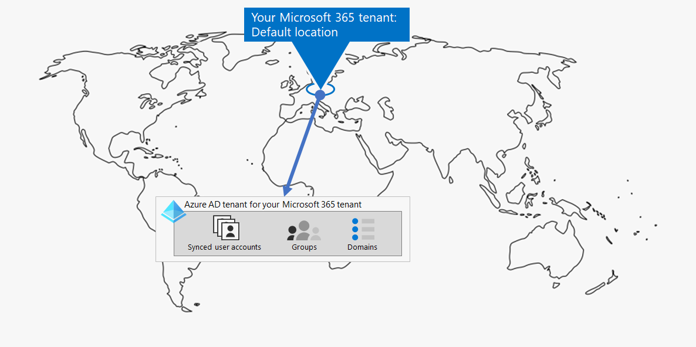
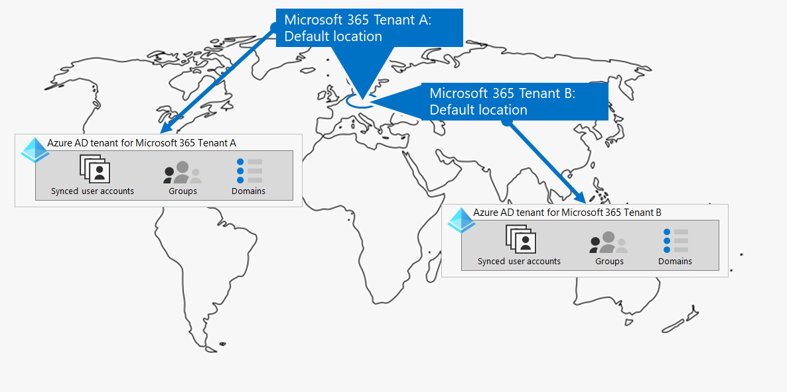
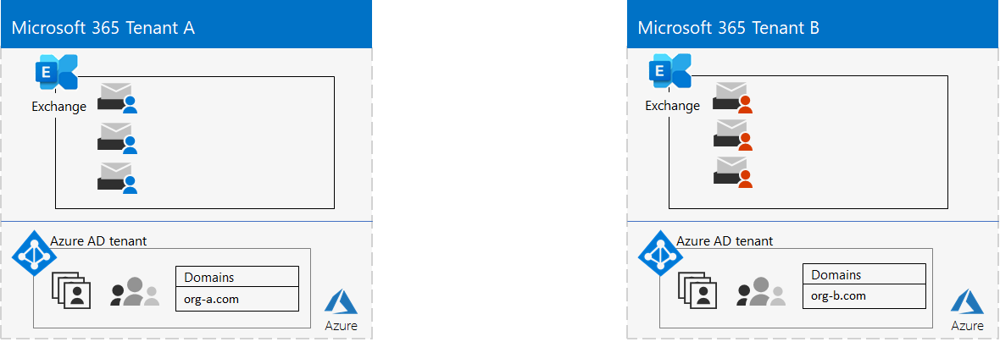
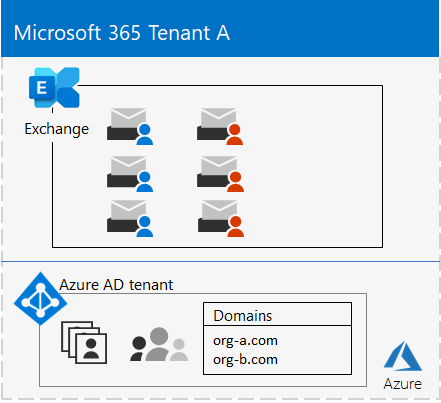
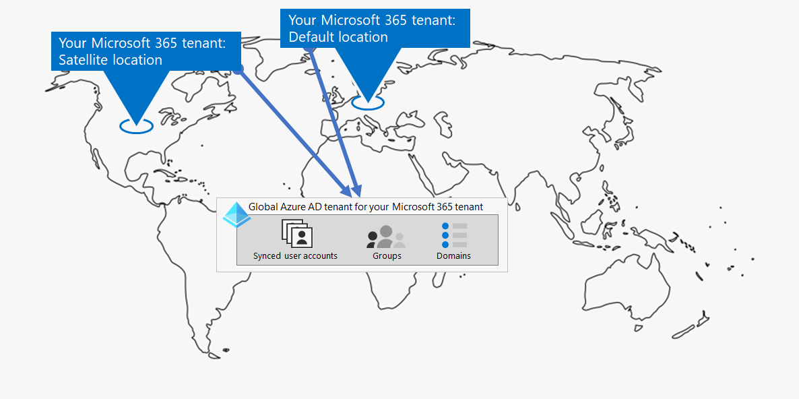
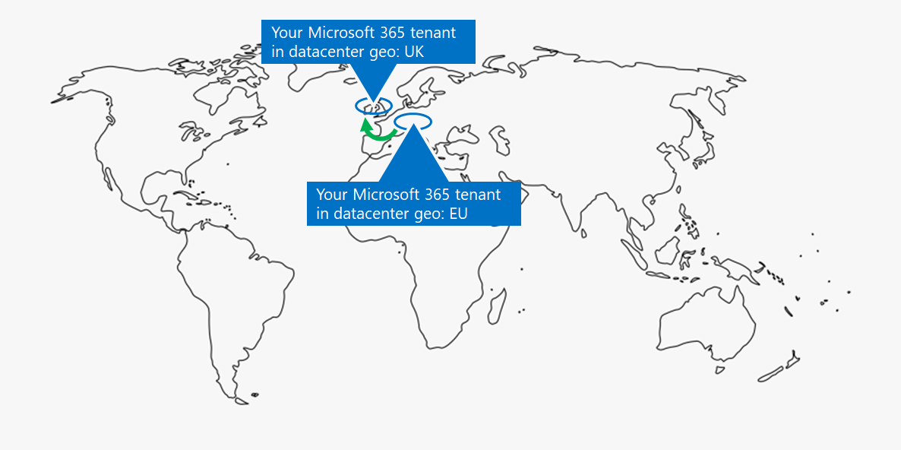
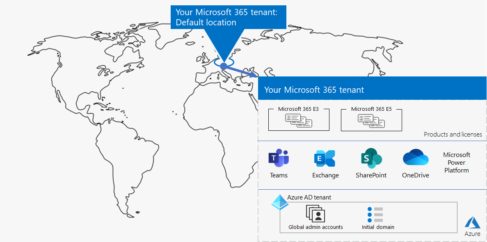
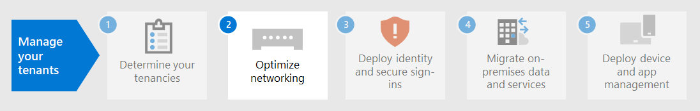

# Step 1. Your Microsoft 365 for enterprise tenants

One of your first tenant decisions is how many to have. Each Microsoft 365 tenant is distinct, unique, and separate from all other Microsoft 365 tenants. Its corresponding Microsoft Entra (formerly known as Azure AD or Azure Active Directory) tenant is also distinct, unique, and separate from all other Microsoft 365 tenants.

## Single tenant
Having a single tenant simplifies many aspects of your organization's use of Microsoft 365. A single tenant means a single Microsoft Entra tenant with a single set of accounts, groups, and policies. Permissions and sharing of resources across your organization can be done through this central identity provider.

A single tenant provides the most feature-rich and simplified collaboration and productivity experience for your users.

Here's an example showing the default location and Microsoft Entra tenant of a Microsoft 365 tenant.

## Multiple tenants

There are many reasons why your organization could have multiple tenants:

- Administrative isolation
- Decentralized IT
- Historical decisions
- Mergers, acquisitions, or divestitures
- Clear separation of branding for conglomerate organizations
- Preproduction, test, or sandbox tenants

Here's an example of an organization that has two tenants (Tenant A and Tenant B) in the same default datacenter geo. Each tenant as a separate Microsoft Entra tenant.

When you have multiple tenants, there are restrictions and additional considerations when managing them and providing services to your users.

### Inter-tenant collaboration

If you want your users to collaborate more effectively across different Microsoft 365 tenants in a secure manner, inter-tenant collaboration options include using a central location for files and conversations, sharing calendars, using IM, audio/video calls for communication, and securing access to resources and applications.

For more information, see [Microsoft 365 inter-tenant collaboration](../enterprise/microsoft-365-inter-tenant-collaboration.md).

### Cross-tenant mailbox migration (preview)

Prior to cross-tenant mailbox migration (in preview), when moving Exchange Online mailboxes between tenants, you have to completely offboard a user mailbox from their current tenant (the source tenant) to on-premises and then onboard them to a new tenant (the target tenant). With the new cross-tenant mailbox migration feature, tenant administrators in both source and target tenants can move mailboxes between the tenants with minimal infrastructure dependencies in their on-premises systems. This removes the need to off-board and onboard mailboxes.

Here are two example tenants and their mailboxes before cross-tenant mailbox migration.

In this illustration, two separate tenants have their own domains and set of Exchange mailboxes.

Here's the target tenant (Tenant A) after cross-tenant mailbox migration.

In this illustration, a single tenant has both domains and both sets of Exchange mailboxes.

For more information, see [Cross-tenant mailbox migration](../enterprise/cross-tenant-mailbox-migration.md).

### Tenant-to-tenant migrations

There are several architectural approaches for mergers, acquisitions, divestitures, and other scenarios that might lead you to migrate an existing Microsoft 365 tenant to a new tenant.

For detailed guidance, see [Microsoft 365 tenant-to-tenant migrations](../enterprise/microsoft-365-tenant-to-tenant-migrations.md).

## Multi-Geo for a tenant

With Microsoft 365 Multi-Geo, you can provision and store data at rest in the other datacenter geo locations that you've chosen to meet data residency requirements, and at the same time unlock your global rollout of modern productivity experiences to your workers.

In a Multi-Geo environment, your Microsoft 365 tenant consists of a default or central location where your Microsoft 365 subscription was originally created and one or more satellite locations. In a multi-geo tenant, the information about geo locations, groups, and user information is mastered in a global Microsoft Entra tenant. Because your tenant information is mastered centrally and synchronized into each geo location, collaboration experiences involving anyone from your company are shared across the locations.

Here's an example of an organization that has its default location in Europe and a satellite location in North America. Both locations share the same global Microsoft Entra tenant for the single Microsoft 365 tenant.

For more information, see [Microsoft 365 Multi-Geo](../enterprise/microsoft-365-multi-geo.md).

## Moving core data to a new datacenter geo

Microsoft continues to open new datacenter geos for Microsoft 365 services. These new datacenter geos add capacity and compute resources to support our ongoing customer demand and usage growth. Additionally, the new datacenter geos offer in-geo data residency for core customer data.

Although opening a new datacenter geo doesn't impact you and your core data stored in an already existing datacenter geo, Microsoft allows you to request an early migration of your organization's core customer data at rest to a new datacenter geo.

Here's an example in which a Microsoft 365 tenant was moved from the European Union (EU) datacenter geo to the one located in the United Kingdom (UK).

For more information, see [Moving core data to new Microsoft 365 datacenter geos](../enterprise/moving-data-to-new-datacenter-geos.md).

## Products and licenses for a tenant

Your Microsoft 365 tenant gets created when you purchase your first product, such as Microsoft 365 E3. Along with the product are licenses, which are charged a monthly or annual fee. An administrator then assigns an available license from one of your products to a user account, either directly or through group membership. Depending on your organization's business needs, you might have a set of products, each with their own pool of licenses.

Determining the set of products and the number of licenses for each requires some planning to:

- Ensure you have enough licenses for the user accounts that need advanced features.
- Prevent you from running out of licenses or having too many unassigned licenses, based on changes in staffing at your organization.

## Results of Step 1

For your Microsoft 365 for enterprise tenants, you have determined:

- How many tenants you have or need.
- For each tenant, which products and licenses must be purchased.
- Whether a tenant needs to be Multi-Geo to comply with data residency requirements.
- Whether you need to set up inter-tenant collaboration.
- Whether you need to migrate one tenant to another.
- Whether you need to move core data from one datacenter geo to new one.

Here's an example of a new tenant.

In this illustration, the tenant has:

- A default location corresponding to a Microsoft 365 datacenter geo.
- A set of products and licenses.
- The set of cloud productivity apps, some of which are specific to products.
- A Microsoft Entra tenant that contains global administrator accounts and an initial DNS domain name.

As we move through the additional steps of this solution, we'll build out this figure.

## Ongoing maintenance for tenants

On an ongoing basis, you might need to:

- Add a new tenant.
- Add new products to a tenant with an initial number of licenses.
- Change the set of licenses for a product in a tenant to adjust for changing staff requirements.
- Move your core data from a tenant to a new datacenter geo location.
- Add Multi-Geo for data residency requirements.
- Set up inter-tenant collaboration.

## Next step

Continue with [networking](tenant-management-networking.md) to provide optimal networking from your workers to Microsoft 365 cloud services.
