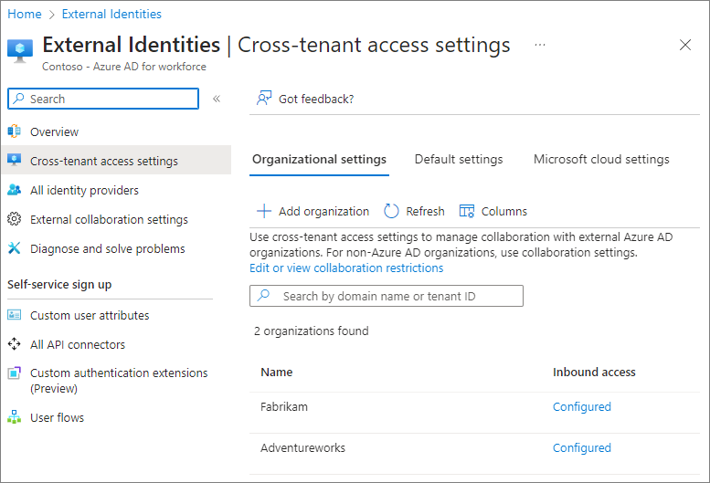
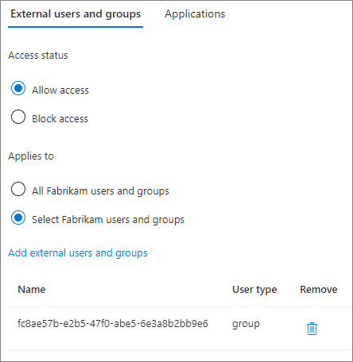
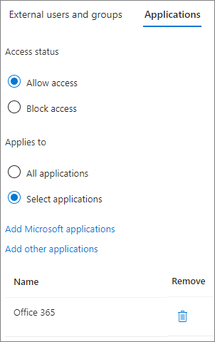
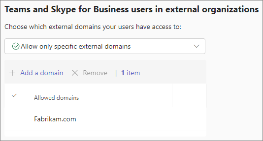
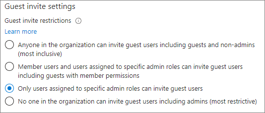

# Onboard trusted vendors to collaborate in Microsoft 365

If your organization has an approval process for access to Microsoft 365 by external organizations, you can use features in Azure Active Directory and Teams to block access from unapproved organizations and add new organizations as they're approved.

[Collaborate with guests in a team (IT Admins)](collaborate-as-team.md)

#### SharePoint and OneDrive integration with Azure AD B2B

The procedures in this article assume that you've enabled [SharePoint and OneDrive integration with Azure AD B2B](/sharepoint/sharepoint-azureb2b-integration). If you haven't enabled Azure AD B2B integration for SharePoint and OneDrive, Azure AD B2B domain allow and block lists don't affect file and folder sharing. In this case, use [Restrict sharing of SharePoint and OneDrive content by domain](/sharepoint/restricted-domains-sharing).

## Allow the vendor's domain in Azure AD external collaboration settings

With Azure AD external collaboration settings, you can allow or block invites to certain domains. By creating an allow list, you allow guest invitations only to those domains and all others are blocked. You can use this to allow guest invitations to vendors that you've approved while blocking those to vendors you haven't.

To allow sharing invitations only from specified domains
1. In Azure Active Directory, under **Identity**, expand **External identities**, and then choose **External collaboration settings**.
1. Under **Collaboration restrictions**, select **Allow invitations only to the specified domains**, and then type the domains that you want to allow.
1. Select **Save**.

    

For more information about using allow or block lists in Azure AD, see [Allow or block invitations to B2B users from specific organizations](/azure/active-dir.ectory/external-identities/allow-deny-list)

## Allow domains for other Microsoft 365 organizations

If you approved vendor also uses Microsoft 365, there are additional settings you can configure to manage these domains and create a more integrated experience for your users.

By adding the vendor organization to Azure AD cross-tenant access settings, you can specify:

- Which users in the vendor organization can be invited to your organization
- Which users in the vendor organization can participate in shared channels in Microsoft Teams
- Which applications those users have access to in your organization
- Whether your Conditional Access policies will accept claims from other Azure AD organizations when external users access your resources.

By adding the vendor organization to the allow list for Teams external access:

- Users in your organization and the vendor organization can chat and meet without the vendor having to log in as a guest.

#### Allow the vendor's domain in Azure AD cross-tenant access settings

To specify settings such as who can be invited from the vendor organization and what applications they can use, first add the application in Azure AD cross-tenant access settings.

To add an organization
1. Sign in to the [Microsoft Entra admin center](https://entra.microsoft.com/) as a Global administrator.
1. Expand **Identity**, and then expand **External Identities**.
1. Select **Cross-tenant access settings**.
1. Select **Organizational settings**.
1. Select **Add organization**.
1. On the **Add organization** pane, type the full domain name (or tenant ID) for the organization.
1. Select the organization in the search results, and then select **Add**.

To specify who your users can invite as guests from the vendor organization:
1. On the **Organizational settings** tab, select the **Inbound access** link for the organization you want to configure.
1. On the **B2B collaboration** tab, select **Customize settings**
1. On the **External users and groups** tab, choose **Select \<organization\> users and groups**, and then select **Add external users and groups**.
1. Add the IDs of the users and groups that you want to include, and then select **Submit**.
1. Select **Save**.

    

To specify which applications guests from the vendor organization can use:
1. On the **Organizational settings** tab, select the **Inbound access** link for the organization you want to configure.
1. On the **B2B collaboration** tab, select **Customize settings**
1. On the **Applications** tab, choose **Select applications**, and then select **Add Microsoft applications** or **Add other applications**.
1. Select the applications that you want to allow, and then choose **Select**.
1. Select **Save**.

    

For more information about the options available in cross-tenant access settings, see [Configure cross-tenant access settings for B2B collaboration](/azure/active-directory/external-identities/cross-tenant-access-settings-b2b-collaboration).

If you plan to use Teams shared channels with the vendor organization, both organizations must set up cross-tenant access settings for Azure AD B2B direct connect. For details, see [Collaborate with external participants in a shared channel](/microsoft-365/solutions/collaborate-teams-direct-connect).

#### Allow the vendor's domain in Teams external access

To allow users in your organization and the vendor organization can chat and meet without the vendor having to log in as a guest, allow the domain in Teams external access.

To allow an organization in Teams external access
1. In the Teams admin center, expand **Users**, and then select **External access**.
1. Under **Choose which domains your users have access to**, choose **Allow only specific external domains**.
1. Select **Allow domains**.
1. In the **Domain** box, type the domain that you want to allow and then select **Done**.
1. If you want to allow another domain, select **Add a domain**.
1. Select **Save**.

    

The external access settings page in the Teams admin center includes Teams accounts not managed by an organization and Skype users. You can turn these off if these accounts don't meet your organization's requirements for approved vendors.

For more information about Teams external access options, see [Manage external meetings and chat with people and organizations using Microsoft identities](/microsoftteams/trusted-organizations-external-meetings-chat).

## Prevent unauthenticated access

There are two features that allow someone from outside your organization to access resources in your organization without signing in:

- Anonymous meeting join
- Unauthenticated file and folder sharing

If your requirements for trusted vendors require everyone to sign in before accessing your organization's resources, you can turn these options off.

To prevent people from joining meetings as anonymous participants, you can turn off **Anonymous users can join a meeting** in Teams meeting policies. For more information, see [Manage anonymous participant access to Teams meetings (IT admins)](/microsoftteams/anonymous-users-in-meetings).

To prevent unauthenticated file and folder sharing, you must prevent the use of *Anyone* sharing links. You can do this for your entire organization or for specific SharePoint sites. For more information, see [Manage sharing settings for SharePoint and OneDrive in Microsoft 365](/sharepoint/turn-external-sharing-on-or-off) and [Change the sharing settings for a site](/sharepoint/change-external-sharing-site).

## Limit who can invite guests

Create a security group for people allowed to invite guests

The first step is to create a security group for the users who will be allowed to invite guests. Be sure to configure this group to allow an Azure AD role, and then assign it the Guest inviter role.

To create a security group for guest inviters
1. Sign in to [Azure Active Directory](https://aad.portal.azure.com) using a Global administrator or Security administrator account.
1. On the **Active Directory** page, select **Groups** and then select **New group**.
1. Choose **Security** for the **Group type**.
1. Type a **Group name.** 
1. Optionally, add a description for the group.
1. For **Azure AD roles can be assigned to the group**, choose **Yes**.
1. Add group owners and members.
1. Under **Roles**, select **No roles selected**.
1. Search for and select the **Guest inviter** role, and then choose **Select**.
1. Select **Create**, and confirm that you want a group to which roles can be assigned. Your group is created and ready for you to add members.

[Limit who can invite guests](limit-who-can-invite-guests.md)

[Azure Active Directory terms of use](/azure/active-directory/conditional-access/terms-of-use)

## Allow only members in specific security groups to share SharePoint and OneDrive files and folders externally

[Allow only members in specific security groups to share SharePoint and OneDrive files and folders externally](/sharepoint/manage-security-groups)

## Related topics

[Microsoft Entra External ID documentation](/azure/active-directory/external-identities/)

[Use guest access and external access to collaborate with people outside your organization](/microsoftteams/communicate-with-users-from-other-organizations)