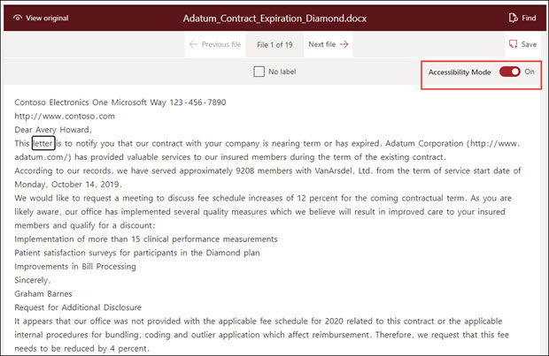
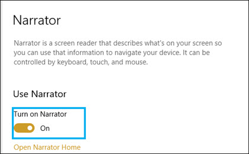

# Accessibility mode in Microsoft Syntex

**Applies to:**  &ensp; &#10003; Unstructured document processing 

In Microsoft Syntex, users can turn on accessibility mode in all stages of model training (label, train, test) when working with example documents. Using accessibility mode can help low-sight users to have easier keyboard accessibility as they navigate and label items in the document viewer.

This helps users to use their keyboards to navigate through text in the document viewer and to hear a narration of not only the selected values, but also of actions (such as labeling or removing labeling from selected text), or predicted label values as you train the model with additional example documents. 

## Requirements

To hear the audio of the narration, make sure to turn on the [Narrator App](https://support.microsoft.com/windows/complete-guide-to-narrator-e4397a0d-ef4f-b386-d8ae-c172f109bdb1) in your Narrator settings on your Windows 10 or later system.

## Labeling for keyboard users

For keyboard users using accessibility mode, if you are labeling text in an example document in the viewer, you can use the following keys:

- Tab: Moves you forward and selects the next word.
- Tab + Shift: Moves you backwards and selects the previous word.
- Enter: Label or removes a label from the selected word.
- Right arrow: Moves you forward through individual characters in a selected word.
- Left arrow: Moves you backward through individual characters in a selected word.

> [!NOTE]
> If you are labeling multiple words for a single label, you need to label each word.

## Narration

For Narrator users using accessibility mode, use the same keyboard navigation described for keyboard users to go through the example document in the viewer.

As you navigate through the sample documents and label string values, Narrator will give user the following audio prompts:

- When you use the keyboard to navigate through the document viewer, Narrator audio will state the selected string.

- Within a selected string, Narrator audio will state each character in the string as you select them by using the left or right arrow keys.

- If you select a string that has been labeled, Narrator will state the value and then "labeled".  For example, if the label value is "Contoso", it will state "Costoso labeled".

- In the training tab, if you select a string in the document viewer that has only been predicted, Narrator audio will state the value, and then "predicted". This occurs when training predicts a value in the file that does not match what has been labeled by the user.

- In the training tab, if you select a string in the document viewer that has been labeled and predicted, Narrator audio will state the value, and then "labeled and predicted". This occurs when training is successful and there is a match between a predicted value and the user label.

After a string is labeled or a label has been removed in the viewer, Narrator audio will warn you to save your changes before you exit.

