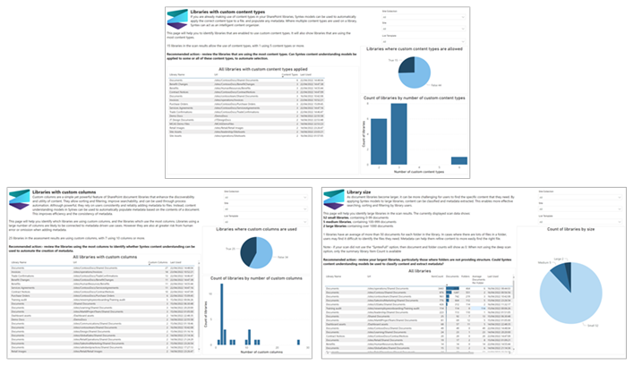

# Discover opportunities in Microsoft Syntex by using the Microsoft 365 Assessment tool

> [!NOTE]
> The Microsoft 365 Assessment tool can be run only against SharePoint Online. 

You can assess how Microsoft Syntex will benefit your organization by using the Microsoft 365 Assessment tool. When you run an assessment, you'll generate a Power BI report that summarizes aspects of your SharePoint information architecture that are indicators for where Syntex might be of value.

The assessment report includes the following information: 

- **Libraries with custom columns** – Identify libraries where Syntex can automatically populate columns, improving consistency. 

- **Column usage** – Identify patterns of column usage, to target Syntex models where they'll have the maximum benefit. 

- **Libraries with custom content types** – Identify libraries using custom content types, where Syntex models can be used to automatically categorize files. 

- **Content type usage** – Identify patterns of content type usage, to target Syntex models where they'll have the maximum benefit. 

- **Libraries with retention labels** – Identify libraries where retention labels are used, where Syntex can be used to automate and improve consistency. 

- **Library size** – Identify large libraries where classification and metadata can improve the content discovery experience. 

- **Library modernization status** – Identify libraries that might need to be modernized to fully make use of Syntex. 

- **Prebuilt model candidates** – Identify libraries where names or content types suggest a prebuilt model could be applied. 

- **Syntex model usage** – Review the current use of Syntex models in your sites. 

- **Assessment overview** – Review the assessment results to identify any failures. 

## Run the assessment

The Syntex assessment is a module in the Microsoft 365 Assessment tool. To run the assessment: 

1. Visit the [Microsoft 365 Assessment tool documentation](https://pnp.github.io/pnpassessment/index.html) to learn more.

2. [Download the tool](https://pnp.github.io/pnpassessment/using-the-assessment-tool/download.html). 

3. [Decide on an authentication method](https://pnp.github.io/pnpassessment/using-the-assessment-tool/setupauth.html).

4. [Configure permissions](https://pnp.github.io/pnpassessment/sharepoint-syntex/requirements.html). 

5. [Run a Syntex assessment](https://pnp.github.io/pnpassessment/sharepoint-syntex/assess.html). 
