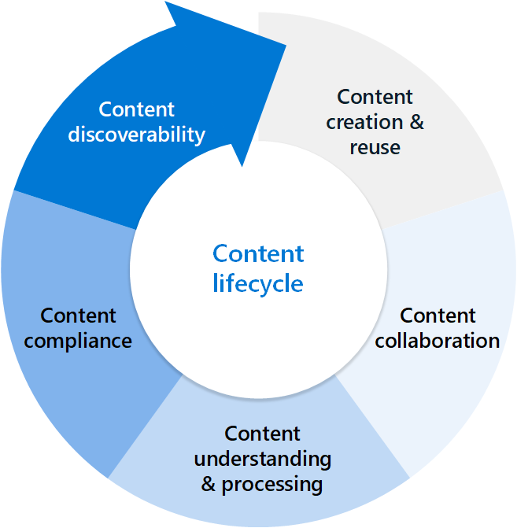
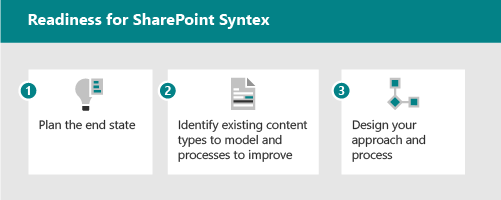

# Get started driving adoption of Microsoft Syntex

Microsoft Syntex is a cloud-based service that applies artificial intelligence (AI) to automate content processing and knowledge extraction. It helps you to transform your content into structured data that can be easily searched, analyzed, and reused.

Microsoft Syntex offers a range of use cases to enhance content management within an enterprise. Here are some examples of how it can be applied:

- **Automatically generate routine documents** — Employ content assembly to create modern templates for files that need to be generated on a regular basis, such as routine maintenance reports.

- **Generate documents in bulk** — Utilize content assembly to generate large amounts of similar documents, for instance, contract renewals.

- **Handle incoming documents** — Use Microsoft Syntex to manage and process incoming business documents like insurance forms, business verifications, and rental contracts.

- **Make information easier to find** — Use Microsoft Syntex to enhance the discoverability and usability of business documents and employee information in document libraries, such as policies and procedures.

- **Find content details** — Centralize, organize, and retrieve content using Microsoft Syntex to make specific details easier to discover, such as patent information.

- **Document compliance** — Utilize Microsoft Syntex to help comply with retention and sensitivity requirements for your business documents, including event or conference files.

## Identify business scenarios

To prepare for using Microsoft Syntex in your organization, you first need to understand the scenarios in which it will be useful. The "why" helps determine what features will be most beneficial and if document processing is required, which model type will be needed. To meet a business outcome, it might be useful to combine multiple Microsoft Syntex features. Use the [example scenarios and use cases](adoption-scenarios.md) to prompt ideas about how you can use Microsoft Syntex in your organization.

Content is the lifeblood of the organization. Many business units in your organization are responsible for processing data and might be doing so today with a mix of manual or semi-automated processes that involve multiple steps. Using Microsoft Syntex features can help you improve your organization’s content management practices including:

- Provide advanced search and filtering to improve search findability and retrieval.

- Set conditional formatting to easily view and filter documents.

- Generate a one-click Power BI report using extracted metadata.

- Create rules within the document library or business workflows via Power Automate.

- Ensure compliance via the application of retention and sensitivity labels.

### Consider your content lifecyle

Thinking about the typical content lifecycle where content is created and re-created, through to content understanding and processing and content discovery and search, there are many features within Microsoft Syntex that can help your business.
<!---
:::row:::
   :::column span="2":::
      Thinking about the typical content lifecycle where content is created and re-created, through to content understanding and processing and content discovery and search, there are many features within Syntex that can help your business.
   :::column-end:::
   :::column span="1":::
      
   :::column-end:::
:::row-end:::
--->

#### Content creation and reuse

Within the lifecycle of content, there might be use cases for automating content creation, particularly content that is transactional or standardized and [content assembly](content-assembly.md) can be useful for this. Content assembly can automatically generate standard repetitive business documents, such as contracts, statements of work, service agreements, letters of consent, sales pitches, and correspondence.

Once you identify repetitive document types, you’ll want to identify the data source that can be used as a source for the documents. Having a list or data source to populate the documents allows you to do this faster, more consistently, and with fewer errors by creating modern templates and using those templates to generate documents. To use this feature, an [Azure subscription](syntex-azure-billing.md) needs to be configured within the Microsoft Syntex set up.

#### Content collaboration

The [annotations](annotations.md) feature in Microsoft Syntex is used to add notes and comments to content in document libraries—either for yourself or for collaborating with others. The annotations feature can be used without modifying the original files, so the original records are preserved.

Annotation tools currently include pen and highlighter, where colors can be selected along with an eraser for removing ink strokes and previous annotations. Once you configure an Azure subscription in your tenant for Microsoft Syntex, this feature will be enabled for your users. You might want to consider providing details to end users about the feature, particularly to business groups that might heavily markup or annotate documents.

#### Content understanding and processing

Using Microsoft Syntex to automate the classification and data extraction from the content using [document processing](model-types-overview.md) and the [taxonomy tagging](taxonomy-tagging-overview.md) or [image tagging](image-tagging-overview.md) features can save time and money while minimizing risk of typos or missed information.

Microsoft Syntex can perform different types of tasks across your content including classification, extraction, and keywords. The following table shows these tasks and related features.

|Task  |Description  |Microsoft Syntex feature  |
|---------|---------|---------|
|Classification     |Identifies the type of content the file represents (for example, a report, an invoice, or a form)         |[Unstructured document processing](document-understanding-overview.md)         |
|Extraction         |Identifies information based on an entity from within a document     |[Structured document processing](form-processing-overview.md) [Freeform document processing](form-processing-overview.md) [Prebuilt document processing](prebuilt-overview.md) [Optical character recognition](ocr-overview.md)    |
|Keyword tagging    |Suggests information based on a property of or decision about a document using keywords         |[Taxonomy tagging](taxonomy-tagging-overview.md) [Image tagging](image-tagging-overview.md)         |

#### Content compliance

The document processing models can also be used to add compliance by having them apply [sensitivity labels](apply-a-sensitivity-label-to-a-model.md) and [retention labels](apply-a-retention-label-to-a-model.md) to content added to document libraries with models configured with them.

Once the content type and metadata are available in a document library, business users can perform many actions on the data including creating new views on the content, building reports, moving content based on certain information present using rules, and creating business process workflows for approvals, adding data to other systems, generating work orders and many other tasks that might have been done manually.
<!---
[**TBD**: To learn more about how to plan for adoption of document processing, see *Manage document processing across your organization*.]--->

#### Content discoverability

 <!--- through search findability and precision--->

Using document processing features in Microsoft Syntex can improve the search experience as each piece of metadata extracted from content now will be searchable. The [content query](metadata-search.md) feature lets you perform specific metadata-based queries on SharePoint document libraries. You can make faster, more precise queries based on specific metadata column values, rather than just searching for keywords.

In addition to classifying and extracting data from content added to a SharePoint library, your organization might have content currently locked in images that is challenging to locate. The [optical character recognition](ocr-overview.md) (OCR) service in Microsoft Syntex lets you extract printed or handwritten text from images and documents. Examples of images include posters, drawings, and product labels. Examples of documents include articles, reports, forms, and invoices. The text is typically extracted as words, text lines, and paragraphs or text blocks, enabling access to digital version of the scanned text. The extracted information is indexed in search and can be made available for compliance features like [data loss prevention](../compliance/dlp-learn-about-dlp.md) (DLP).

## Plan for getting started

When getting started with Microsoft Syntex, you’ll want to assess the current state and needs of the organization regarding content management, processing, and analysis. It might help to identify specific key content repositories used by groups in your organization and to discuss with those teams their current business processes and scenarios. Are there cases where they're currently managing content manually that can be automated? These might include cases where they're handling intake of standard forms or documents like HR documents or purchase orders for processing or if they're generating repeated content at scale such as offer letters or proposals. Or areas where they're doing their annotations via pen and paper or a third-party application where you can now do this within your existing SharePoint environment.

When thinking about which business scenarios to consider, ask yourself the following questions:

- Does it solve a real problem?
- Will it be widely used or have broad impact?
- Is it obtainable?
- Can you measure success?

The Microsoft Syntex commands in the [Microsoft 365 Assessment tool](adoption-assessment-tool.md) can also help identify potential areas of your SharePoint environment that could benefit from Microsoft Syntex features.

If you’re not sure where to start, consider checking out the [Microsoft Syntex site templates](site-templates.md) available in your tenant once you set up Microsoft Syntex and configure your Azure subscription. These templates are available on all team sites and are prebuilt, ready-to-deploy, and customizable. Use these templates to jumpstart a professional site to manage, process, and track the status of business documents in your organization using multiple Microsoft Syntex features. These sites can help you demo features to business teams and jumpstart envisioning and scenario development for your organization by illustrating how the features can add value for business areas like contract management and accounting.

## Identify roles and responsibilities

When determining who in your organization will need to be involved in your Microsoft Syntex projects, it will help to map out the features required. The roles in the following table might be involved, depending on the features you select to use.

For example, if you're focused on document processing, then the SharePoint administrator role will be key in creating and managing content centers needed to manage models at scale. If you’re focused on features like OCR and compliance, then the Purview Compliance administrator will be needed. If taxonomy tagging will be pursued, it’s important to understand your corporate term store management or to determine if you’ll use a content center.

|Administrator  |Requirement  |Responsibilities  |
|---------|---------|---------|
|Azure Subscriptions administrator     |Microsoft Entra role         |Configure Azure subscription settings, review Microsoft cost management in Azure data         |
|Purview Compliance administrator     |Microsoft Entra role         |Plan for compliance settings, such as sensitivity labels and retention policies and OCR settings          |
|SharePoint administrator     |Microsoft Entra role         |Gather business use cases, determine if features will be enabled across all sites or for selected sites Manage content centers and permissions Establish best practices and review model analytics       |
|Power Platform administrator     |Microsoft Entra role         |Configure Dataverse environment (if necessary) for freeform and structured models      |
|SharePoint Term Store administrator     |Configured by SharePoint admin in SharePoint admin center         |Manage enterprise term sets, determine if end users can modify certain term sets      |
|Microsoft Syntex business user (managing models, using content assembly)     |Permissions managed at the site level or on content centers Content  enter edit permissions SharePoint Manage Lists permissions where you want to publish models or use content assembly features    |Gather business use cases Create, train, and apply models     |

## Setup and configuration considerations

Planning for a deployment of Microsoft Syntex involves determining which features you’ll enable and planning for costs using the [Microsoft Syntex cost calculator](https://aka.ms/syntex/calculator) to assist in predicting costs for Microsoft Syntex, particularly with the advent of pay-as-you-go services. This tool gives you a better understanding of your organization’s usage patterns and estimated costs so you can make more informed decisions. It’s also helpful in conjunction with the [Microsoft 365 Assessment tool](adoption-assessment-tool.md), which analyzes your information architecture and highlights libraries with customer content types and extended columns that can benefit from Syntex-powered automation.

## Readiness checklist

To get ready for implementing Microsoft Syntex, you need to:

1. Plan the end state
    - Plan for harnessing the value of Microsoft Syntex features in areas like:
        - Search
        - Filtering and view formatting
        - Compliance
        - Automation

2. Identify
    - Understand existing information architecture and content management feature use.
    - Are any existing content types good candidates for models?
    - What existing processes would be improved by metadata?
    - How much content will you process?

3. Design
    - Design your approach to information architecture, managed metadata, and content types.
    - Design the process for definition, creation, and management.

<!---
# Get started driving adoption of Microsoft Syntex

Think of the intelligent content services available in Microsoft Syntex as having three parts:

- **Content understanding:** Create no-code AI models to classify and extract information from content to automatically apply metadata for knowledge discovery and reuse. Learn more about [content understanding](document-understanding-overview.md).
- **Content processing:** Automate capture, ingestion, and categorization of content and streamline content-centric processes using Power Automate. Learn more about [content processing](form-processing-overview.md).
- **Content compliance:** Control and manage content to improve security and governance with integration to Microsoft Purview Information Protection.

With new AI services and capabilities, you can build content understanding and classification apps directly into the content management flow using Syntex. For  custom model types, there are three different ways of understanding your content. The custom model type you use is based on file format and use case.

| Unstructured document processing | Structured document processing | Freeform document processing |
| ------- | ------- | ------- |
| Created in the content center, part of Syntex. | Created from document library. | Created from document library. |
| Model created in native interface. | Model created in AI Builder. | Model created in AI Builder. |
| Used for semi-structured or unstructured file formats. | Used for structured or semi-structured file formats. | Used for unstructured or free-form file formats. |
| Trainable classifier with optional extractors. | Settable classifier. | Settable classifier. |
| Can be applied to multiple libraries. | Restricted to a single library. | Restricted to a single library. |
| Train on 5-10 PDF, Office, or email files, including negative examples. | Train on PDF, JPG, PNG format, total 50 MB/500 pp. | Train on PDF, JPG, PNG format, total 50 MB/500 pp. |

For a more complete comparison of the custom capabilities, see [Compare custom models in Syntex](difference-between-document-understanding-and-form-processing-model.md).

If you don't need to build a custom model, you can use a [prebuilt model](prebuilt-overview.md) that has already been trained for specific structured documents.

## Identify pilot business scenarios to optimize

To prepare for using Syntex in your organization, you first need to understand the scenarios in which it will be useful. The "why" helps determine what model will be needed, and how to structure your organization based on where the model will be applied. Here are a few scenarios where custom models can help your organization:

- **Content processing**: Process contracts, statements of work, and other form-like documents. Intake the forms, train the model to understand and map the fields, and then run your forms through to automatically collect the data.

- **Invoice analysis**: Pull out the relevant details from your invoices and make sure they're complying with policy or are being processed appropriately.

Think about ways that Syntex can help your organization:

- Automate business processes
- Improve search accuracy
- Manage compliance risk

When thinking about which business scenarios to consider, ask yourself the following questions:

- Does it solve a real problem?
- Will it be widely used or have broad impact?
- Is it obtainable?
- Can you measure success?

Prioritize scenarios based on impact and ease of implementation. Make your initial focus area higher impact scenarios that can also be easily implemented. De-prioritize lower impact scenarios that are hard to implement.

Use the [example scenarios and use cases](adoption-scenarios.md) to prompt ideas about how you can use Syntex in your organization.

## Identify roles and responsibilities

Determine who in your organization will build and manage the models. The following roles might be involved.

| SharePoint/Knowledge admin | Power Platform admin | Knowledge manager | Model owner |
|:-------|:-------|:-------|:-------|
| Microsoft Entra role| Microsoft Entra role | Microsoft Entra role | Champions |
| Configure structured document processing and freeform document processing models | Configure Dataverse environment | Gather use cases | Gather business use cases |
| Manage content centers and permissions| Purchase and allocate AI Builder credits | Establish best practices and review model analytics | Create and apply models |

Knowledge manager, business process owner, and content model owner create sample models and champion adoption in the organization. Others who might be involved the compliance admin and taxonomy managers.

Where will they build and apply the models? Are there existing processes or repositories that could be enhanced?

- Unstructured document processing: You can create multiple content centers for different business areas.
- Structured document processing or freeform document processing: Decide which sites will get this action.

## Strategic positioning

Work with stakeholders to make sure they are aligned on the strategy for using Syntex. Research and provide the following resources to help with this positioning:

- Business outcomes:
  - Potential fiscal outcomes
  - Potential agility outcomes
  - Business outcome template
- Stakeholders/Exec sponsor buy-in/alignment
  - Business case decks
  - Financial models
  - Company readiness - culture

## Identify stakeholders

Identify the stakeholders for your project.

|Role |Responsibilities |Department |
|:-------|:-------|:--------|
| Executive sponsor   | Communicate high-level vision and values to the company   |  Executive leadership   |
| Project lead | Oversee the entire launch execution and rollout process | Project management |
| Knowledge administrators| Create and manage the content centers | IT or other department|
| Content managers and model owners| Gather use cases and create and apply models | Any department|
| Champions | Help evangelize and manage objection handling | Any department (staff) |
| Tenant administrator | Configure tenant-level settings | IT department|
| Power Platform administrator| Configure Dataverse environment | IT department|

> [!NOTE]
> Though we recommend having each of these roles fulfilled throughout your rollout, you might find that you don't require them all to get started with your identified solution.

## Readiness checklist

To get ready for implementing Syntex, you need to:

1. Plan the end state
    - Models are the means, not the end.
    - Plan for harnessing the value of extracted metadata with:
      - Search
      - Filtering and view formatting
      - Compliance
      - Automation
2. Identify
    - Understand existing information architecture and content management feature use.
    - Are any existing content types good candidates for models?
    - What existing processes would be improved by metadata?
3. Design
    - Design your approach to information architecture, managed metadata, and content types.
    - Design the process for definition, creation, and management.

## Engage your organization

1. Identify stake holders, confirm scenarios, and develop a project plan.
2. Configure settings and apply licenses.
3. Begin awareness and training – recruit champions.
4. Roll out in stages.  
5. Gather feedback and iterate.
6. As usage grows plan for any AI Builder credits as needed.

## See also

[Microsoft Syntex adoption center](https://adoption.microsoft.com/sharepoint-syntex/adoption/)

[Scenarios and use cases for Microsoft Syntex](adoption-scenarios.md)

[Overview of model types in Microsoft Syntex](syntex-overview.md)
