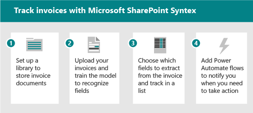
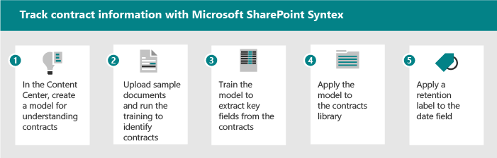

# Scenarios and use cases for Microsoft Syntex

Use these example scenarios to prompt ideas about how you can use Microsoft Syntex in your organization.

|Scenario |Description |
|---|---|
|[:::image type="content" source="../media/content-understanding/uc-site-template.png" alt-text="Image of a generic business person using a computer." border="false":::](site-templates.md)|[**Site template solutions**](site-templates.md)  Use SharePoint site templates for Syntex to jumpstart a professional site to manage, process, and track the status of business documents.  [Accounts payable](https://support.microsoft.com/office/c7ff13e7-66d9-4040-b8c6-78924272ec4d)  [Contracts management](https://support.microsoft.com/office/80820115-c700-4a62-bb59-69b33c8e3b4f) |
|[:::image type="content" source="../media/content-understanding/uc-automatic-content-assembly.png" alt-text="Image of a generic business person using a computer in a manufacturing setting." border="false":::](scenario-generate-routine-documents.md)|[**Automatically generate routine documents**](scenario-generate-routine-documents.md)  Use Syntex content assembly to create modern templates for files that need to be generated on a regular basis.  [Routine maintenance reports](scenario-generate-routine-documents.md#routine-maintenance-reports) |
|[:::image type="content" source="../media/content-understanding/uc-bulk-content-assembly.png" alt-text="Image of a generic business people in a busy office setting." border="false":::](scenario-generate-documents-bulk.md)|[**Generate documents in bulk**](scenario-generate-documents-bulk.md)  Use Syntex content assembly to generate large amounts of similar documents.  [Contract renewals](scenario-generate-documents-bulk.md#contract-renewals) |
|[:::image type="content" source="../media/content-understanding/uc-incoming-documents.png" alt-text="Image of a generic firstline workers in a worksite setting." border="false":::](scenario-handle-incoming-documents.md)|[**Handle incoming documents**](scenario-handle-incoming-documents.md)  Use Syntex to manage and process incoming business documents, such as insurance forms, business verifications, and rental contracts.  [Insurance claims](scenario-handle-incoming-documents.md#insurance-claims)  [Rental contract management](scenario-handle-incoming-documents.md#rental-contract-management)  [Construction documentation verification](scenario-handle-incoming-documents.md#construction-documentation-verification)|
|[:::image type="content" source="../media/content-understanding/uc-unstructured-repos.png" alt-text="Image of a generic business person in an office setting." border="false":::](scenario-organize-repositories.md)|[**Make information easier to find**](scenario-organize-repositories.md)  Use Syntex to make business documents and employee information in document libraries easier for users to find and use.  [Policies and procedures](scenario-organize-repositories.md#policies-and-procedures) |
|[:::image type="content" source="../media/content-understanding/uc-find-details.png" alt-text="Image of a generic business people at computers in an office setting." border="false":::](scenario-find-content-details.md)|[**Find content details**](scenario-find-content-details.md)  Use Syntex to centralize, organize, and retrieve content to make the specific details easier to discover.  [Patent information](scenario-find-content-details.md#patent-information) |
|[:::image type="content" source="../media/content-understanding/uc-document-compliance.png" alt-text="Image of a generic business people at a desk in an office setting." border="false":::](scenario-document-compliance.md)|[**Document compliance**](scenario-document-compliance.md)  Use Syntex to help comply with retention and sensitivity requirements for your business documents.  [Event or conference files](scenario-document-compliance.md#event-or-conference-files) |

<!---
OLD
Use the following example scenarios to prompt ideas about how you can use Microsoft Syntex in your organization.

- [Scenario: Track information from invoices by using the structured document processing model](adoption-scenarios.md#scenario-track-information-from-invoices-by-using-the-structured-document-processing-model)
- [Scenario: Track information from contracts by using the unstructured document processing model](adoption-scenarios.md#scenario-track-information-from-contracts-by-using-the-unstructured-document-processing-model)
- [Scenario: Avoid risk with records management, document governance, and compliance processes based on Syntex](adoption-scenarios.md#scenario-avoid-risk-with-records-management-document-governance-and-compliance-processes-based-on-syntex)
- [Scenario: Capture information from previously inaccessible documents](adoption-scenarios.md#scenario-capture-information-from-previously-inaccessible-documents)
- [Scenario: Improve data processing to provide insights and analytics](adoption-scenarios.md#scenario-improve-data-processing-to-provide-insights-and-analytics)
- [Scenario: Automate order processing](adoption-scenarios.md#scenario-automate-order-processing)
- [Scenario: Simplify visa renewal process](adoption-scenarios.md#scenario-simplify-visa-renewal-process)

## Scenario: Track information from invoices by using the structured document processing model

For example, you can set up a process using Syntex and Power Automate features to track and monitor invoices.

1. Set up a library to store the invoice documents.
2. Train the model to recognize fields in the documents.
3. Extract the fields you want to track into a list.
4. Set up a flow to notify you for specific events, such as:
    - A new invoice is added.
    - An invoice is past its due date.
    - An invoice is for an amount that's larger than your automatic approval amount.

When you automate this scenario, you can:

- Save time and money by automatically extracting data from the invoices instead of doing it manually.
- Reduce potential errors and ensure better compliance by using workflows to check invoices and notify you of any issues.

## Scenario: Track information from contracts by using the unstructured document processing model

As another example, you can set up a process to identify contracts your company has with other companies or individuals. Set up a model to extract key information from those contracts, such as the client name, fees, dates, or other important information, and add the information to the library as fields you can quickly view. Apply a retention label on the document library to ensure that contracts can't be deleted before a specific length of time for appropriate compliance with your business regulations.

1. Start at the content center and create a new unstructured document processing model for contracts.
2. Upload sample documents for positive and negative examples, then run the training to identify contract documents and review the results.
3. Train the extractor to identify fields in the contracts, such as the client name, fee, and date, and then test the extractor.
4. When the model is complete, apply the model to a library where you can upload contracts.
5. Apply a retention label to the date field, so that contracts are retained in the library for the required length of time.

When you automate this scenario, you can:

- Save time and money by automatically extracting data from the contracts instead of doing it manually.
- Ensure better compliance by using retention labels to ensure that the contracts are retained appropriately.

## Scenario: Avoid risk with records management, document governance, and compliance processes based on Syntex

Reducing risks is a common goal for most companies. You might need:

- A better way to provide/enforce information governance across your tenant.
- To improve the system for classification of documents, emails and other forms of communication considered "records" for projects.
- To audit receipts, contracts, and so on, to ensure compliance with company policies.
- To ensure that projects have all the documentation required for compliance.

Set up some processes for compliance with Syntex to capture and appropriately classify, audit, and flag documents and forms that need better governance. You can rely on Syntex to auto classify content rather than relying on end users to manually tag, or the compliance team to manually apply governance rules and archiving. And you can enable a simplified search experience, manage data volumes, apply records management and retention policies, ensure compliance, and best practice archiving and purging practices.

When you automate this scenario, you can feel secure that:

- Compliance is upheld and risk is reduced.
- Taxonomy and records management is consistently and accurately applied.
- Content volumes are controlled.
- Employees can easily discover the right information in the right context.

## Scenario: Capture information from previously inaccessible documents

Most organizations have large repositories of legal documents, policies, contracts, HR documents, and governance guidelines. Mine these data stores to extract valuable information such as: projects, sectors, themes, people, geographical areas, and so on.

For example, an HR director needs to quickly access all HR documents – including resumes, HR policies, and other forms. And they want to quickly identify necessary information from resumes and other HR-related documents without manually sifting through the documents. They’re looking for a solution that allows them to quickly find the information they need without having to manually look through thousands of resumes, HR policies, and other documentation that may be spread across several sites.

When you automate this scenario, you can:

- Unlock knowledge from digital content.
- Classify HR policies, resumes, sales documents, technical blueprints, and account plans, and extract information.
- Quickly find the correct information or document that you’re looking for.
- Get instant access to the latest information.
- Reduce search times.

## Scenario: Improve data processing to provide insights and analytics

For example, a pharmaceutical company could use Syntex to extract information from FDA documents to answer questions that their leaders have. Having the answers more easily accessible can reduce the time needed to produce these answers and increase the availability of data to generate more accurate answers to leadership questions.

For example, a project manager needs to quickly provide answers to product-related questions from my leadership team. They need to find information and metrics related to queries in one consolidated dashboard. They’re looking for a solution that extracts the information they need from product labels, product pamphlets, and other materials and generates a consolidated report that they can use when reporting back to their leadership team.

When you automate this scenario, you can:

- Reduce time to produce answers.
- Increase availability of data.
- Provide more accurate answers.

## Scenario: Automate order processing

With Syntex, you can reduce the time of manual processing of customer orders. For example, you can upload orders from fax, email, or paper into SharePoint by using OCR processing and then extract the metadata from those orders so you can fulfill them by using automated processes.

For example, a supply chain manager wants to reduce errors caused by manual data entry. They want to avoid manual review and data entry of inbound customer orders (paper, fax, or e-mail) to reduce errors going into their business systems. They want a solution that applies AI and machine learning techniques to validate incoming order information, extract core data and automatically push it into their ERP system, for order fulfillment and reconciliation.

When you automate this scenario, you can ensure that:

- Order and shipment accuracy increases.
- Fees or penalties associated to order or shipment errors are reduced.
- Delays in invoicing or payments decrease.
- Personnel costs are reduced.

## Scenario: Simplify visa renewal process

Syntex can help you automate reminders and renewals for key contract information. For example, an HR director needs to ensure that employees’ visas are up to date or renewed on time. They want to give people a simple and intuitive process for updating their visas. They need a solution that extracts renewal dates from contracts and automatically sends employees reminders when their renewal dates are approaching.

When you automate this scenario, you can ensure that:

- The levels of non-compliance are reduced.
- The number of manual reminders is reduced.
- The number of fines for non-compliance is reduced.
--->
