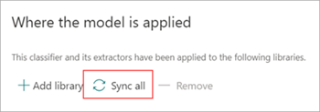

# Apply a model to a document library in Microsoft Syntex

**Applies to:**  &ensp; &#10003; All custom models &ensp; | &ensp; &#10003; All prebuilt models

 

> [!VIDEO https://www.microsoft.com/videoplayer/embed/RE4CSoL]

 

After you train an unstructured document processing model, train and publish a freeform or structured document processing model, or create a prebuilt model, you can apply it to one or more SharePoint document libraries in your Microsoft 365 tenant.

This article applies to both *enterprise models* and *local models*. An enterprise model is created and trained in the [content center](create-a-content-center.md), and can be discovered by others to use. A [local model](create-local-model.md) is created and trained locally on your own SharePoint site.  

> [!NOTE]
> You can apply the model only to document libraries to which you have access.

## Apply your model to a document library

You can apply a model to different places, including the model home page or from the list of available models. To apply your model to a SharePoint document library:

1. On model home page, on the **Apply model to libraries** tile, select **Apply model**. Or, in the **Where the model is applied** section, select **Add library**.

    

2. You can then select the SharePoint site that contains the document library that you want to apply the model to. If the site doesn't show in the list, use the search box to find it.

    

    > [!NOTE]
    > You must have *Manage List* permissions or *Edit* rights to the document library you are applying the model to.

3. After selecting the site, select the document library to which you want to apply the model. In the sample, select the *Documents* document library from the *Contoso Case Tracking* site.

    

4. Because the model is associated to a content type, when you apply it to the library it will add the content type and update the default view with the labels you extracted showing as columns. However, you can select **Advanced settings** to optionally choose to retain the current library view or to use a new view with model information and file thumbnails. If you choose to keep the current library view, the new views with model information are still available under the library's view menu.

    

    For more information, see [Choose the view in a document library](choose-library-view.md).

5. Select **Add** to apply the model to the library.

6. On the model home page, in the **Where the model is applied** section, you should see the name of the SharePoint site listed.

7. Go to your document library and make sure you are in the model's document library view. Select **Automate** > **View models**.

8. On the **Review models and apply new ones** page, select the **Applied** tab to see the models that are applied to the document library.

     

9. Select **View model details** to see information about a model, such as a description of the model, who published the model, and if the model applies retention or sensitivity labels to the files it classifies.

After applying the model to the document library, you can begin uploading documents to the site and see the results.

The model identifies any files and folders with the model’s associated content type and lists them in your view. If your model has any extractors, the view displays columns for the data you're extracting from each file or folder.

> [!NOTE]
> If two or more unstructured document processing models are applied to the same library, the uploaded file is classified using the model that has the highest average confidence score. The extracted entities will be from the applied model only.   If a freeform or structured document processing model model and an unstructured document processing model are applied to the same library, the file is classified using the unstructured document processing model and any trained extractors for that model. If there are any empty columns that match the freeform or structured document processing model, the columns will be populated using those extracted values.

## Sync changes to one or more document libraries

When you publish a model to multiple document libraries and then update the model, such as adding or removing an extractor, you need to push the update to all the libraries that the model has been applied.

To sync changes to all applied libraries:

1. On model home page, in the **Where the model is applied** section, select **Sync all**.

     

To sync changes to one or only selected libraries:

1. On model home page, in the **Where the model is applied** section, select the library or libraries you want to apply the changes to.

2. Select **Sync**.

     

## Apply the model to files and folder content already in the document library

An applied model processes all files and folder content uploaded to the document library after it's applied. You can also do the following steps to run the model on files and folder content that already exist in the document library prior to the model being applied:

1. In your document library, select the files and folders that you want to be processed by your model.

2. After selecting your files and folders, **Classify and extract** will appear in the document library ribbon. Select **Classify and extract**.

       

3. The files and folders you selected will be added to the queue to be processed.

    > [!NOTE]
    > If you've selected one or more folders or are migrating a large set of files, classification might take up to 24 hours.

### Classification Date field

When a custom is applied to a document library, the **Classification Date** field is included in the library schema. By default, this field is empty. However, when documents are processed and classified by a model, this field is updated with a date-time stamp of completion. 

    

The **Classification Date** field is used by the [**When a file is classified by a content understanding model**](/connectors/sharepointonline/#when-a-file-is-classified-by-a-content-understanding-model) trigger to run a Power Automate flow after a model has finished processing the contents of a file or folder and has updated the **Classification Date** field.

   

The **When a file is classified by a content understanding model** trigger can then be used to start a flow using any extracted information from the file or folder.

As an example, when a model is stamped with the **Classification Date**, you can use the **Send an email after Syntex processes a file** flow to notify users that a new file has been processed and classified by a model in the SharePoint document library.

To run the flow:

1. Select a file, and then select **Integrate** > **Power Automate** > **Create a flow**.

2. On the **Create a flow** panel, select **Send an email after Syntex processes a file**.

     

