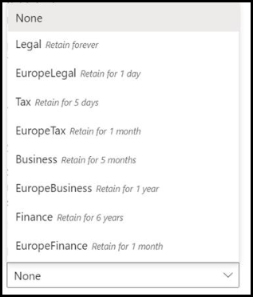
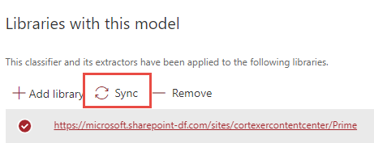
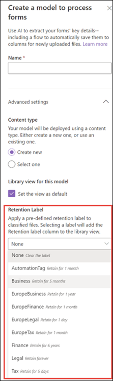
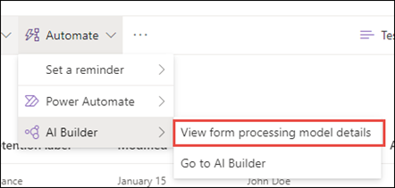
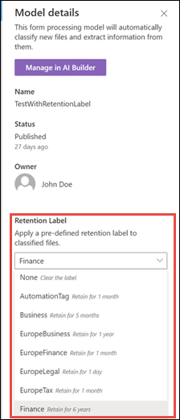
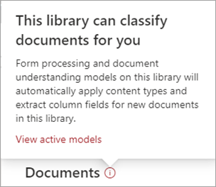

# Apply a retention label to a model in Microsoft Syntex

**Applies to:**  &ensp; &#10003; Unstructured document processing &ensp; | &ensp; &#10003; Structured document processing &ensp;| &ensp; &#10003; All prebuilt models

 

> [!VIDEO https://www.microsoft.com/videoplayer/embed/RE4GydO]  

 

You can easily apply a [retention label](../compliance/retention.md) to unstructured, structured and prebuilt models in Microsoft Syntex.

> [!Note]
> Retention labels are not yet available for freeform document processing models.

Retention labels let you apply retention settings to the documents that your models identify.  For example, you want your model to not only identify any *Insurance notice* documents that are uploaded to your document library, but to also apply a *Business* retention tag to them so that these documents can't be deleted from the document library for the specified time period (the next five months, for example).

You can apply a pre-existing retention label to your model through your model settings on your model's home page. 

## Add a retention label to an unstructured document processing model or a prebuilt model

> [!Important]
> For retention labels to be available to apply to your unstructured document processing or prebuilt models, they need to be [created](../compliance/file-plan-manager.md#create-retention-labels) and [published](../compliance/create-apply-retention-labels.md#how-to-publish-retention-labels) in the Microsoft Purview compliance portal.

1. From the model home page, select **Model settings**.

2. In **Model settings**, in the **Security and compliance** section, select the **Retention label** menu to see a list of retention labels that are available for you to apply to the model.

   

3. Select the retention label you want to apply to the model, and then select **Save**.

After applying the retention label to your model, you're able to apply it to a:

- New document library
- Document library to which the model is already applied
 
### Apply the retention label to a document library to which the model is already applied

If your unstructured document processing model or prebuilt model has already been applied to a document library, you can do the following to sync your retention label update to apply it to the document library:

1. On your model home page, in the **Libraries with this model** section, select the document library to which you want to apply the retention label update.

2. Select **Sync**.

     

After applying the update and syncing it to your model, you can confirm that it has been applied by doing the following steps:

1. In the content center, in the **Libraries with this model** section, select the library to which your updated model was applied.

2. In your document library view, select the information icon to check the model properties.

3. In the **Active models** list, select your updated model.

4. In the **Retention label** section, you'll see the name of the applied retention label.

On your model's view page in your document library, a new **Retention label** column will display.  As your model classifies files it identifies as belonging to its content type and lists them in the library view, the **Retention label** column will also display the name of the retention label that has been applied to it through the model.

For example, all *Insurance notice* documents that your model identifies will also have the *Business* retention label applied to them, preventing them from being deleted from the document library for five months. If an attempt is made to delete the file from the document library, an error will display saying it isn't allowed because of the applied retention label.

## Add a retention label to a structured document processing model

> [!Important]
> For retention labels to be available to apply to your structured document processing models, they need to be [created](../compliance/file-plan-manager.md#create-retention-labels) and [published](../compliance/create-apply-retention-labels.md#how-to-publish-retention-labels) in the Microsoft Purview compliance portal.

You can either apply a retention label to a structured document processing model when you're creating a model, or apply it to an existing model.

### To add a retention label when you create a structured document processing model

1. When you're [creating a new structured document processing model](./create-a-form-processing-model.md), select **Advanced settings**.

2. In **Advanced settings**, in the **Retention label** section, select the menu and then select the retention label you want to apply to the model.
 
     

3.  After you've completed your remaining model settings, select **Create** to build your model.

### To add a retention label to an existing structured document processing model

You can add a retention label to an existing structured document processing model in different ways:

- Through the **Automate** menu in the document library
- Through the **Active model** settings in the document library 

#### To add a retention label to an existing structured document processing model through the Automate menu

You can add a retention label to an existing structured document processing model that you own through the **Automate** menu in the document library in which the model is applied.

1. In your document library to which the model is applied, select the **Automate** > **AI Builder** > **View model details**.

    

2. In the model details, in the **Retention label** section, select the retention label you want to apply, and then select **Save**.

      

#### To add a retention label to an existing structured document processing model in the active model settings

You can add a retention label to an existing structured document processing model that you own through the Active model settings in the document library in which the model is applied.

1. In the SharePoint document library in which the model is applied, select the **View active models** icon, and then select **View active models**.

    

2. In **Active models**, select the model to which you want to apply the retention label.

      

3. In the model details, in the **Retention label** section, select the retention label you want to apply, and then select **Save**.

> [!NOTE]
> You must be the model owner for the model settings pane to be editable. 

