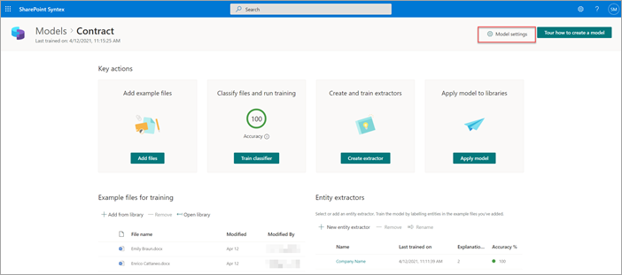
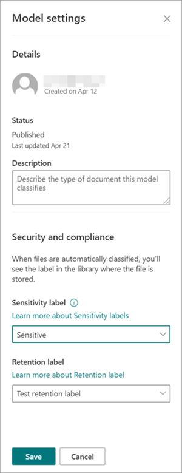
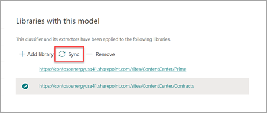

# Apply a sensitivity label to a model in Microsoft Syntex

**Applies to:**  &ensp; &#10003; All custom models &ensp; | &ensp; &#10003; All prebuilt models

You can easily apply a [sensitivity label](../compliance/sensitivity-labels.md) to unstructured document processing models in Microsoft Syntex.

Sensitivity labels let you apply encryption to the documents that your models identify. For example, you want your model to not only identify any financial documents that contain bank account numbers or credit card numbers that are uploaded to your document library, but also to apply a sensitivity label that's configured with encryption settings to restrict who can access that content and how it can be used. Syntex models honor the [label order](../compliance/apply-sensitivity-label-automatically.md#how-multiple-conditions-are-evaluated-when-they-apply-to-more-than-one-label) rules and also don't overwrite an existing label that was manually applied by a user to the file.

You can apply a pre-existing sensitivity label to your model through your model settings on your model's home page. The label must already be published to be available for selection from model settings. Labels apply to Office files for Word (.docx), PowerPoint (.pptx), and Excel (.xlsx).

> [!Important]
> For sensitivity labels to be available to apply to your models, they need to be [created and published in the Microsoft Purview compliance portal](../admin/security-and-compliance/set-up-compliance.md).

## Add a sensitivity label to a model

1. From the model home page, select **Model settings**.

   

2. On **Model settings** pane, in the **Compliance** section, select the **Sensitivity label** menu to see a list of sensitivity labels that are available for you to apply to the model.

    

3. Select the sensitivity label you want to apply to the model, and then select **Save**.

After you apply the sensitivity label to your model, you can apply it to a:

- New document library
- Document library to which the model is already applied
 
### Apply the sensitivity label to a document library to which the model is already applied

If your model has already been applied to a document library, you can do the following to sync your sensitivity label update to apply it to the document library:

1. On the model home page, in the **Libraries with this model** section, select the document library to which you want to apply the sensitivity label update.

2. Select **Sync**.

   

After you apply the update and sync it to your model, you can confirm that it has been applied by doing the following steps:

1. In the content center, in the **Libraries with this model** section, select the library to which your updated model was applied. 

2. In your document library view, select the information icon to check the model properties.

3. In the **Active models** list, select your updated model.

4. In the **Sensitivity label** section, you'll see the name of the applied sensitivity label.

On your model's view page in your document library, a new **Sensitivity label** column will display. As your model classifies files it identifies as belonging to its content type and lists them in the library view, the **Sensitivity label** column will also display the name of the sensitivity label that has been applied to it through the model.

For example, all financial documents that your model identifies also will have the *Encryption* sensitivity label applied to them, preventing them from being accessed by unauthorized people. If an attempt is made to access the file from the document library by an unauthorized person, an error will display saying it isn't allowed because of the applied sensitivity label.

