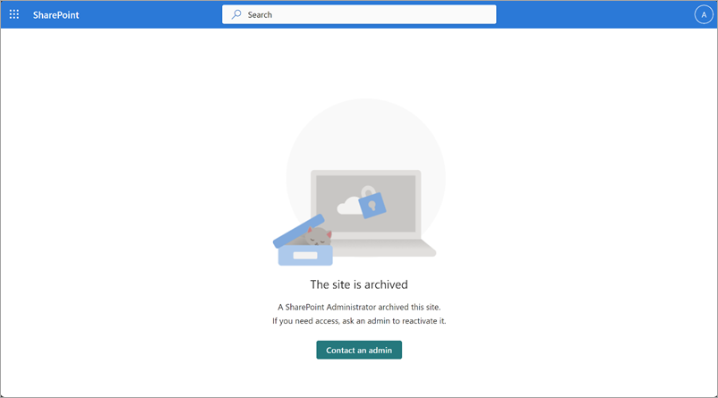

# End user experience in Microsoft 365 Archive (Preview)

End users aren't able to access or search for any content that has been archived. Whenever users try to access archived content, they see a message stating that the site has been archived.

In Microsoft 365 Archive, admins have an option to set a custom URL where the users will be taken if they select **Request to reactivate** when they encounter archived content. This can take users to any place you choose, such as a form, a ticketing system, and so on. This custom URL can be set via a flag (``-ArchiveRedirectUrl``) in the Set-SPOTenant PowerShell cmdlet starting in version 16.0.23408.12000.

For a multi-geo tenant, the URL needs to be set for each geo location.

The **Request to reactivate** button will not be visible if a redirect URL has not been set.

 

> [!div class="nextstepaction"]
> [Back to overview](archive-overview.md)
