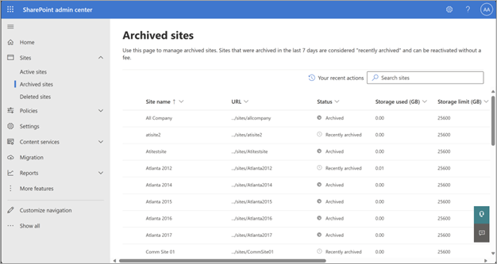
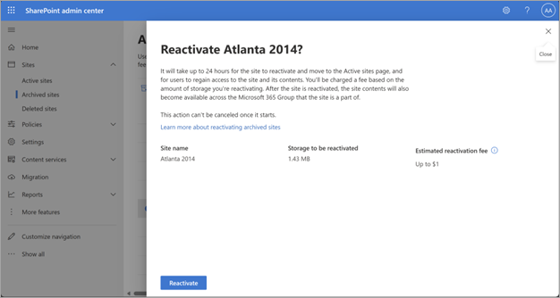

# Manage Microsoft 365 Archive (Preview)

> [!NOTE]
> This feature is currently in limited preview and subject to change.

## Archive sites

Global admins and SharePoint admins can archive both non-group connected sites and group-connected sites from the SharePoint admin center. Archiving group-connected sites will archive only the site, and the rest of the group will continue being active. As soon as a site is archived, it stops consuming storage from active storage quota, and the storage starts being counted towards Microsoft 365 Archive storage. (There might be a delay in the change in storage being reflected in the admin center.)

When a site is archived, compliance features such as eDiscovery and retention labels continue to be applied to the site.

1. In the SharePoint admin center, go to [**Active sites**](https://go.microsoft.com/fwlink/?linkid=2185220), and sign in with an account that has [admin permissions](https://learn.microsoft.com/en-us/sharepoint/sharepoint-admin-role) for your organization.

   > [!NOTE]
   > If you have Office 365 operated by 21Vianet (China), sign in to the [Microsoft 365 admin center](https://go.microsoft.com/fwlink/p/?linkid=850627), then browse to the SharePoint admin center and open the **Active sites** page.

2. In the left column, select one or more sites.

3. Select **Archive**, and to confirm, select **Archive**.

4. Archived sites can be seen on the **Archived sites** page in the SharePoint admin center.

    

> [!NOTE]
> To archive a hub site, you first need to unregister it as a hub site. Archiving Microsoft Teams-connected sites with private or shared channel sites is not supported. Teams sites with standard channels are supported.

## Manage archived sites

Archived sites can be reactivated or deleted. Deletion of archived sites follows the same behavior as that of active sites; that is, a site doesn't need to be reactivated before being deleted. However, sites in the “Reactivating” state can't be deleted until reactivation completes.

Admins can view details of the site, such as the URL, Archive Status, or Storage, from the **Archived sites** page.

## Reactivate a site

If there's a need to access the site content again, the sites need to be reactivated. After a site is archived, it stays in the “Recently Archived” state for seven days. All reactivations from this state are free of cost and instantaneous. After seven days, the site enters the “Archived” state. Reactivations might take up to 24 hours, and have an associated reactivation cost. To learn more about the costs and how pricing works, see [Charge model](archive-setup#charge-model).

After reactivation, the site will move back to the **Active sites**d page. The site will resume its normal function, and the users will have the same access rights to the site and its content as they did before the site was archived. After reactivation is complete, the storage consumed by the site will accrue to your storage quota consumption.

1. In the SharePoint admin center, go to [**Active sites**](https://go.microsoft.com/fwlink/?linkid=2185220), and sign in with an account that has [admin permissions](https://learn.microsoft.com/en-us/sharepoint/sharepoint-admin-role) for your organization.

   > [!NOTE]
   > If you have Office 365 operated by 21Vianet (China), sign in to the [Microsoft 365 admin center](https://go.microsoft.com/fwlink/p/?linkid=850627), then browse to the SharePoint admin center and open the **Active sites** page.

2. In the left column, select a site that needs to be reactivated.

3. On the command bar, select **Archive**.

4. On the **Archive** pane, select **Reactivate**.

5. If you're trying to reactivate a site from “Archived” state, you'll see a confirmation pop-up that shows an estimated price for reactivation. Select **Confirm** to reactivate. The site will enter the “Reactivating” state. It will move to active sites once reactivation is complete.

    

When you reactivate a site, its permissions, lists, pages, files, folder-structure, site-level policies, and other metadata will all be the same state as they were when the site was archived. The only two exceptions are when files are deleted while the site is archived:

- Content in the recycle bin expires naturally, and that expiration continues while archived.
- Content marked to be deleted by retention policies will still be deleted as normal.

Other than these two exceptions, you can expect the site to be unchanged.  

 

> [!div class="nextstepaction"]
> [Back to list of preview documentation](archive-overview.md#preview-documentation)