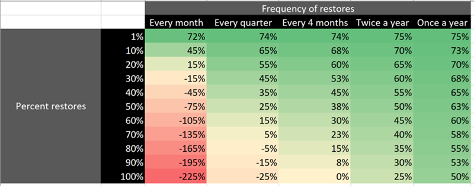

# Pricing model for Microsoft 365 Archive (Preview)

> [!NOTE]
> This feature is currently in preview and subject to change. The feature is currently rolling out and might not yet be fully available to all organizations.

Microsoft 365 Archive charges you for storage and reactivation.

- **Storage consumption** that is charged at a per-GB monthly rate. This meter is only charged when archived storage plus active storage in SharePoint exceeds a tenant’s included or licensed allocated SharePoint storage capacity limit. In other words, there's no additional storage cost for archived sites if the tenant hasn't yet consumed its already licensed Storage quota. For more information about storage quota limits, see [SharePoint limits](/office365/servicedescriptions/sharepoint-online-service-description/sharepoint-online-limits).

- **Site reactivation** that is charged at a per-GB rate. The reactivation fee is charged regardless of whether a tenant is above or below its SharePoint capacity limit and only if reactivation is executed more than seven days after the site was most recently put into an archive state. This seven-day grace period provides you with the opportunity to reverse an accidental archival without reaction costs.  

Monthly archive usage is calculated as the sum of the usage of all currently archived sites. Each site’s usage is equal to the site storage usage of that site, which can be seen on the site itself or from the Active sites page in the SharePoint admin center. The size of an archived site, and therefore the storage for which it's billed, can only change if the content in the site changes (for example, content naturally expiring in the recycle bin or a retention policy deleting content within the site directly from archive to the recycle bin).

To see the pricing for Microsoft 365 Archive, see [Pay-as-you-go services and pricing for Microsoft Syntex](../syntex-pay-as-you-go-services.md).

### Cost savings if you archive with Microsoft 365 Archive

The following table helps visualize the savings you'll realize by archiving content based on the frequency and percent of all archived content you're restoring. The key takeaway is that if you are not reactivating more than 30% of your data more than twice a year, you'll achieve most of the savings offered by the product.

