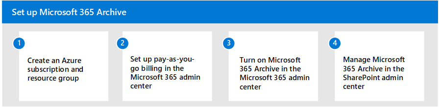

# Set up Microsoft 365 Archive (Preview)

> [!NOTE]
> This feature is currently in preview and subject to change. The feature is currently rolling out and might not yet be fully available to all organizations.

Microsoft 365 Archive follows a pay-as-you-go model, and is configured through the Microsoft 365 admin center. Before you begin, read the [Microsoft 365 preview terms and conditions](archive-preview-terms.md).

To set up Microsoft 365 Archive, follow these steps:

1. Create an [Azure subscription](/azure/cloud-adoption-framework/ready/azure-best-practices/initial-subscriptions) and [resource group](/azure/azure-resource-manager/management/manage-resource-groups-portal).
2. [Set up pay-as-you-go billing](../syntex-azure-billing.md) for Syntex in the Microsoft 365 admin center.
3. [Turn on Microsoft 365 Archive](#set-up-microsoft-365-archive) in the Microsoft 365 admin center.
4. [Manage Microsoft 365 Archive](archive-manage.md) in the SharePoint admin center. 

## Prerequisites

### Licensing

Before you can use Microsoft 365 Archive, you must first link your Azure subscription in [Syntex pay-as-you-go](../syntex-azure-billing.md). Microsoft 365 Archive is billed based on the number of gigabytes (GB) archived and number of gigabytes (GB) reactivated. For more information about pricing, see [Pricing model](archive-pricing.md).

To set up pay-as-you-go billing, see [Configure Microsoft Syntex for pay-as-you-go billing at Syntex billing](../syntex-azure-billing.md).

> [!NOTE]
> Currently in Microsoft 365 Archive (Preview), you will not be able to set up pay-as-you-go billing for two regions: US_West or Canada_East.  

### Permissions

You must have Global admin or SharePoint admin permissions to be able to access the Microsoft 365 admin center and set up Microsoft 365 Archive.

## Set up Microsoft 365 Archive

Once pay-as-you-go billing has been enabled for Syntex on Microsoft 365 admin center, Microsoft 365 Archive can be enabled.

1. In the Microsoft 365 admin center, select <a href="https://go.microsoft.com/fwlink/p/?linkid=2171997" target="_blank">**Setup**</a>, and then select **Use content AI with Microsoft Syntex**.

2. On the **Use content AI with Microsoft Syntex** page, select **Manage Microsoft Syntex**.

3. On the **Manage Microsoft Syntex** page, select **Archive (Preview)**.

4. On the **Archive (Preview)** page, select **Turn on**, and on the confirmation pane, select **Confirm**.

    

Microsoft 365 Archive is now enabled for you, and you're able to archive content from the SharePoint admin center.

## Turn off Microsoft 365 Archive

To turn off Microsoft 365 Archive:

1. On the **Manage Microsoft Syntex** page, select **Archive (Preview)**.

2. On the **Archive (Preview)** page, select **Turn off**.

When you turn off Microsoft 365 Archive, any further archiving stops. The sites already archived will continue to be in an archive state, and will be billed. The sites can be reactivated with reactivation cost or deleted.
