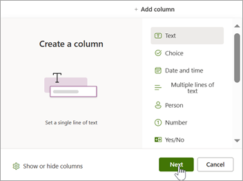
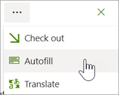
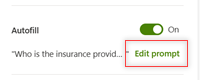
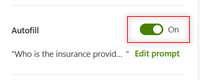

# Create an autofill column in Microsoft Syntex

Autofill is a new setting in the **Create a column** panel that lets you use natural language prompts to extract specific information or generate information from files within a SharePoint library. The information is then displayed in the columns of the library. You can set up multiple autofill columns in the same library.

## Create a new autofill column

To create a new autofill column, follow these steps:

1. In a SharePoint library, select **+Add Column**, select the type of column you want, and then select **Next**.

   

2. On the **Create a column** panel, enter a name for the column heading and a brief description of the column information.

   

3. In the **Autofill** section, select **Set up**.

4. On the **Autofill** panel, in the **Prompt** box, create the prompt. The prompt identifies the type of information you want to extract from a file to a column.

   For **Text** and **Multiple lines of text** only, a suggested prompt is automatically generated. Select the **Refresh** button to see a different suggested prompt. Select the suggested prompt to add it to the **Prompt** box, and you can edit it as needed. For other column types, see these [suggested prompts](#suggested-prompts-for-other-column-types).

   

5. In the **Test the prompt** section, select a file to test the prompt using the files in the library. The results display in the **Result** box. If needed, you can modify the prompt and retest it until you achieve the result you want.

6. When have the prompt you want, select **Save**. The new column displays in the library.

    > [!TIP]
    > If you are setting up more than one autofill column, you can help minimize your transaction costs by completing the setup of all autofill columns before processing.

7. To process existing library content, select the files for which you want to apply the autofill column. Then from the command bar, select **More options** (**...**) > **Autofill**.

   

    You see a message indicating that autofill is starting to process the files and that it might take time to complete processing.

8. After an autofill setting on a column is saved, any new files uploaded to the library are automatically processed, and the extracted information is saved to the corresponding columns.

    > [!NOTE]
    > AI-generated content might be incorrect. Be sure to check the column results.

## Update an existing autofill column

To edit a prompt or update an autofill column, follow these steps:

1. In the document library, select the column, and then select **Column settings** > **Edit**.

2. On the **Edit column** panel, in the **Autofill** section, select **Edit prompt**.

   

3. On the **Autofill** panel, in the **Prompt** box, modify the wording as needed.

4. In the **Test the prompt** section, select a file to test the prompt using the files in the library. You can modify the prompt and retest it until you achieve the result you want.

5. When have the prompt you want, select **Save**.

## Turn off the autofill setting on a column

To turn off autofill on a specific column, follow these steps:

1. In the document library, select the column, and then select **Column settings** > **Edit**.

2. On the **Edit column** panel, in the **Autofill** section, switch the toggle to **Off**.

   

3. Select **Save**.

## Suggested prompts for other column types

|Column type  |Suggested prompt  |Example   |
|---------|---------|---------|
|**Number**      | \<insert the question here>? Respond with a valid number. If no proper answer is found, respond with \<insert default response>.       | What is the total number of hours agreed upon? Respond with a valid number. If no proper answer is found, respond with "Not applicable."       |
|**Yes/No**     | \<insert the question here>? Respond with "Yes" or "No" and only "Yes" or "No." If the documents don't provide enough information, leave the answer blank.      | Is the tenant required to have renter's insurance? Respond with "Yes" or "No" and only "Yes" or "No." If the documents don't provide enough information, leave the answer blank.      |
|**Date and time**      | \<insert the question here>? Format the answer as a valid C# datetime. If no proper answer is found, respond with \<insert default response>.      | What is the deadline for the quarterly financial report submission? Format the answer as a valid C# datetime. If no proper answer is found, respond with "No deadline set."      |
|**Choice**      | Make a decision about this document based on the following categories: \<Choice 1>, \<Choice 2> and \<Choice 3>. Reply with one of the choices only. Reply with "None of the above" if none of the choices fits.      | Make a decision about this sales agreement based on the following categories: Signatory Approval, Legal Review, and Finalize Sale. Reply with one of the choices only. Reply with "None of the above" if none of the choices fits.      |
|**Choice**      | Make a decision about this document based on the following categories: \<Choice 1> \<insert description for choice 1>, \<Choice 2> \<insert description for choice 2>, and \<Choice 3> \<insert description for choice 3>. Reply with one of the choices only. Reply with "None of the above" if none of the choices fits.      | Make a decision about this document based on the following categories: Approval Needed: Requires managerial review and approval before proceeding, Information Only: For informational purposes and doesn't require any action, and Urgent Update: Contains time-sensitive information that requires immediate attention and updating. Reply with one of the choices only. Reply with "None of the above" if none of the choices fits.      |
|**Hyperlink**      | \<insert the question here>? Reply with the name formatted as a valid URL.      | Who is the insurance provider? Reply with the name formatted as a valid URL.      |
|**Currency**      | \<insert the question here>? Reply in a valid U.S. currency format. If the documents don't provide enough information, leave the answer blank.      | What is the total cost of the project as detailed in the invoice? Reply in a valid U.S. currency format. If the documents don't provide enough information, leave the answer blank.      |

> [!NOTE]
> To see the column types that are currently available for autofill, see [Supported column data types](autofill-overview.md#supported-column-data-types).

<!---|**Text**     | \<insert the question here>? The answer needs to be fewer than 255 characters. If no proper answer is found, respond with \<insert default response>.  | Who is the broker listed in the agreement? The answer needs to be fewer than 255 characters. If no proper answer is found, respond with "None."   |
|**Text**     | \<insert the question here>? If no proper answer is found, respond with \<insert default response>. | What is the current status of the project milestone? If no proper answer is found, respond with "Status pending review."   |
|**Multiple lines of text**     | \<insert the question here>? If no proper answer is found, respond with \<insert default response>.   | What is the description of the project scope? If no proper answer is found, respond with "None found."   |--->