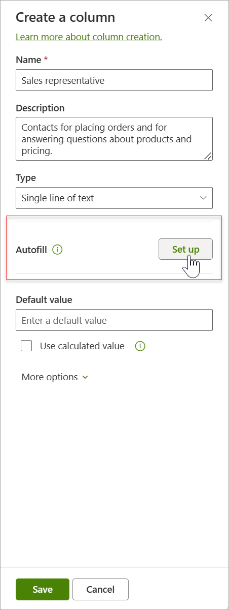
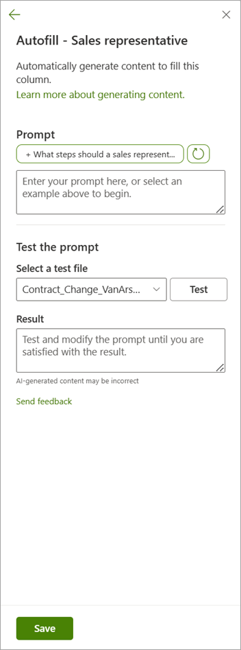

# Create autofill columns in Microsoft Syntex

## Create a new autofill column

To create a new autofill column, follow these steps:

1. In a SharePoint library, select **+Add Column**, select the type of column you want, and then select **Next**.

2. On the **Create a column** panel, enter a title or column heading and other information you normally would.

   

3. In the **Autofill** section, select **Set up**.

4. On the **Autofill** panel, in the **Edit the prompt** box, create the prompt.

   

5. In the **Test the prompt** section, test the prompt using the files in the library. You can modify the prompt and retest it until you achieve the result you want.

6. When have the prompt you want, select **Save**.

Once the column settings are saved, any new files uploaded to the library will be processed, and their metadata will be saved to the corresponding columns.

## Update an existing autofill column

## Use autofill columns with other models

Autofill columns can work alongside other Microsoft Syntex models. You can associate different extractive or generative prompts with more than one column, allowing you to extract metadata that other models might not detect or generate.
