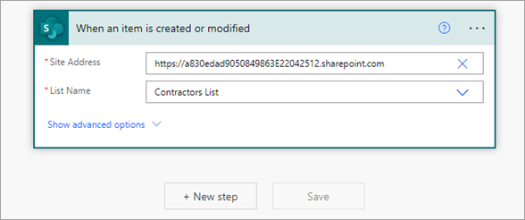
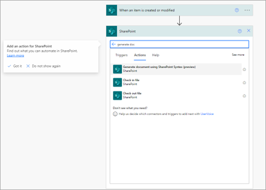

# Automate document generation with Microsoft Syntex and Power Automate

Using content assembly in Microsoft Syntex together with Power Automate, you can automate the generation of documents using modern templates.

## Automate document generation

Follow these steps to automatically generate documents using a modern template and Power Automate.

1. Sign in to Power Automate.

2. In the left panel, select **Connectors**. In the search box, search for *SharePoint*, and then select the **SharePoint** connector.

3. On the SharePoint connector page, select the trigger that you want to use to start the automated document generation process.

    We recommend starting with any one of the following three triggers:

    - When an item is created
    - When an item is created or modified
    - When an item is deleted

4. Next, set up the trigger by entering the SharePoint site address and the name of the SharePoint list. Select **New step**.

   

5. Select the SharePoint connector again. In the search box, search for and select the action **Generate document using Syntex**.

   

6. Enter the site information, and select the document library that contains the modern template.

7. Once the template is selected, you'll start seeing the template fields. Associate the fields with the columns in the list.

    > [!NOTE]
    >Data mapping in the template is not supported in this action. For example, if you have associated a field in your template with a managed metadata column, during automated generation you will be able to associate this field with a column in a list.

8. When done, select **Save** to save the flow.

    > [!NOTE]
    > We recommend using templates that don't need users to manually add values for document generation. If the template needs manual input for a field, you can specify that value against the field rather than mapping it to a SharePoint list column.  
    > Currently, only Word documents (.docx) are supported using this action.  

9. To generate a PDF file using this action, provide **.pdf** as the extension in the file name.

10. Whenever a template consists of a table placeholder, that field has all the column names in the suggestion shown in the **Risks** field.

    To fill the table, placeholder values should be passed as a list of JSON objects with column name and values. For example:

    *[{"Column 1":"Low","Column 2":"Test","Column 3":"Test","Column 4":"Low"},{"Column 1":"Medium","Column 2":"Test","Column 3":"Test","Column 4":"Medium"}]*

11. The action doesn't support images, and templates containing these fields are hidden while selecting the templates in the action.

