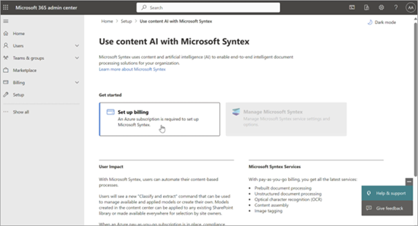

# Set up pay-as-you-go billing for Microsoft 365 Backup (Preview)

As a first step to start using Microsoft 365 Backup, you should link an Azure subscription in Syntex pay-as-you-go, if you haven't already done so. Although Microsoft 365 Backup isn't part of the Microsoft Syntex product suite, this offering is still using the Syntex billing setup for consistency with other Microsoft 365 pay-as-you-go offerings.

Use these steps to set up pay-as-you-go billing for Microsoft 365 Backup.

1. Go to the [Microsoft 365 admin center](https://admin.microsoft.com/Adminportal/Home).

2. Select **Setup**.

3. On the **Setup** page, in the **Files and content** section, select **Use content AI with Microsoft Syntex**.

4. On the **Use content AI with Microsoft Syntex** page, select **Set up billing**.

    

    > [!NOTE]
    > To set up pay-as-you-go billing for Microsoft 365 Backup, you must provide an owner or contribution role on the Azure subscription to be used.

5. If you ***don't*** have an Azure subscription or resource group, follow these steps. If you have an Azure subscription and resource group, go directly to step 6.

    To create a new Azure subscription with the same organization and Microsoft Entra tenant as your Microsoft 365 subscription:

    1. Sign in to the [Azure portal](https://portal.azure.com) with your Microsoft 365 admin, Microsoft Entra DC admin, or Global admin account.

    1. In the left navigation, select **Subscriptions**, and then select **Add**.

    1. On the **Add subscription** page, select an offer and complete the payment information and agreement.

    To create a new Azure resource group:

    1. On the **Set up pay-as-you-go billing** panel, select **Learn more about Azure resource groups**.

    1. Or, you can follow steps in [Manage Azure resource groups by using the Azure portal](/azure/azure-resource-manager/management/manage-resource-groups-portal) to create a resource group.

    

    > [!NOTE]
    > The resource group should be mapped to the Azure subscription you provided when you set up pay-as-you-go.

6. If you ***have*** an Azure subscription, follow these steps:

    1. On the **Set up pay-as-you-go billing** panel, under **Azure subscription**, select the subscription from the dropdown list.

       > [!NOTE]
       > The subscription dropdown list will not populate if you don't have an owner or contributor on the subscription.

       

    1. Under **Resource group**, select the resource group from the dropdown list.

    1. Under **Region**, select the region from the dropdown list.

    1. Review and accept the terms of service, and then select **Save**.

You have successfully set up billing. You can proceed to [Step 2: Turn on Microsoft 365 Backup](backup-setup.md#step-2-turn-on-microsoft-365-backup).
