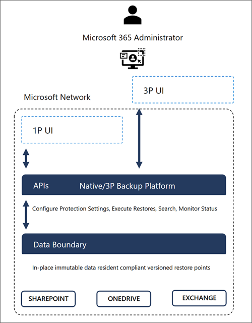

# Overview of Microsoft 365 Backup (Preview)

> [!NOTE]
> Microsoft 365 Backup (Preview) is rolling out. When it is available worldwide, this message will be updated and you will be able to see and enable the feature in the Syntex billing setup flow in the Microsoft 365 admin center.
<!---
> [!NOTE]
> This feature is currently in preview and subject to change and [limitations as defined](backup-limitations.md). Before you begin, read the [Microsoft 365 Backup preview terms and conditions](backup-preview-terms.md).
--->
## About the preview

Microsoft 365 Backup is currently in preview and will begin rolling out to organizations in early 2024. You can set up billing for the product as described in [Set up Microsoft 365 Backup](backup-setup.md). Once Microsoft 365 Backup has been deployed and is available for use in your tenant, you'll see it in the Microsoft 365 admin center page under **Settings**.

During the preview period, performance and speed of web interfaces, initial configuration, and restores might be slower than expected as we scale up our infrastructure to remove undesirable latency from our system.

## Microsoft and partner offerings

This documentation outlines the Microsoft 365 Backup offering available in the Microsoft 365 admin center. We're partnering with many independent software vendors (ISVs) to provide differentiated versions of their applications integrated with the Microsoft 365 Backup Storage platform—all providing the same underlying performance value proposition for your Microsoft 365 data.

In the case of a partner application, operation of the Microsoft 365 Backup tool will be managed and paid for entirely through the partner's application. Those applications will have the ability to provide a single pane of glass for all of your data estates that require backups, and they might provide additional enhanced experiences or workflows.

## Scenarios and value proposition

Business continuity assurance is a top-of-mind concern for many companies. Microsoft 365 Backup delivers business continuity peace of mind by providing performance and reliable restore confidence. When evaluating a backup and restore offering, what really matters isn't solely the backup, but the ability to restore your data to a healthy state quickly when you need to do so. Recovering large volumes of content is difficult when copying data at a scale from a remote, air-gapped location requiring weeks or even months to get your business back up and running.

In cases of a ransomware attack that encrypts large swaths of your data, or instances of an internal accidental or malicious data deletion or overwrite event, you need to be able to get your business back to a healthy state as soon as possible. This is what the Microsoft 365 Backup product offers, both through the Microsoft 365 admin center, as well as via third-party applications built on the Microsoft 365 Backup Storage platform.

To summarize, applications built on top of the Microsoft 365 Backup Storage platform deliver the following benefits regardless of the size or scale of the protected tenant:

- Fast backup within hours

- Fast restore within hours (see [performance targets](#general-availability-performance-targets) later in this article)

- Full SharePoint site and OneDrive account restore fidelity, meaning the site and OneDrive are restored to their exact state at specific prior points in time via a rollback operation

- In the future, roll forward granular file-level restores in OneDrive and SharePoint

- Full Exchange mailbox item restores or granular item restores using search

- Consolidated security and compliance domain management

<!---M365-Backup_VID_WEB_Final.mp4   <need a link that embeds properly into the learn docs> --->

## Architectural overview and performance expectations

### Architecture

Microsoft 365 Backup provides ultra-fast backup and restore capabilities by creating backups within the protected services’ data boundaries.

Microsoft 365 Backup not only provides uniquely fast recovery from common business continuity and disaster recovery (BCDR) scenarios like ransomware or accidental/malicious employee content overwrite/deletion. Additional BCDR scenario protections are also built directly into the service. For example, OneDrive, SharePoint, and Exchange Online provide replicated copies of your data across geographically disparate datacenters to automatically protect against physical disasters and automatically failover to live active copies seamlessly without the need for end customer intervention.

Our backups are protected from malicious overwrites because OneDrive, SharePoint, and Exchange use Append-Only storage. This means that SharePoint can only add new content blobs and can never change old ones until they're permanently deleted. The Exchange items are backed up in an immutable manner and can't be accessed by a client process (such as Outlook, OWA, or MFCMAPI). This process ensures that items can't be changed or corrupted after an initial save, protecting against attackers that try to corrupt old versions. For More information about the built-in service and data resiliency, see [SharePoint and OneDrive data resiliency in Microsoft 365](/compliance/assurance/assurance-sharepoint-onedrive-data-resiliency) and [Exchange Online data resiliency in Microsoft 365](/compliance/assurance/assurance-exchange-data-resiliency).

Key architectural takeaways:

- Data never leaves the Microsoft 365 data trust boundary or the geographic locations of your current data residency.

- The backups are immutable unless expressly deleted by the Backup tool admin via product offboarding.

- OneDrive, SharePoint, and Exchange have multiple physically redundant copies of your data to protect against physical disasters.

    

### General availability performance targets

> [!IMPORTANT]
> During the preview period, performance and speed of web interfaces, initial configuration, and restores might be slower than expected as we scale up our infrastructure to remove undesirable latency from our system. The following performance targets are not guarantees during the preview and might change at general availability.

#### Backup policy performance

Creating a new protection policy initiates the process of backing up selected SharePoint sites, OneDrive accounts, and Exchange mailboxes. Once you submit a request to activate a valid protection policy, it takes on average up to 60 minutes to process and another 60 minutes to create publish restore points.

Restore points are physically created in the service as soon as the policy is confirmed to be activated in the tool, even if those restore points take some additional time to become visible in the restore tool.

#### Restoration performance

Restoration performance dictates your recovery time objection, or the time it will take for you to restore a healthy state of your data and thus recover from a data destruction event.
For full OneDrive account and SharePoint site restores, the fastest recovery will happen when choosing in-place restore rather a new URL restore. Additionally, choosing one of the recommended “faster” restore points presented in the restore workflow UI will yield the quickest recovery results.

All restore points and restores to new URLs will be relatively fast, but same URL restores using a recommended “faster” restore point will typically yield better results. The Exchange Online restore workflow doesn't have or require the “faster” restore points.

It will take on average less than one hour for the first full site or account protection unit to be restored when a new restore session is initiated. After the first site or account is restored in a session, the remaining protection units will complete in relatively fast succession.

The following table summarizes expected performance for a normally distributed tenant, including tenants of very large size and scale. During the preview period, actual performance might deviate from these general availability targets.

|Scenario |First full-container restore completes |Restore of all containers complete |
|:-------|:-------|:--------|
| 1,000 sites (30-GB average site size)  |Less than 1 hour  |Less than 12 hours  |
| 1,000 mailboxes (30-GB average mailbox size)| Less than 1 hour | Less than 12 hours |

## General Data Protection Regulations (GDPR)

For information about GDPR and Microsoft 365 Backup, see [GDPR special handling, compliance, and backup data deletion](backup-offboarding.md#gdpr-special-handling-compliance-and-backup-data-deletion).