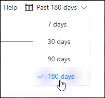
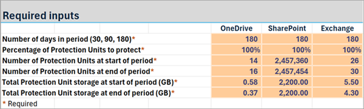
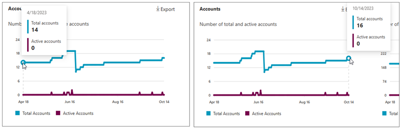

# Pricing model for Microsoft 365 Backup (Preview)

> [!NOTE]
> This feature is currently in preview and subject to change.

## Microsoft 365 Backup charge model

The Microsoft 365 Backup service, offered through the Microsoft 365 admin center, is a [pay-as-you-go consumption-based service](../syntex-pay-as-you-go-services.md). The preview list price is $0.15/GB/month of protected content.

### What’s counted towards protected backup storage?

Microsoft 365 Backup will charge you for content size of the following for 365 days from when it is added to backup protection:

- Cumulative back up size of the mailboxes, SharePoint sites, and OneDrive accounts being protected. Size of OneDrive accounts and SharePoint sites are the size of the live OneDrive accounts and SharePoint sites as displayed in the live sites’ usage reports. Mailboxes are the size of the user's mailbox plus their online archives plus deleted items held for Backup.

- Deleted content in user’s Recycle Bin and second-stage Recycle Bin (also known as Site Collection Recycle Bin).

> [!NOTE]
> Restore points or size of restores will not be charged. Although Azure is being used to process the payments, there are no additional Azure API or storage costs beyond the Microsoft 365 Backup usage charges mentioned above.

As an example, if you have a site under protection that is currently 1 GB for the first month, you'll be charged 1 GB of Backup usage. If you delete content in that site such that it's now only 0.5 GB, your next monthly bill will still be for 1 GB since the backup tool is retaining that deleted content for a year. After a year when the backup of that deleted content expires, the 0.5 GB being retained for backup purposes will no longer be charged for Backup.

> [!NOTE]
> These prices are subject to change when the product becomes generally available. A partner application integrated with Microsoft 365 Backup storage might charge a different rate for their service.

<!---<Include charge model video >--->

## Pricing calculator

The Microsoft 365 Backup pricing calculator is a tool that helps you estimate the amount of backup storage and the costs that you'll incur to protect and back up your Microsoft 365 data.

> [!NOTE]
> The tool is not intended to provide an exact prediction of your backup consumption, but rather to give you an estimate based on your current usage reports that are forecasted for the next 24 months based on historical trends.

### Pricing calculator overview

The Microsoft 365 Backup pricing calculator, when calculating the storage required for each month, takes into consideration the following heuristics:

- How much storage is typically added (or removed) from a protection unit during the month. For example, if the protection unit was a SharePoint site, how much storage on average is added (or removed) from a SharePoint site during the month due to documents being added (or deleted).

- How many new protection units for a service type are typically added (or removed) every month. For example, if the service type is Exchange mailboxes, how many new mailboxes are added (or deleted) on average each month.

- The largest amount of storage required for the previous 12 months.

### Using the pricing calculator

To use the Microsoft 365 Backup pricing calculator, you'll need to perform the following steps. Information about how to collect data from each of these steps is detailed later in this article.

1. Download the latest version of the Microsoft 365 Backup pricing calculator tool from [https://aka.ms/M365BackupCalculator](https://aka.ms/M365BackupCalculator).

2. Review your [Microsoft 365 usage reports](https://admin.microsoft.com/Adminportal/Home#/reportsUsage) to get historical information about your current usage. Heuristics from the usage reports will be used to populate the inputs (orange boxes) in the pricing calculator tool.

3. Open the Excel spreadsheet and select the **High-Level Estimates** worksheet. This sheet produces the simplest default model based on linear data growth assumptions.

4. Enter the information recorded from the usage reports into the **High-Level Estimates** worksheet.

5. If you know your tenant will have non-organic or non-linear usage changes, then for each of the service types, optionally override the estimated number of protection units or storage for a month in any or all of the service-specific tabs in the pricing calculator tool.

6. An estimate of the Microsoft 365 Backup costs for the next 24 months will then be generated.

### Leverage the Microsoft 365 usage reports as source data for the pricing calculator

This section describes how to use your [Microsoft 365 admin center usage reports](https://admin.microsoft.com/Adminportal/Home#/reportsUsage) to populate the Microsoft 365 Backup pricing calculator.

The Microsoft 365 Backup pricing calculator uses the input data about your current usage to help determine heuristics such as your average growth and usage patterns. To get this information, go to [Usage - Microsoft 365 admin center](https://admin.microsoft.com/Adminportal/Home#/reportsUsage) and then review the [OneDrive - Usage](#onedrive---usage), [SharePoint - Site usage](#sharepoint---site-usage), or [Exchange - Mailbox usage](#exchange---mailbox-usage) reports.

You can change the period that the reports display data for by selecting the **Past *n* days** on the right-hand side and then selecting the period.

  
As a recommendation and if there's usage data available, the longer the period is—for example, 180-days—the more accurate your usage estimates will be and therefore more accurate the Microsoft 365 Backup pricing calculator estimates will be.

For each of the service types (Exchange, OneDrive, and SharePoint) record the following information by reviewing the appropriate usage report:

- Number of protection units at start end of period
- Number of protection units at end of period
- The amount of storage used at the start and end of the period

Once you have this information, enter it into the **High-Level Estimates** worksheet as shown in the following example.

#### OneDrive - Usage

##### Accounts

Number of total and active accounts at the start of the period and at the end of the period. For example, 14 accounts and 16 accounts:

##### Storage

Amount of storage used at the start of at the start of the period and at the end of the period. For example, 0.58 GB and 0.37 GB:

#### SharePoint - Site usage

##### Sites

Number of total and active sites at the start of the period and at the end of the period. For example, 2,457,360 sites and 2,457,454 sites:

##### Storage

Amount of storage used at the start of at the start of the period and at the end of the period. For example, 2,200 GB and 2,200 GB:

#### Exchange - Mailbox usage

 
##### Mailbox

Number of total and active user mailboxes at the start of the period and at the end of the period. For example, 26 mailboxes and 30 mailboxes:

##### Storage

Amount of storage used at the start of the period and at the end of the period. For example, 5.5 GB and 4.3 GB:

### Pricing calculator notes

When using the Microsoft 365 Backup pricing calculator, be aware of the following:

- In the Microsoft 365 Backup pricing calculator, any Excel spreadsheet cell that is colored orange can have data entered.

- To modify how many protection units you want to protect per service type, you can change the **Percentage of Protection Units to protect**. For example, if you only want to protect 20 percent of your SharePoint sites, you can set the **Percentage of Protection Units to protect** for SharePoint to 20%.

- The estimate is calculated projecting forward from the end of period data. That is, Month 1 is calculated using the end of period data.

- The **Variables** worksheet displays the heuristics such as average growth and usage patterns of the service types which are used to calculate the estimate.

- The **Price per GB** field on the **Variables** worksheet can be modified if required. For the Microsoft 365 Backup solution, we recommend that you use the default value.

- The OneDrive accounts, SharePoint sites, and Exchange mailboxes worksheets provide more detail on the estimated costs including the ability to override the estimated number of protection units or storage for a month.

- If the number of protection units for a month is overridden and the storage for a month is *not* overridden as well, then the amount of storage required for the month is calculated by multiplying the overridden number of protection units by the average new protection unit storage added per month (GB).

### Variables

The following variables are used to estimate the Microsoft 365 Backup costs and are defined in the **Variables** worksheet:

- **Number of months in a protection unit period**: The number of months in the period converted from the number of days in the period.

- **Average number of protection units added per month**: The average number of new protection units that are added each month. Essentially protection unit growth per month.

- **Average protection unit storage per type at start of period (GB)**: The average amount of storage consumed by a protection unit at the start of the period.

- **Average protection unit storage per type at end of period (GB)**: The average amount of storage consumed by a protection unit at the end of the period.

- **Average protection unit storage growth per month (GB)**: The amount of storage that is typically added to each protection unit every month. Essentially protection unit storage growth per month.

- **Average new protection unit storage added per month (GB)**: The average amount of storage that is required if a new protection unit is added during a month.
