# Restore data in Microsoft 365 Backup (Preview)

> [!NOTE]
> This feature is currently in preview and subject to change.

Once you back up your data, you might need to restore the data in case of an accidental deletion, ransomware attack, or other event. The Restore feature in Microsoft 365 Backup is created to help you restore backed up data.

As part of restoring data from backup, admin needs to choose a *restore point* manually or from a recommended *express restore point* by the tool.

- **Restore point**. A prior point in time from which you can restore a healthy version of your content or metadata. If the data from a prior point in time is identical to the present state of your data, then there will be no items restored, including **Restore to a new folder** for Exchange Online.

- **Express restore point**. A set of recommended restore points that offers faster restore of data from the backup than a regular restore point.

Currently, you can restore OneDrive accounts, SharePoint sites, and Exchange mailbox content from specific prior points in time from the backups. Site restores to a prior point in time, if restored to the same URL, will overwrite the state and the content of the site to match the exact state at the prior point in time. This is commonly referred to as a rollback versus a roll-forward.

Mailbox restores inherently restore only changed items such that current items that remain unchanged since the desired prior restore point won't be modified or overwritten. Thus, mailbox restores follow a roll-forward process. Site, OneDrive, and mailbox restores can be done in place or in the case of SharePoint sites to a new URL, or in the case of mailbox items a new folder. By restoring to a new location, any undesirable overwriting any existing data is avoided.

> [!NOTE]
> During the preview, only full OneDrive account and SharePoint site restore is possible. In the future, file-level granular restore will be possible.

In the future, we'll support granular OneDrive and SharePoint file-level restore to provide a roll-forward behavior similar to that of mailbox item restores today.

Restores started serially for each of three services will execute in parallel. There's no need to wait for one service’s restore to finish before starting another.

## Restore point frequency

The restore point frequency, also known as the [recovery point objective](backup-faq.md#what-is-the-service-recovery-point-objective) (RPO), defines the maximum amount of time during which data is lost after an attack. Stated differently, it’s the time between the most recent backup of the healthy state of data and the time of the attack. The RPOs for each of the protected services are summarized in the following table.

|Type  |RPO for 0-14 days in the past  |RPO for 15-365 days in the past  |
|---------|---------|---------|
|Full OneDrive account and full SharePoint site restore    |15 minutes     |One week     |
|Exchange Online   |10 seconds         |10 seconds         |

## Restore data from backup for OneDrive, SharePoint, and Exchange

Once you back up your data, you might need to restore the data in case of an accidental deletion, ransomware attack, or other event. The restore feature in Microsoft 365 Backup is created to help you restore backed up data.

> [!NOTE]
> We recommend choosing an express restore point for full account, site, or mailbox restores as it will provide the fastest restore experience.

Select the **OneDrive**, **SharePoint**, or **Exchange** tab for steps to restore data from backup for that product.

# [OneDrive](#tab/onedrive)

Follow these steps to restore data backed up for OneDrive.

1. In the Microsoft 365 admin center, on the **Microsoft 365 Backup** page, in the **OneDrive** section, select **Restore**.

2. On the **Select type of content** page, you'll see **OneDrive accounts** preselected. Select **Next**.

    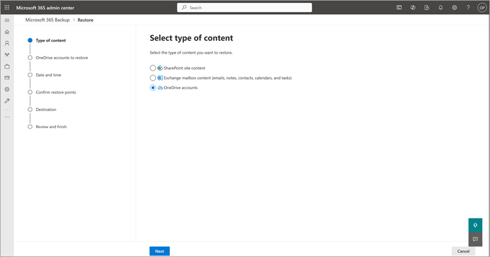

3. From the list of backed up OneDrive accounts, select the accounts to restore, and then select **Next**.

4. On the **Select the date and time** page, select the date and time from which you want to restore the content.

    

    Choose a recommended restore point from **Select a faster restore point**, which will offer a faster restore compared to standard restore points.

    

    Backup will restore the closest backed up content *before* the specified date and time. Select **Next**.

    For example, assume backup is taken October 2, 2023 8:00 AM and October 2, 10:00 AM PST. If you select date and time as October 2, 2023 9:00 AM PST, Microsoft 365 Backup will restore the OneDrive and its content to its state on October 2, 2023 8:00 AM PST.

5. On the **Confirm restore points** page, you'll be presented with a list of available express restore points that will restore with better performance than non-express restore points. We highly recommend that you choose an express restore point all else equal.

    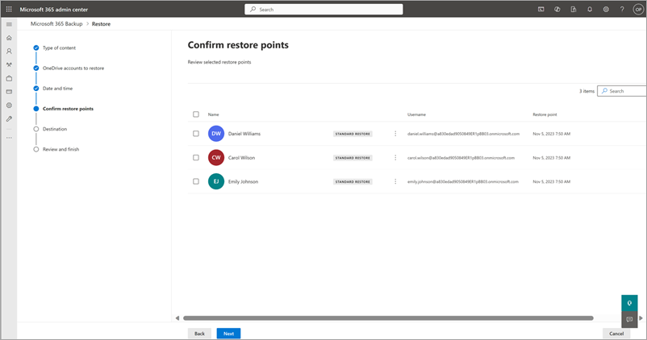

6. Confirm the restore point in time to which the data will be restored from backup. If the restore point is correct, select **Next**.

7. On the **Select another backup** panel, choose another backup for the account selected, if needed.

    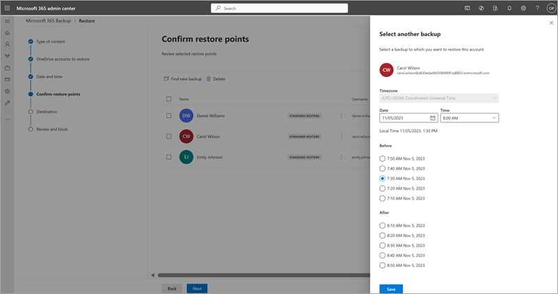

8. On the **Set destination** page, selected OneDrive accounts can be restored by choosing  either the **Restore to the original OneDrive accounts** or **Create new SharePoint site and restore to there** option.

    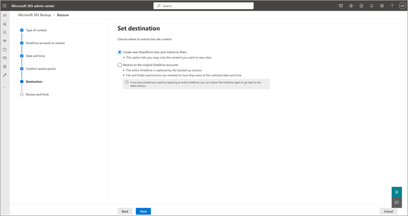

    a. **Restore to the original OneDrive accounts** option
        - The entire OneDrive is replaced by the backed-up version chosen based on the restore point.
        - File and folder permissions are also reverted to the selected date and time.

    b. **Create new SharePoint site and restore to there** option
        - The entire OneDrive will restore to a new SharePoint site where you can then copy or move data into the original OneDrive to create a roll-forward type of restore and avoid overwriting currently healthy data.

9. On the **Review and Finish** page, you'll be asked to review and finish all your choices. If everything looks as you want it, select **Restore OneDrive accounts**.

    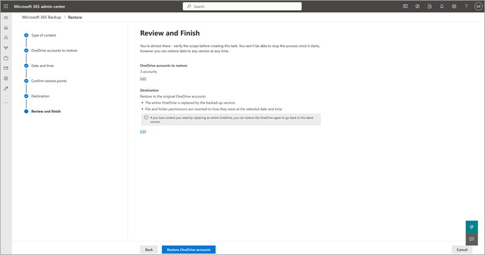

# [SharePoint](#tab/sharepoint)

Follow these steps to restore data backed up for SharePoint.

1. In the Microsoft 365 admin center, on the **Microsoft 365 Backup** page, in the **SharePoint** section, select **Restore**.

2. On the **Select type of content** page, you'll see **SharePoint site content** preselected. Select **Next**.

    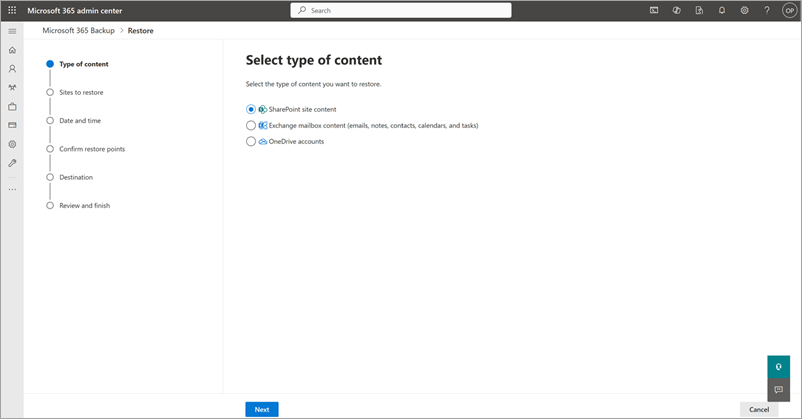

3. From the list of backed up SharePoint sites, select the sites to restore, and then select **Next**.

4. On the **Select the date and time** page, select the date and time from which you want to restore the content.

    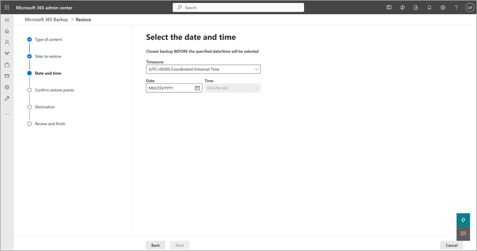

    Choose a recommended restore point from **Select a faster restore point**, which will offer a faster restore compared to standard restore points.

    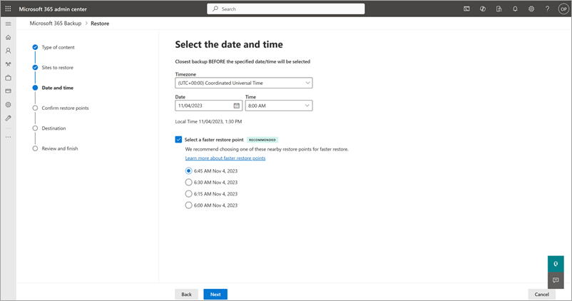

    Backup will restore the closest backed up content *before* the specified date and time. Select **Next**.

    For example, assume backup is taken October 2, 2023 8:00 AM and October 2, 2023 10:00 AM PST. If you select date and time as October 2, 2023, 9:00 AM PST, Microsoft 365 Backup will restore the site and its content to the state present on October 2, 2023 8:00 AM PST.

5. On the **Confirm restore points** page, you'll be presented with a list of available express restore points that will restore with better performance than non-express restore points. We highly recommend that you choose an express restore point all else equal.

    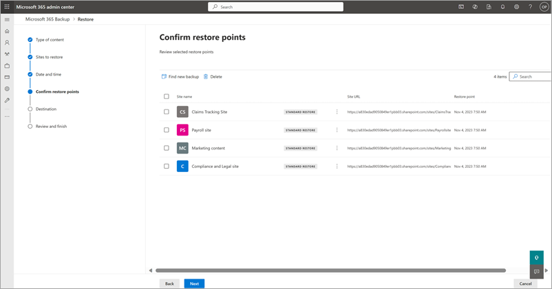

6. Confirm the restore point in time to which the data will be restored from backup. If the restore point is correct, select **Next**.

7. On the **Select another backup** panel, choose another backup for the site selected, if needed.

    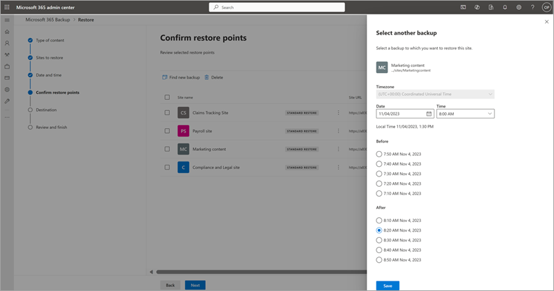

8. On the **Set destination** page, selected SharePoint sites can be restored by choosing  either the **Restore to the original OneDrive accounts** or **Create new SharePoint site and restore to there** option.

    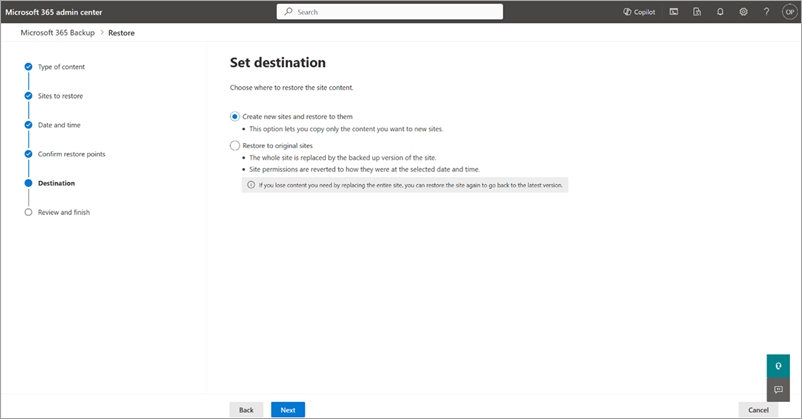

    a. **Restore to original sites** option
        - The entire original site is replaced by the backed up version chosen based on the restore point.
        - File and folder permissions and all metadata state are also reverted to the selected date and time.

    b. **Create new SharePoint site and restore to there** option
        - The entire site will restore to a new SharePoint site where you can then copy or move data into the original site or a different site to create a roll-forward type of restore and avoid overwriting currently healthy data.

9. On the **Review and Finish** page, you'll be asked to review and finish your choices. If everything looks as you want it, select **Restore sites**.

    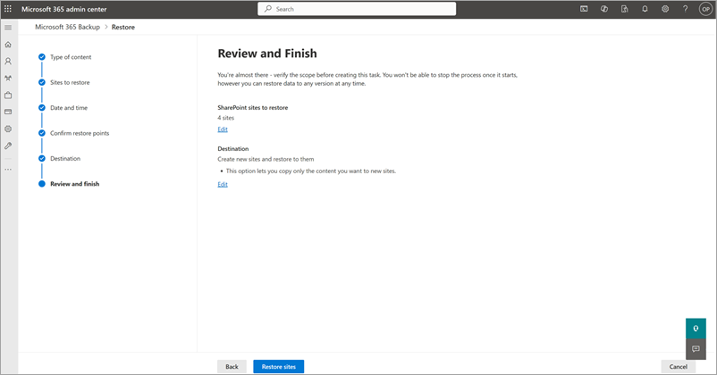
  

# [Exchange](#tab/exchange)

<!---Once you have set up protection policies for your mailboxes, you might need to restore the data in case of an accidental deletion, ransomware attack, or other event. The Restore feature in Microsoft 365 Backup is created to help you restore backed up data. Exchange restores will only restore modified or deleted items. Any item that is unaffected in the visible folder structure will remain intact.--->

Follow these steps to restore data backed up for Exchange.

1. In the Microsoft 365 admin center, on the **Microsoft 365 Backup** page, in the **Exchange** section, select **Restore**.

2. On the **Select type of content** page, you'll see **Exchange mailbox content (emails, notes, contacts, calendars, and tasks)** preselected. Select **Next**. Note that calendar restores aren't supported during the preview.

3. From the list of backed up Exchange accounts, select the accounts to restore, and then select **Next**.

4. On the **Content scope** page, you'll see two options to choose from:

    - [Option 1: All emails, notes, contacts, calendars, and tasks](#option-1-all-emails-notes-contacts-calendars-and-tasks)
    - [Option 2: Selected content only](#option-2-selected-content-only)

### Option 1: All emails, notes, contacts, calendars, and tasks

1. Use this option to perform a full mailbox restore, On the **Content scope** page, the **All emails, notes, contacts, calendars, and tasks** option lets you restore all emails, notes, contacts, and tasks, and modified calendar items for that user account. Select the last known good (LKG) date and time from which you want to restore the content. Make sure that the time zone in the dropdown menu reflects your intention, and select **Next**.

    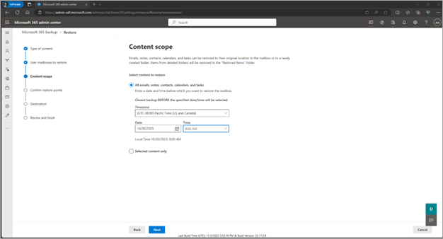

    For example, the last time the end user remembers seeing their mailbox in a “good state” was October 2, 2023 8:00 AM. However, on October 2, 2023 9:00 AM they saw all of their emails were encrypted (possible ransomware attack), choose the last known good time as October 2, 2023 8:00 AM.

2. Now you'll be asked to confirm the restore point in time to which the data will be restored from backup. The page informs you whether there are any backups to restore from the LKG time chosen. If you see no errors, you can proceed. If there are errors, you have the option to choose another LKG time. Select **Next**.

3. The destination of restored items can be chosen from two options, then select **Next**.

    a. **Restore to a new folder** where the content will be restored to a newly created folder named *Restored Items YYYY-DD-MM, HH:MM*.

    b. **Restore in place** where current version of the item will be overwritten by the restored content.

4. On the **Review and Finish** page, you'll now be asked to review and finish all your choices. If everything looks as you want it, select **Restore user mailboxes**.

5. Track the progress of your newly created task on the **Restoration tasks** tab.

### Option 2: Selected content only

1. Use this option to perform a partial mailbox restore. On the **Content scope** page, the **Selected content only** option gives the admin the ability to do a granular restore (not full mailbox restore).

    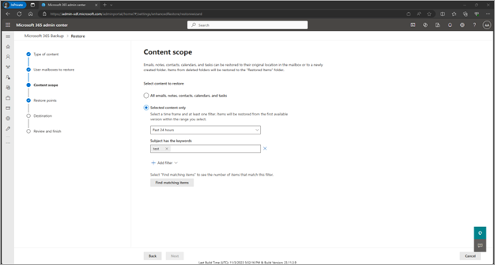

    The search for items is based on four options:

    - Sender
    - Recipient
    - Has attachment
    - Keywords

    Choose the time period, then filter and value that you want to do a granular search on to find matching items.
  
2. Now you'll be asked to confirm the restore point in time to which the data will be restored from backup. If the restore point is what you want, select **Next**.

3. The destination of restored items can be chosen from two options, then select **Next**.

    a. **Restore to a new folder** where the content will be restored to a newly created folder named *Recovered Items YYYY-MM-DD, HH:MM*.

    Example:
    
    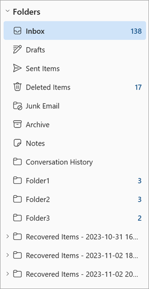

    b. **Restore in place** where the current version of the item will be overwritten by the restored content.

4. On the **Review and Finish** page, you'll now be asked to review and finish all your choices. If everything looks as you want it, select **Restore user mailboxes**.

5. Track the progress of your newly created task on the **Restoration tasks** tab.

### States of backup

|States  |Definition  |
|---------|---------|
|Active     | Protection scope selected under backup policy is being actively backed up. |
|Paused     | No further backups will be taken but already taken backups will be preserved. |
|Not set up | No backup policy is set up for this scope.  |
|Processing | A change to backup policy or a restore is in progress.  |

---