# Set up Microsoft 365 Backup (Preview)

> [!NOTE]
> Microsoft 365 Backup (Preview) is now available worldwide in all commercial cloud environments. This preview feature is subject to change and [limitations as defined](backup-limitations.md). Before you begin, read the [Microsoft 365 Backup preview terms and conditions](backup-preview-terms.md).

Get started with Microsoft 365 Backup by following these simple three steps in the Microsoft 365 admin center.

<!---<insert how-to Affirma video   – https://aka.ms/M365Backup-how-to-video> --->

## Step 1: Set up pay-as-you-go billing

Microsoft 365 Backup is a pay-as-you-go offering that charges based on consumption unlike traditional seat-based licenses. To set up pay-as-you-go for Microsoft 365 Backup, you will need to provide these things:

> [!div class="checklist"]
> * **Valid Azure subscription**. An Azure subscription provides a logical container for your resources. Each Azure resource is associated with only one subscription. Creating a subscription is the first step in adopting Azure. To learn more about Azure concepts, see [Azure fundamental concepts](/azure/cloud-adoption-framework/ready/considerations/fundamental-concepts).
> * **Resource group**. A resources group provides a logical grouping of resources within an Azure subscription.
> * **Region**. The region in which you want to register the service.
> * **Owner or contributor**. Name of an owner or contributor role on the Azure subscription.

Once you have these items ready, you can [set up pay-as-you-go billing for Microsoft 365 Backup](backup/backup-billing.md).

<!---To set up pay-as-you-go billing, follow the steps in [Configure Microsoft Syntex for pay-as-you-go billing](../syntex-azure-billing.md).--->

### Permissions

You must have Global admin or SharePoint admin permissions to access the Microsoft 365 admin center and set up Microsoft 365 Backup.

## Step 2: Turn on Microsoft 365 Backup

To enable Microsoft 365 Backup, you'll need to go to the Microsoft 365 admin center.

1. Go to the [Microsoft 365 admin center](https://admin.microsoft.com/Adminportal/Home).

2. Select **Setup**.

3. On the **Setup** page, in the **Files and content** section, select **Use content AI with Microsoft Syntex**.

4. On the **Use content AI with Microsoft Syntex** page, select **Manage Microsoft Syntex**.

5. From the list of products, select **Backup Preview**.

6. By default, the feature is turned off. Select **Turn on** to enable Microsoft 365 Backup for your organization.

7. Review the applicable [terms of service for Microsoft 365 Backup](backup-preview-terms.md) and select **Confirm**.

    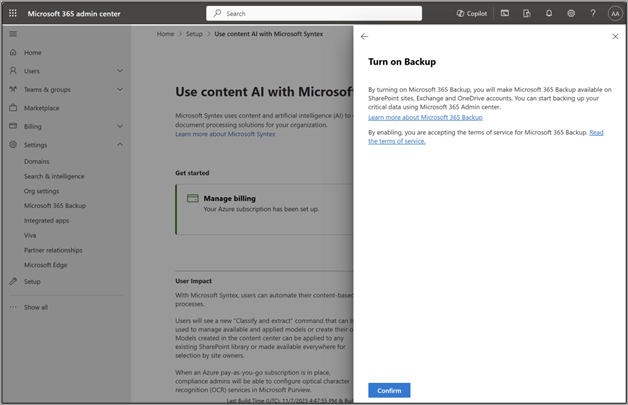
<!---
8. Select **Go to Microsoft 365 Backup** to start setting up Microsoft 365 Backup on OneDrive, SharePoint, or Exchange.

    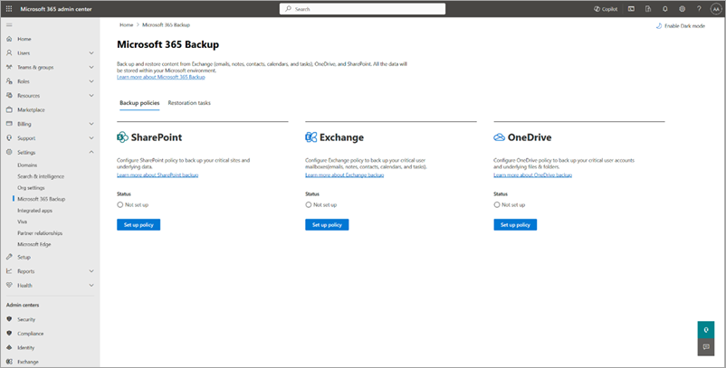
--->

## Step 3: Create backup policies to protect your data

Now that you have enabled Microsoft 365 Backup for your organization, follow through to create policies and start protecting your content.

1. Go to the [Microsoft 365 admin center](https://admin.microsoft.com/Adminportal/Home).

2. Select **Settings**.

3. Select **Microsoft 365 Backup** from the list of products.

    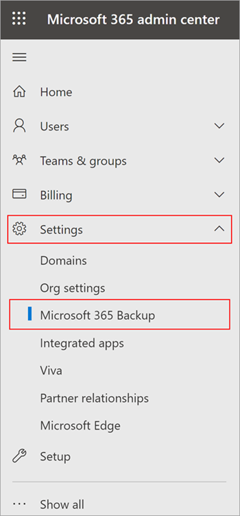

### Set up backup policies for OneDrive, SharePoint, and Exchange

To use Microsoft 365 Backup for OneDrive, SharePoint, or Exchange, you need to create a backup policy for each product. A *policy* represents the backup plan defined by admins for protecting the Microsoft 365 data of an organization.

A policy contains details of what data (OneDrive accounts, SharePoint sites, and Exchange mailboxes) to protect. Although you see the retention period and backup frequency (which defines the restore point objective), those settings aren't currently variable or modifiable.

Select the **OneDrive**, **SharePoint**, or **Exchange** tab for steps to create a backup policy for that product.

# [OneDrive](#tab/onedrive)

Follow these steps to set up a backup policy for OneDrive accounts using Microsoft 365 Backup.

1. Go to the [Microsoft 365 admin center](https://admin.microsoft.com/Adminportal/Home).

2. Select **Settings**.

3. Select **Microsoft 365 Backup** from the list of products.

4. On the **Microsoft 365 Backup** page, in the **OneDrive** section, select **Set up policy**.

    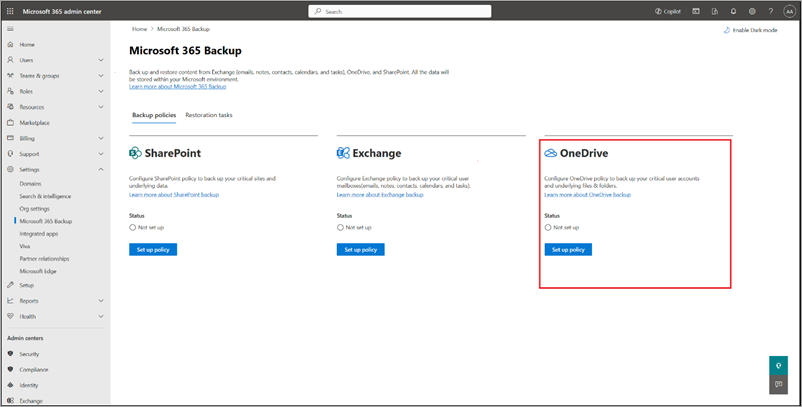

5. On the **Overview** page, review the backup features for OneDrive, and then select **Next**.

    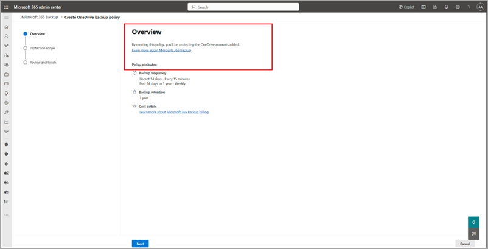

6. On the **Protection scope** page, you can set up OneDrive user accounts using any or all three ways. A protection scope is the scope of user accounts within OneDrive that you want to protect with Microsoft 365 Backup.

    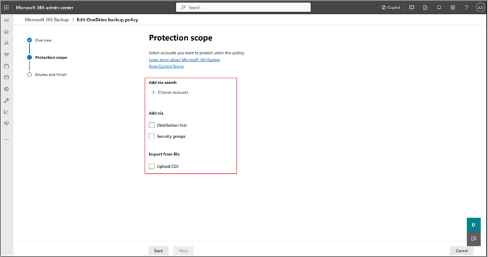

    a. Under **Add via search**, select **Choose accounts** to see user accounts that can be added via search. On the **Search and select accounts** panel, select the accounts you want to add to the policy.

    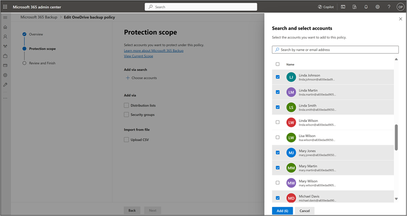

    b. Under **Add via**, select **Distribution lists** or **Security groups**, or both. The distribution list and security group are flattened when added, meaning the policy won't update dynamically if the groups or distribution list are updated later.

    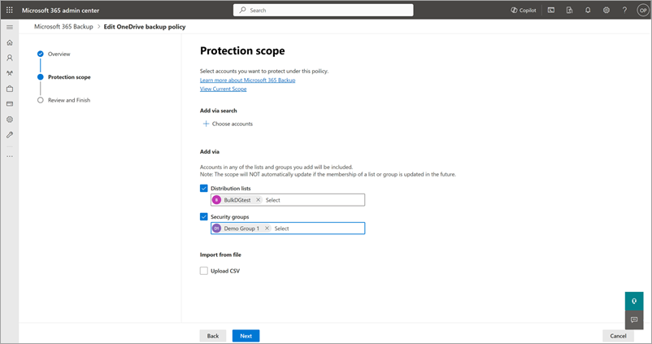

    c. Under **Import from file**, select **Upload CSV** to import user account details via CSV upload.

    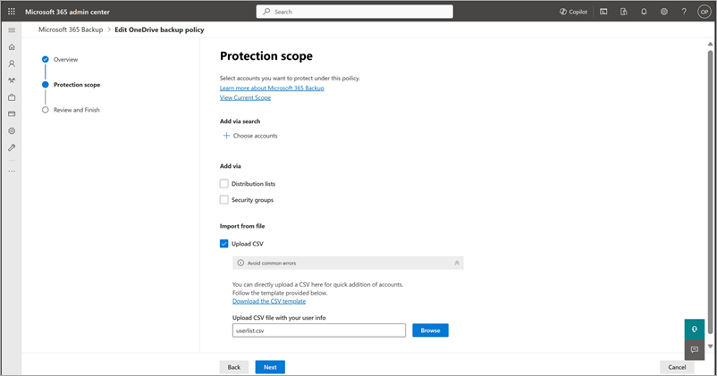

8. On the **Review OneDrive backup policy** page, review the information to make sure it's how you want it, and then select **Create policy** (or **Update policy** if it's an update).

9. The backup policy for OneDrive is created.

    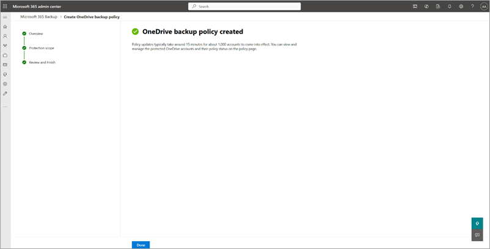

# [SharePoint](#tab/sharepoint)

Follow these steps to set up a backup policy for SharePoint sites using Microsoft 365 Backup.

1. Go to the [Microsoft 365 admin center](https://admin.microsoft.com/Adminportal/Home).

2. Select **Settings**.

3. Select **Microsoft 365 Backup** from the list of products.

4. On the **Microsoft 365 Backup** page, in the **SharePoint** section, select **Set up policy**.

    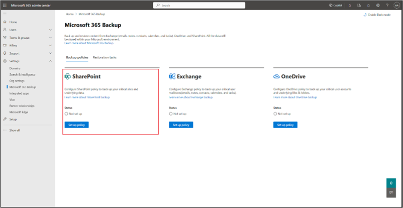

5. On the **Overview** page, review the backup features for SharePoint, and then select **Next**.

    

6. On the **Protection scope** page, you can set up SharePoint sites by choosing to back up individual sites or collection of sites. A protection scope is the scope of sites within SharePoint that you want to protect with Microsoft 365 Backup.

    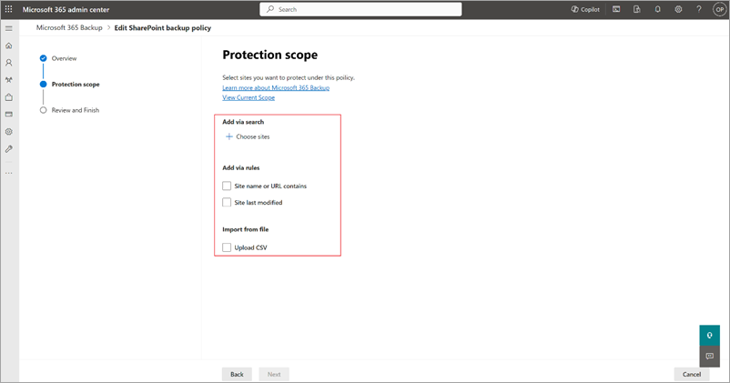

    a. Under **Add via search**, select **Choose sites** to see the individual sites or site collections that can be added via search. On the **Search and select sites** panel, select the sites you want to add to the policy.

    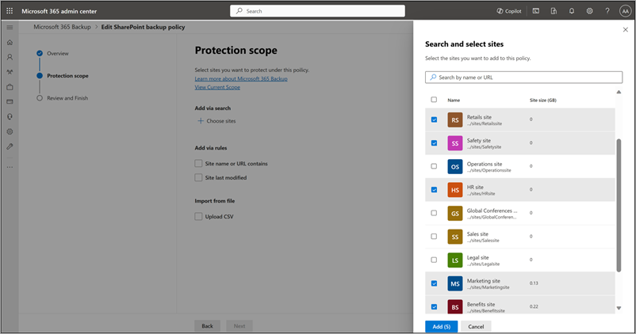

    b. Under **Add via**, select **Distribution lists** or **Security groups**, or both. The distribution list and security group are flattened when added, meaning the policy won't update dynamically if the groups or distribution list are updated later.

    c. Under **Import from file**, select **Upload CSV** to import user account details via CSV upload.

    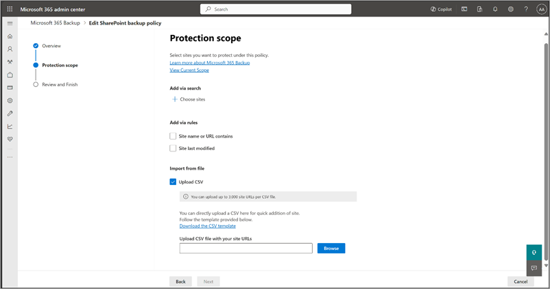

7. Once you've made the right selections, select **Next** to create the backup policy for SharePoint.

8. On the **Review SharePoint backup policy** page, review the information to make sure it's how you want it, and then select **Create policy** (or **Update policy** if it's an update).

    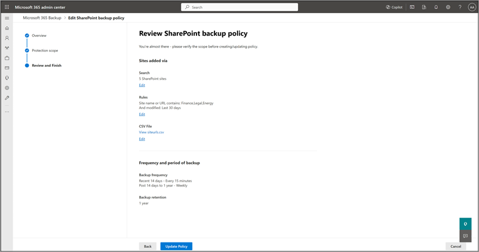

9. The backup policy for SharePoint is created.

    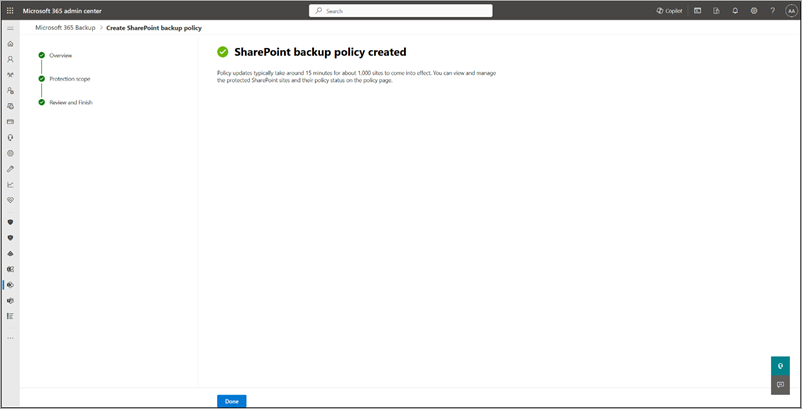

# [Exchange](#tab/exchange)

Follow these steps to set up a backup policy for Exchange mailboxes sites using Microsoft 365 Backup. Ensure that Microsoft 365 Backup is [enabled for your tenant](#step-2-turn-on-microsoft-365-backup).

1. Go to the [Microsoft 365 admin center](https://admin.microsoft.com/Adminportal/Home).

2. Select **Settings**.

3. Select **Microsoft 365 Backup** from the list of products.

4. On the **Microsoft 365 Backup** page, in the **Exchange** section, select **Set up policy**.

    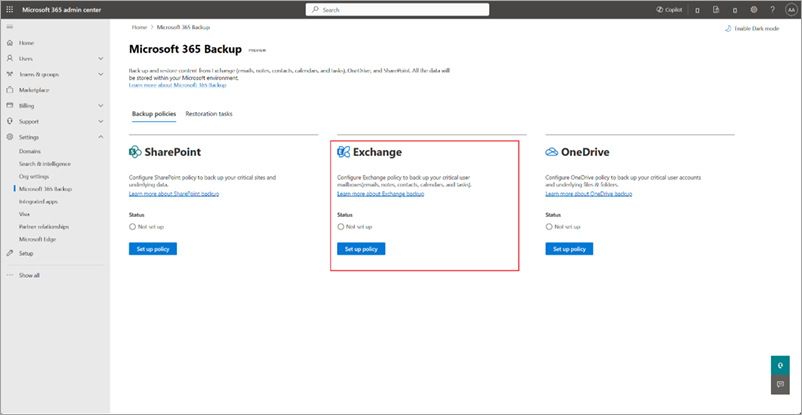

5. On the **Overview** page, review and verify the backup policy attributes for Exchange, such as backup frequency, backup retention, cost details, and then select **Next**.

    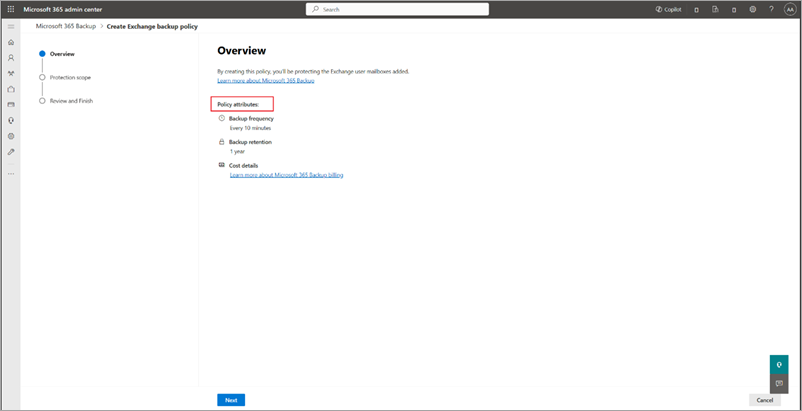

6. On the **Protection scope** page, choose the scope of protection for the mailbox policy. Microsoft 365 Backup for Exchange allows the addition of mailboxes in three ways.

    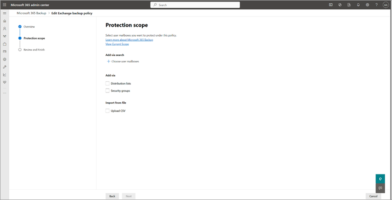

    a. Under **Add via search**, select **Choose user mailboxes** to see the mailboxes that can be added via search. On the **Search and select mailboxes** panel, select the mailboxes you want to add to the policy.

    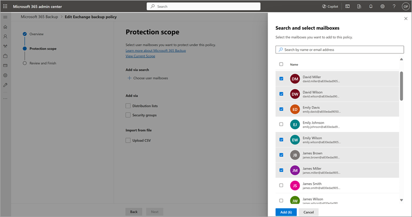

    b. Under **Add via**, select **Distribution lists** or **Security groups**, or both. The distribution list and security group are flattened when added, meaning the policy won't update dynamically if the groups or distribution list are updated later.

    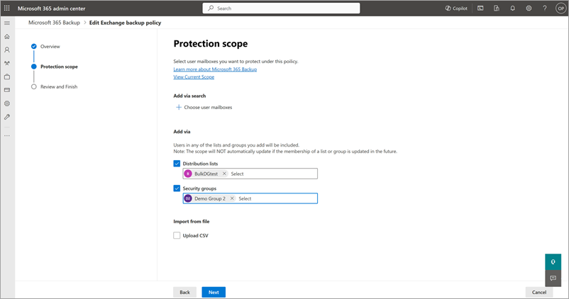

    c. Under **Import from file**, select **Upload CSV** to import user account details via CSV upload.

    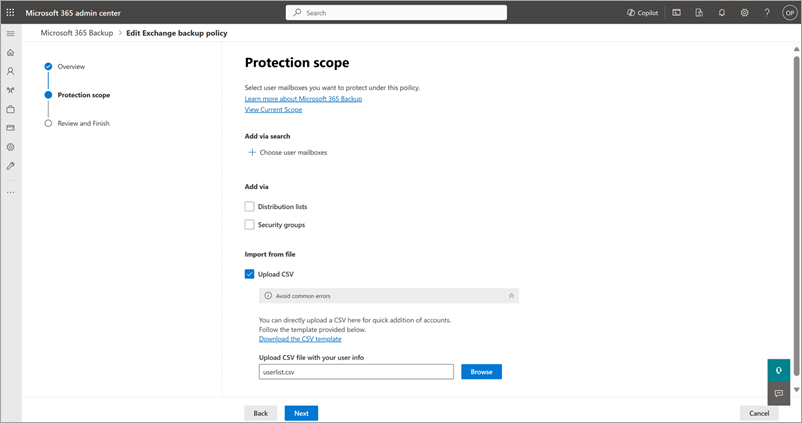

7. Once you've made the right selections, select **Next** to create the backup policy for Exchange.

8. On the **Review Exchange backup policy** page, review the information to make sure it's how you want it, and then select **Create policy** (or **Update policy** if it's an update).

    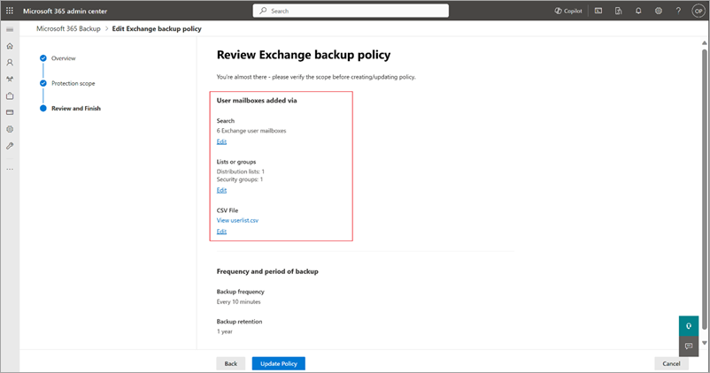

9. Wait for status of your policy to show as **Active** in the home screen. This might take between 15 and 60 minutes. The backup policy for Exchange is created. Select **View scope** at any time to verify the details.

    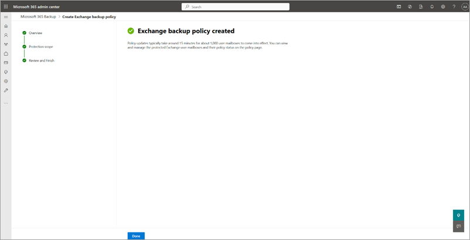

---

## Admin roles and backup management privileges

Only tenant-level admins can create and manage backups using Microsoft 365 Backup for their users. End users don't have the ability to enable backup or restores for their user account, distribution lists, mailboxes, or sites. It’s important to note that your admin role determines which products you can manage with Microsoft 365 Backup. In the future, we might introduce a Backup admin role that can control the entire tool.

|Admin role  |OneDrive  |SharePoint  |Exchange  |
|---------|---------|---------|---------|
|Global admin     | ✓        | ✓        | ✓       |
|SharePoint admin     | ✓        | ✓        |         |
|Exchange admin    |         |         | ✓        |

## Glossary

- **Protection units** – SharePoint sites, OneDrive accounts, or Exchange Online mailboxes backed up by the Microsoft 365 Backup tool.

- **Restore point** – A prior point in time from which you can restore a version of your content and metadata. If the protection unit from a prior point in time is identical to the present state of your data, then a restore from that point will have no impact on your current data.

- **RPO** – Recovery point objective, or how close in time the most recent restore point is to an impacting event.

- **RTO** – Recovery time objective, or how fast a restore to a prior point in time can complete.
