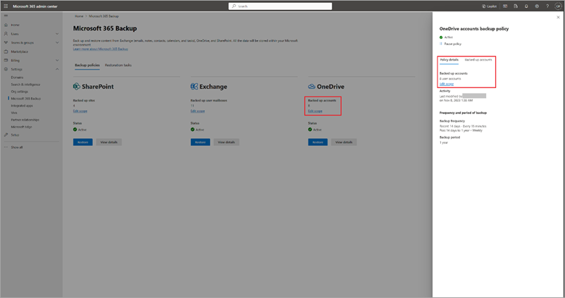
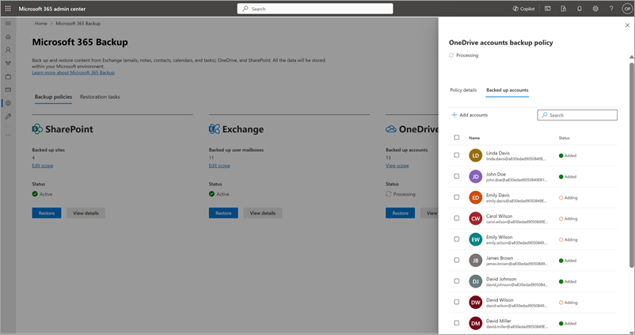
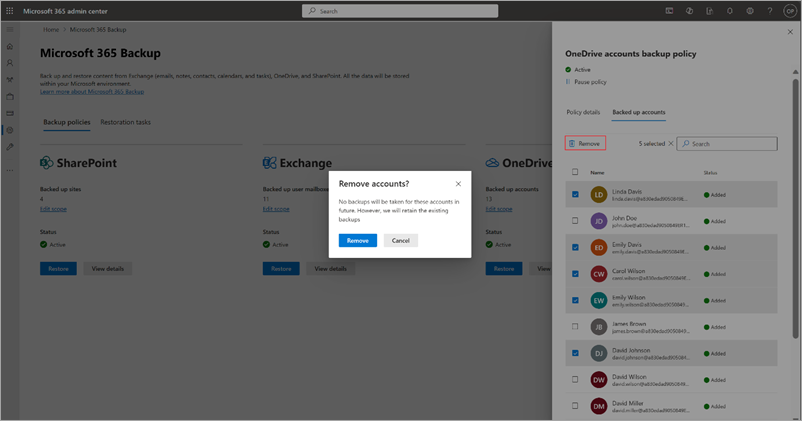
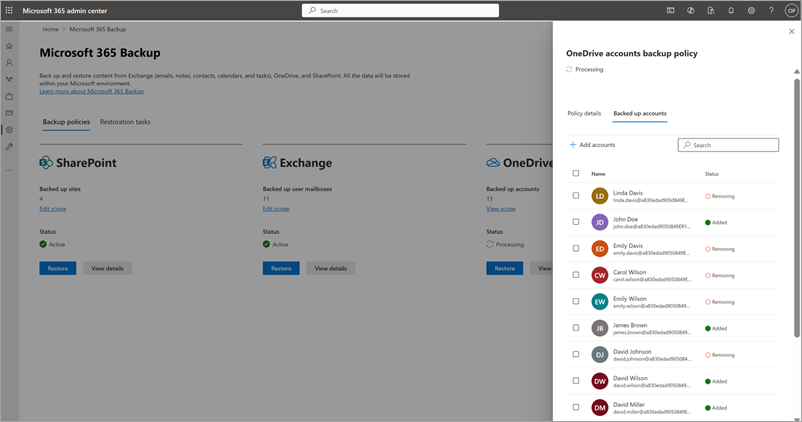
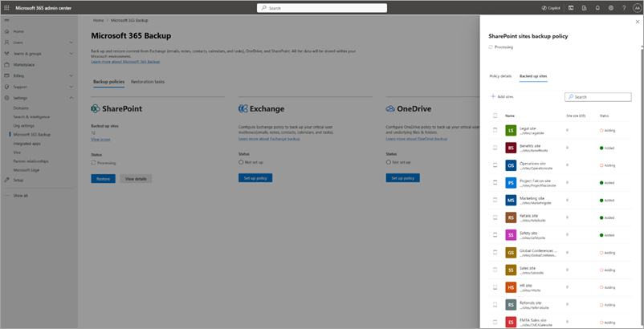
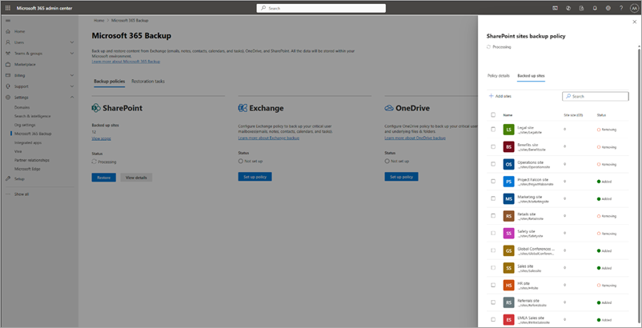
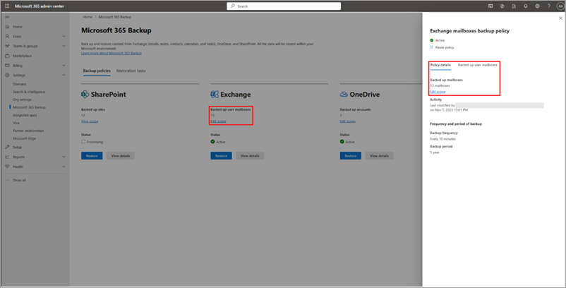
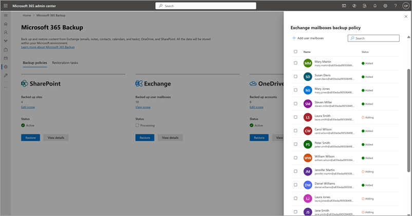
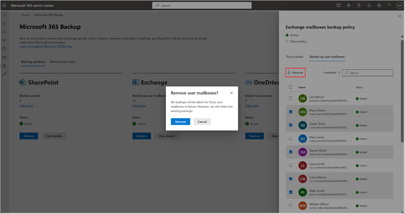
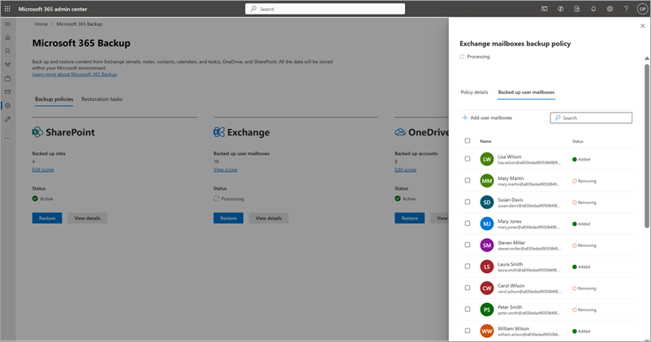

# View and edit backup policies in Microsoft 365 Backup (Preview)

> [!NOTE]
> This feature is currently in preview and subject to change.

You can edit the scope of OneDrive accounts, SharePoint sites, and Exchange mailboxes  associated with a backup policy. As part of edit, you can either add new accounts, sites, or mailboxes to or remove them from backup. Removing accounts, sites, and mailboxes from Microsoft 365 Backup doesn't mean existing backups will be deleted, rather it means additional backups will not be taken.

Select the **OneDrive**, **SharePoint**, or **Exchange** tab for steps to view and edit backup policies for that product.

# [OneDrive](#tab/onedrive)

Follow these steps to view and edit backup policies for OneDrive.

1. In the Microsoft 365 admin center, on the **Microsoft 365 Backup** page, in the **OneDrive** section, select **Edit scope**.

    

2. On the **OneDrive accounts backup policy** panel, on the **Policy details** tab, select **Edit scope**.

3. You can either add new accounts to or remove accounts from an existing OneDrive backup policy.

    a. To add new accounts, on the **Backed up accounts** tab, select **+ Add accounts**.

    b. Select the accounts from the list. Once you have added accounts to the list, follow the prompts to update the policy.

    

    c. To remove accounts from existing backup policy, on the **Backed up accounts** tab,  select the accounts from the list, and then select **Remove**. Once you have done your changes, follow the prompts to remove the accounts.

    

4. Once you have done your changes, follow the prompts to update the policy.

    

> [!NOTE]
> Removing accounts from backup policy means no future backups will be taken for those removed accounts. Existing backups for those accounts will not be deleted.

# [SharePoint](#tab/sharepoint)

Follow these steps to view and edit backup policies in SharePoint.

1. In the Microsoft 365 admin center, on the **Microsoft 365 Backup** page, in the **SharePoint** section, select **Edit scope**.

    

2. On the **SharePoint sites backup policy** panel, on the **Policy details** tab, select **Edit scope**.

3. You can either add new sites to or remove sites from an existing SharePoint backup policy.

    a. To add new sites, on the **Backed up sites** tab, select **+ Add sites**.

    b. Select sites by any method as discussed in the creation section. Once you have added sites to the list, follow the prompts to update the policy.

    

    c. To remove sites from existing SharePoint backup policy, on the **Backed up sites** tab,select the relevant sites, and then select **Remove**. Once you have done your changes, follow the prompts to remove the sites.

    

4. Once you have done your changes, follow the prompts to update the policy.

    

> [!NOTE]
> Removing sites from backup policy means no future backups will be taken for those removed sites. Existing backups for the removed sites will not be deleted.

# [Exchange](#tab/exchange)

Follow these steps to view and edit backup policies for Exchange.

1. In the Microsoft 365 admin center, on the **Microsoft 365 Backup** page, in the **Exchange** section, select **Edit scope**.

    

2. On the **Exchange mailbox backup policy** panel, on the **Policy details** tab, select **Edit scope**.

3. You can either add new user mailboxes to or remove user mailboxes from the existing Exchange backup policy.

    a. To add new user mailboxes, select **+ Add user mailboxes**.

    

    b. To remove user mailboxes from existing backup policy, on the **Backed up sites** tab, select the user mailboxes from the list, and select **Remove**.

    

4. Once you have done your changes, follow the prompts to update the policy.

    

> [!NOTE]
> Removing mailboxes from backup policy means no future backups will be taken for those removed mailboxes. Existing backups for those mailboxes will not be deleted.

---