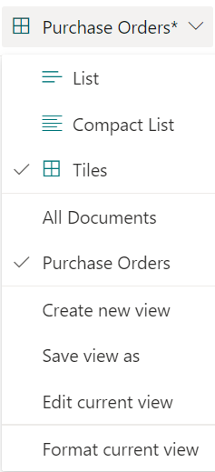
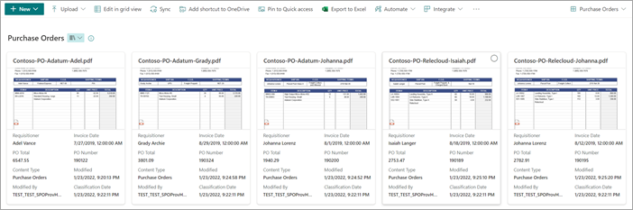

# Choose the view in a document library in Microsoft Syntex

**Applies to:**  &ensp; &#10003; All custom models &ensp; | &ensp; &#10003; All prebuilt models

There are multiple ways to view how you see the information in a SharePoint document library. You can choose the default view or change the view in your document library to fit your needs or preferences.

## Choose the default view

When you apply any model to a library, you have the option to set a new default view for the document library.

Because a model is associated to a content type, when you apply it to the library it will add the content type and update the default view with the labels you extracted showing as columns. However, you can select **Advanced settings** to optionally choose to retain the current library view or to use a new view with model information and file thumbnails. If you choose to keep the current library view, the new views with model information are still available under the library's view menu.

   

## Change the library view

You can change the view in a document library depending on your preferences. To change the view on the library page, select the view dropdown menu to show the options, and then select the view you want to use.

   

For example, if you select **Tiles** from the list, the page will display as shown.

   

The **Tiles** view displays up to eight user-created fields. If there are fewer than eight, up to four system-generated fields are shown: Sensitivity (if available), Retention (if available), Content type, Modified date, Modified by, and Classification date.

To edit any current view, on the view dropdown menu, select **Edit current view**.
