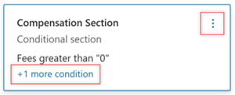

# Create conditional sections for a modern template in Microsoft Syntex

When you create a modern template, you can specify which parts of a document will be included and under what conditions. This lets you control which sections of the template will be included when you generate a document.

## Create a conditional section

Before you can create a conditional section, you first need to [create form fields in the template](content-assembly-modern-template.md#create-and-reuse-fields). Then, follow these steps to create a conditional section.

1. In the document, select the block of text for which you want to specify the condition.

2. On the **Set up the template** panel, select **Conditional section**. 

   

3. On the **New conditional section** panel, in the **Name** box, enter a name that reflects the content you've selected. (For this example, we named it **Compensation Section**.)

   

4. Select **Next**.

### Set conditions

You can add conditions to specify whether this section of the template will be included in the final generated document.

For this example, we want to show the selected content for two conditions: if the fees are greater than zero and if the nature of employment is full time. 

#### To add the first condition

1. On the **Set condition** panel, from the **Choose a field** dropdown list, select the appropriate field. (For this example, we selected **Fees**.)

   

2. From the **Choose a condition** dropdown list, select the appropriate condition. (For this example, we selected **greater than**.)

3. In the **Enter a value** box, enter the appropriate value. (For this example, we entered **0**.)

#### To add additional conditions

1. On the **Set condition** panel, select **+ And** or **Or**, depending how you want the additional condition to be linked to the first condition. (For this example, we chose **And**.)

2. On the **Set condition** panel, from the **Choose a field** dropdown list, the appropriate field. (For this example, we selected **Nature of Employment**.)

   

3. From the **Choose a condition** dropdown list, select the appropriate condition. (For this example, we selected **exact match**.)

4. In the **Enter a value** box, enter the appropriate value. (For this example, we entered **Full Time**.)

5. When you're done entering conditions, select **Save**. The new field is displayed in the **Set up the template** panel and shows the conditions based on which this section will be included in the final document.

   

## Edit a conditional section

To edit the conditions in a conditional section, you can use either of these two methods:
 
- Select the **+1 more condition** hyperlink, which takes you to the **Set conditions** page.
- Select the three dots, and then select **Edit**.

   

> [!NOTE]
> - Currently, you can create conditional sections around text and complete paragraphs. Conditional sections around images and tables is not yet supported. 
>- You can't add nested conditions. To achieve nested conditions, you'll need to create conditional sections around every section and specify all the required conditions.
 
## See also

[Create a document from a modern template](content-assembly-create-document.md)