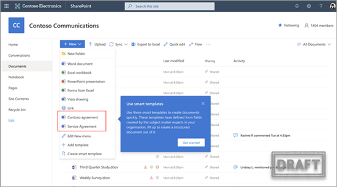
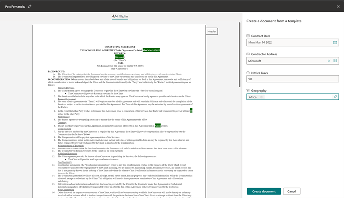

# Create a document from a modern template in Microsoft Syntex

You can use a *published* modern template to quickly create similar documents without having to start from scratch. To create a document using a published template, follow these steps:

1. From a SharePoint document library, select **New**, and then select the modern template you want to use.

   

2. The template opens in the template studio.

3. On the **Create a document from a template** panel, enter the information, and then select **Create document**.

   

   To help reduce time and effort involved in filling values for fields, Syntex provides:

      - Suggestions to help you easily pick values when selecting values from a list.
      - Autofill field values if able to uniquely identify a record for fields associated with the same list.
