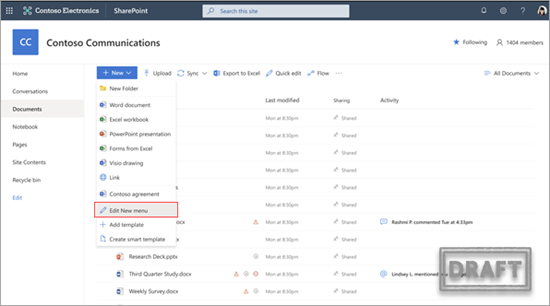
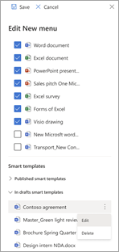
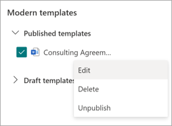
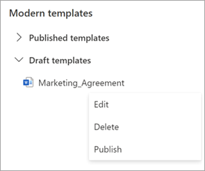

# Edit a modern template in Microsoft Syntex

If you need to edit an existing template or to delete or unpublish a template, follow these steps.

1. From a SharePoint document library, select **New** > **Edit New menu**.

   

2. On the **Edit New menu** panel, in the **Modern templates** section, select the published or draft template you want to edit.

   

3. To edit a published template or a draft template:

   - For **Published templates**, select **Edit** to open the template studio where you can edit the published template. You can also choose to delete or unpublish the template.

      

   - For **Draft templates**, select **Edit** to open the template studio where you can edit the draft template. You can also choose to delete or publish the template.

      
